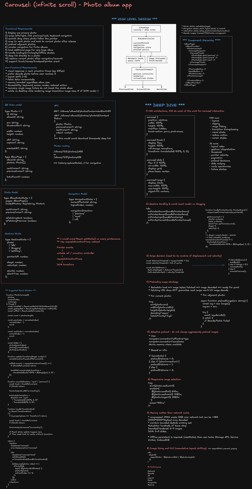

# Frontend System Design: Infinite Photo Album Carousel

> **Editable diagram:** [Open in Excalidraw](https://excalidraw.com/#room=3c018417558a92d5276e,vO47pQ0I3e7d2LKyxCCKDQ)



## Problem Statement

Design a frontend photo album app with left/right swiping and an infinite carousel feel.

Users should be able to:

- Browse photos smoothly.
- Swipe or click to move between photos.
- Continue navigating without obvious boundaries.
- Recover gracefully from loading and network failures.
- Use the experience with mouse, touch, keyboard, and assistive technologies.

Assume the backend is already complete. The focus is client architecture:

- Page interactions
- Component responsibilities
- State management
- Preloading
- Image decoding
- Gestures
- Rendering
- Performance
- Accessibility
- Failure handling

This should be treated as a **frontend system design interview**, not a distributed storage problem.

---

# 1. Clarify "Infinite"

There are two common interpretations.

| Mode | Meaning | Frontend behavior |
|---|---|---|
| Finite album | Last photo wraps to first, and first wraps to last | Circular indexing |
| Large / unbounded feed | More photos exist beyond currently loaded items | Cursor pagination + virtualization |

A reusable frontend architecture should support both.

```ts
type AlbumMode =
  | {
      type: "circular";
      totalCount: number;
    }
  | {
      type: "paginated";
      hasNextPage: boolean;
      hasPreviousPage: boolean;
    };
```

The visual carousel should not need to know much about which backend mode is active.

---

# 2. Requirements

## Functional Requirements

### MVP

- View one primary photo at a time.
- Swipe left and right.
- Previous / next buttons.
- Arrow-key navigation.
- Circular navigation for finite albums.
- Paginated loading for large albums.
- Smooth drag where the image follows the user's pointer.
- Snap to the next image or return to the current image when released.
- Preload adjacent photos.
- Loading state.
- Empty state.
- Per-image error state.
- Pagination error state.
- Offline behavior.
- Deep link to a particular photo.
- Preserve logical photo position after resize, rotation, or remount.

### Optional Follow-Ups

- Thumbnail strip.
- Grid overview.
- Pinch-to-zoom.
- Pan.
- Captions.
- Likes and comments.
- Upload / edit flows.
- Mixed photo + video items.
- Full-screen lightbox.

---

# 3. Scope

Assume:

- Web or mobile web.
- Backend provides album metadata and paginated photo metadata.
- Images are served through CDN URLs.
- Frontend owns gestures, rendering, caching policy, preloading, and local state.

Out of scope unless asked:

- Photo upload pipeline.
- Image processing backend.
- CDN architecture.
- Permission backend.
- Face recognition.
- ML ranking.
- Storage architecture.

---

# 4. Non-Functional Requirements

| Requirement | Target | Why |
|---|---|---|
| Gesture response | Visual movement begins within one frame | Avoid lag |
| Animation | Target 60 FPS | Smoothness |
| Next-photo readiness | Adjacent image usually decoded before navigation | Avoid decode jank |
| Layout stability | No major layout shift | Polished experience |
| DOM size | Constant | Large albums must remain cheap |
| Memory | Bounded decoded working set | Avoid mobile crashes |
| Failure isolation | One failed image does not break album | Reliability |
| Accessibility | Mouse, touch, keyboard, screen reader, reduced motion | Inclusive UX |
| Deep linking | Stable photo identity | Shareability |

Core architectural rule:

> Do not render every photo in the album.

A 10,000-photo album should still only need roughly 3–5 carousel slides in the DOM.

---

# 5. High-Level Architecture

```text
                    ┌─────────────────────────┐
                    │       AlbumPage         │
                    │ routing / deep links    │
                    └────────────┬────────────┘
                                 │
                    ┌────────────▼────────────┐
                    │     AlbumController     │
                    │                         │
                    │ currentPhotoId          │
                    │ pagination              │
                    │ navigation state        │
                    │ preload policy          │
                    └───────┬─────────┬───────┘
                            │         │
               ┌────────────▼───┐ ┌──▼─────────────┐
               │ Metadata Cache │ │ Image Preloader │
               │ pages / photos │ │ fetch + decode │
               └────────────────┘ └─────────────────┘
                            │
                    ┌───────▼─────────────┐
                    │  CarouselViewport   │
                    │                     │
                    │ gesture controller  │
                    │ animation           │
                    │ virtualized slides  │
                    └─────────┬───────────┘
                              │
              ┌───────────────┼────────────────┐
              ▼               ▼                ▼
         PreviousSlide   CurrentSlide      NextSlide
```

Separate the system into four concerns:

1. **Server state**
   - metadata
   - pages
   - cursors
   - fetch state

2. **Logical navigation state**
   - current photo
   - direction
   - current logical index

3. **High-frequency gesture state**
   - drag offset
   - velocity
   - pointer state
   - animation phase

4. **Image resources**
   - HTTP cache
   - decoded image readiness
   - preload policy

---

# 6. Minimum API Contract

```ts
type Photo = {
  id: string;
  albumId: string;

  src: string;
  thumbnailSrc?: string;

  width: number;
  height: number;

  alt?: string;
  caption?: string;

  createdAt?: string;
};

type AlbumPage = {
  albumId: string;
  photos: Photo[];

  nextCursor?: string;
  previousCursor?: string;

  totalCount?: number;
};
```

Example:

```http
GET /albums/:albumId/photos?cursor=abc&limit=50
```

For deep links:

```http
GET /albums/:albumId/photos/:photoId/context
```

Potential response:

```ts
type PhotoContext = {
  photo: Photo;
  previousCursor?: string;
  nextCursor?: string;
  index?: number;
};
```

This lets a user open photo 8,000 without downloading the first 7,999 photo records.

---

# 7. Routing and Deep Links

Prefer stable photo identity in the URL.

```text
/albums/123/photos/p456
```

or:

```text
/albums/123?photo=p456
```

Use photo ID rather than array index.

Why?

```text
photo ID = stable identity
index = unstable position
```

If items are inserted or deleted, index 50 can refer to a different photo.

Potential history strategy:

- Enter album: `pushState`
- Swipe inside album: `replaceState`
- Leave view / navigate elsewhere: `pushState`

This avoids making browser Back walk through every swipe.

---

# 8. State Model

Do not put every state concern into one React state object.

## 8.1 Server State

```ts
type AlbumDataState = {
  pages: AlbumPage[];
  loadedPhotos: Map<string, Photo>;

  nextCursor?: string;
  previousCursor?: string;

  isFetchingNext: boolean;
  isFetchingPrevious: boolean;

  error?: Error;
};
```

This could be managed by:

- TanStack Query
- Relay
- Apollo
- Redux Query
- Custom cache

The carousel should not know how the networking library works.

---

## 8.2 Navigation State

```ts
type NavigationState = {
  currentPhotoId: string;
  logicalIndex: number;

  navigationDirection:
    | "previous"
    | "next"
    | null;
};
```

---

## 8.3 Gesture State

```ts
type GestureState = {
  phase:
    | "idle"
    | "dragging"
    | "settling";

  pointerId?: number;

  dragX: number;
  velocityX: number;

  startX: number;
  startY: number;

  previousX: number;
  previousTime: number;

  direction:
    | "undecided"
    | "horizontal"
    | "vertical";
};
```

Important:

> `dragX` should not normally live in React state.

Pointer move events may fire 60–120+ times per second.

Preferred flow:

```text
pointermove
   ↓
mutable ref
   ↓
requestAnimationFrame
   ↓
DOM transform
```

React commits only semantic state changes such as:

```text
photo D → photo E
```

---

# 9. Component Architecture

```tsx
<AlbumPage>
  <AlbumProvider>
    <PhotoCarousel>
      <CarouselViewport>
        <CarouselTrack>
          <PhotoSlide slot="previous" />
          <PhotoSlide slot="current" />
          <PhotoSlide slot="next" />
        </CarouselTrack>
      </CarouselViewport>

      <PreviousButton />
      <NextButton />
      <PhotoCounter />
    </PhotoCarousel>

    <ThumbnailStrip />
  </AlbumProvider>
</AlbumPage>
```

Responsibilities:

| Component | Responsibility |
|---|---|
| `AlbumPage` | routing, deep linking, page lifecycle |
| `AlbumProvider` | album metadata and query state |
| `PhotoCarousel` | orchestration |
| `CarouselViewport` | clipping and input |
| `CarouselTrack` | translate animation |
| `PhotoSlide` | image rendering and item-level error |
| Controls | navigation |
| `ThumbnailStrip` | optional direct navigation |

---

# 10. Virtualization

Suppose album contains:

```text
A B C D E F G
```

and `D` is current.

Only render:

```text
┌────────────┬────────────┬────────────┐
│     C      │     D      │     E      │
│ previous   │  current   │    next    │
└────────────┴────────────┴────────────┘
```

Initial track:

```css
transform: translate3d(-100%, 0, 0);
```

After swiping left:

```text
C | D | E
    ← translate left
```

When transition reaches E:

1. Commit `current = E`
2. Rebind slides:
   - previous = D
   - current = E
   - next = F
3. Reset transform back to center with no transition

The user never sees the reset.

---

# 11. Circular Indexing

```ts
function normalizeIndex(index: number, count: number) {
  return ((index % count) + count) % count;
}
```

Then:

```ts
const previousIndex =
  normalizeIndex(currentIndex - 1, photos.length);

const nextIndex =
  normalizeIndex(currentIndex + 1, photos.length);
```

This creates:

```text
first.previous → last
last.next → first
```

without duplicating the entire album.

---

# 12. CSS Responsibilities

CSS should own:

- layout
- clipping
- image fit
- animation duration
- easing
- reduced motion
- visual states

JavaScript / React should own:

- logical index
- gesture interpretation
- thresholds
- velocity
- pagination
- preloading
- slide recycling
- routing
- errors

Baseline CSS:

```css
.photo-carousel {
  width: 100%;
  height: 100%;
}

.carousel-viewport {
  position: relative;
  width: 100%;
  height: 100%;

  overflow: hidden;

  touch-action: pan-y pinch-zoom;

  background: #111;
}

.carousel-track {
  display: flex;
  width: 100%;
  height: 100%;

  transform: translate3d(-100%, 0, 0);

  will-change: transform;
}

.carousel-track.is-animating {
  transition:
    transform
    240ms
    cubic-bezier(0.22, 0.61, 0.36, 1);
}

.carousel-slide {
  position: relative;

  flex: 0 0 100%;
  width: 100%;
  height: 100%;

  display: grid;
  place-items: center;
}

.carousel-image {
  display: block;

  max-width: 100%;
  max-height: 100%;

  width: auto;
  height: auto;

  object-fit: contain;

  user-select: none;
  -webkit-user-drag: none;
}

.carousel-button {
  position: absolute;
  top: 50%;

  transform: translateY(-50%);

  width: 44px;
  height: 44px;

  border: 0;
  border-radius: 999px;

  font-size: 24px;

  cursor: pointer;
}

.carousel-button.previous {
  left: 16px;
}

.carousel-button.next {
  right: 16px;
}

.carousel-status {
  position: absolute;

  width: 1px;
  height: 1px;

  overflow: hidden;

  clip: rect(0 0 0 0);
}

@media (prefers-reduced-motion: reduce) {
  .carousel-track.is-animating {
    transition-duration: 1ms;
  }
}
```

---

# 13. Why `transform`

Prefer:

```css
transform: translate3d(...)
```

instead of:

```css
left: -300px;
```

because transform is usually compositor-friendly and avoids unnecessary layout work.

Good path:

```text
JS
 ↓
transform
 ↓
compositor
```

Avoid a path that unnecessarily triggers:

```text
layout → paint → composite
```

---

# 14. Pointer Events

Use Pointer Events instead of separate mouse and touch implementations.

```tsx
<div
  onPointerDown={handlePointerDown}
  onPointerMove={handlePointerMove}
  onPointerUp={handlePointerUp}
  onPointerCancel={handlePointerCancel}
/>
```

Benefits:

- mouse
- pen
- touch

all share one interaction model.

---

# 15. Pointer Capture

```ts
event.currentTarget.setPointerCapture(event.pointerId);
```

Without pointer capture:

```text
pointer leaves carousel bounds
        ↓
events stop arriving
        ↓
carousel can become stuck
```

Pointer capture keeps the active gesture coherent.

---

# 16. Gesture Direction Lock

Do not let horizontal carousel gestures break vertical page scrolling.

Compute:

```ts
const dx = currentX - startX;
const dy = currentY - startY;
```

Then:

```ts
if (Math.abs(dx) > Math.abs(dy) + threshold) {
  // horizontal carousel gesture
}
```

Else:

```text
let browser handle vertical scroll
```

This is especially important on mobile.

---

# 17. `touch-action`

Use:

```css
.carousel-viewport {
  touch-action: pan-y pinch-zoom;
}
```

This preserves:

- vertical scrolling
- pinch zoom

while allowing horizontal carousel interaction.

Avoid:

```css
touch-action: none;
```

unless there is a very strong reason.

---

# 18. React Performance Rule

Avoid:

```tsx
const [dragX, setDragX] = useState(0);

function handlePointerMove(event) {
  setDragX(event.clientX - startX);
}
```

That creates:

```text
pointermove
   ↓
setState
   ↓
React scheduling
   ↓
render
   ↓
reconciliation
   ↓
commit
```

for every movement.

Instead:

```tsx
const gestureRef = useRef<Gesture | null>(null);
const trackRef = useRef<HTMLDivElement>(null);
```

and update transform with:

```ts
requestAnimationFrame(() => {
  track.style.transform =
    `translate3d(calc(-100% + ${dragX}px), 0, 0)`;
});
```

Use React state only when the logical photo changes.

---

# 19. Swipe Threshold

Do not use distance alone.

Combine:

- displacement
- velocity

Example:

```ts
const distanceThreshold = viewportWidth * 0.2;
const velocityThreshold = 0.5;

const shouldNavigate =
  Math.abs(dragX) > distanceThreshold ||
  Math.abs(velocityX) > velocityThreshold;
```

Then:

```ts
if (!shouldNavigate) {
  snapBack();
} else if (dragX < 0) {
  navigateNext();
} else {
  navigatePrevious();
}
```

This gives intuitive flick behavior.

---

# 20. Interaction State Machine

```text
                    pointerdown
           ┌────────────────────────┐
           │                        ▼
        ┌──────┐                ┌─────────┐
        │ IDLE │                │DRAGGING │
        └──────┘                └────┬────┘
           ▲                          │
           │              pointerup  │
           │                          ▼
           │                    ┌──────────┐
           │                    │ DECIDE   │
           │                    └────┬─────┘
           │                         │
      transitionend                  ├── below threshold
           │                         │       ↓
           │                         │    SNAPBACK
           │                         │
           │                         └── advance
           │                                  ↓
           └──────────────────────────── SETTLING
```

This protects against:

- navigation while settling
- duplicate pointer-up events
- pointer cancellation
- conflicting animations

---

# 21. Image Loading Pipeline

"Preload" is not one thing.

```text
metadata available
      ↓
image bytes fetched
      ↓
image decoded
      ↓
ready to paint
```

Fetching alone does not guarantee a smooth next swipe.

Goal:

> Adjacent images should ideally be decoded before navigation.

---

# 22. Image Preloader

```ts
const decodedImages = new Set<string>();
const pendingImages = new Map<string, Promise<void>>();

export function preloadImage(src: string): Promise<void> {
  if (decodedImages.has(src)) {
    return Promise.resolve();
  }

  const pending = pendingImages.get(src);

  if (pending) {
    return pending;
  }

  const promise = new Promise<void>((resolve, reject) => {
    const image = new Image();

    image.src = src;

    const load = async () => {
      try {
        if (image.decode) {
          await image.decode();
        }

        decodedImages.add(src);
        resolve();
      } catch (error) {
        reject(error);
      } finally {
        pendingImages.delete(src);
      }
    };

    image.onload = load;

    image.onerror = () => {
      pendingImages.delete(src);
      reject(new Error(`Failed to load image: ${src}`));
    };
  });

  pendingImages.set(src, promise);

  return promise;
}
```

---

# 23. Preload Policy

Priority:

```text
                         CURRENT
                            │
                            ▼
                  ┌──────────────────┐
                  │   current image  │
                  └──────────────────┘

                    HIGH PRIORITY
                ┌─────────┴─────────┐
                ▼                   ▼
           previous              next

                OPPORTUNISTIC
                ┌─────────┴─────────┐
                ▼                   ▼
               -2                  +2

            METADATA ONLY
        everything farther away
```

Potential adaptive logic:

```ts
function getPreloadDistance() {
  const connection =
    (navigator as any).connection;

  if (connection?.saveData) {
    return 0;
  }

  if (
    connection?.effectiveType === "2g" ||
    connection?.effectiveType === "slow-2g"
  ) {
    return 1;
  }

  return 2;
}
```

Directional bias:

```text
user repeatedly swipes next

preload:
+1
+2
+3
-1
```

---

# 24. Responsive Images

Avoid serving a 5000px source to a 390px device.

```tsx

```

The frontend should prefer an appropriate CDN image size.

---

# 25. Memory Model

A compressed JPEG may be only a few MB over the network but much larger after decode.

Example:

```text
4000 × 3000 × 4 bytes
≈ 48 MB decoded
```

Ten decoded photos:

```text
≈ 480 MB
```

Therefore:

```text
metadata:
hundreds / thousands may be okay

decoded images:
small working set

mounted DOM slides:
3–5
```

Do not confuse browser network cache with decoded-image memory.

---

# 26. Client Cache

Separate:

## Metadata Cache

```ts
Map<string, Photo>
```

This may retain many lightweight records.

## Image Cache

Normally let the browser HTTP cache own image bytes.

Avoid:

```ts
const [images, setImages] =
  useState<Map<string, Blob>>();
```

unless offline persistence is an explicit requirement.

If offline storage is required, consider:

- Service Worker
- Cache Storage API
- IndexedDB

---

# 27. Pagination

Suppose page size = 50.

Do not wait until photo 50 to fetch page 2.

```text
loaded:
1 ... 43 [44] 45 ... 50
               ↑
         preload threshold
```

Example:

```ts
const remainingAhead =
  photos.length - currentIndex - 1;

if (
  hasNextPage &&
  remainingAhead <= 5 &&
  !isFetchingNextPage
) {
  fetchNextPage();
}
```

Important:

> Metadata page loading and image-byte loading use different thresholds.

Metadata is cheap enough to fetch farther ahead.

---

# 28. Data Flow

```text
              Query Cache
                  │
        loaded photo metadata
                  │
                  ▼
          AlbumController
                  │
        currentPhotoId
                  │
          ┌───────┼───────┐
          │       │       │
          ▼       ▼       ▼
        prev    current   next
          │       │       │
          └───────┼───────┘
                  ▼
           CarouselViewport

Pointer Events
      │
      ▼
GestureController
      │
requestAnimationFrame
      │
      ▼
CSS transform

transition finished
      │
      ▼
AlbumController.next()
      │
      ▼
React rebinds prev/current/next
```

This separates:

```text
interaction pipeline
```

from:

```text
application state pipeline
```

---

# 29. React API

Simple product wrapper:

```tsx
<PhotoCarousel
  photos={photos}
  currentPhotoId={currentPhotoId}
  onPhotoChange={setCurrentPhotoId}
  hasNextPage={hasNextPage}
  fetchNextPage={fetchNextPage}
/>
```

For a design-system primitive:

```tsx
<Carousel.Root
  value={currentPhotoId}
  onValueChange={setCurrentPhotoId}
>
  <Carousel.Viewport>
    <Carousel.Track>
      {slides}
    </Carousel.Track>
  </Carousel.Viewport>

  <Carousel.Previous />
  <Carousel.Next />
  <Carousel.Counter />
</Carousel.Root>
```

---

# 30. Pure Props vs Composable Components

## Large Props API

```tsx
<PhotoCarousel
  showButtons
  showCounter
  showThumbnails
  keyboardNavigation
  loop
  swipeThreshold={0.2}
  preloadCount={2}
  buttonPlacement="overlay"
/>
```

Advantages:

- easy onboarding
- consistent
- easy docs

Disadvantages:

- prop explosion
- difficult customization
- many boolean combinations

## Compound / Composable API

```tsx
<Carousel.Root>
  <Carousel.Viewport />
  <Carousel.Previous />
  <Carousel.Next />
</Carousel.Root>
```

Advantages:

- flexible layout
- reusable primitive
- product teams control composition

A good platform strategy:

> Offer reusable composable primitives plus an opinionated `PhotoCarousel` wrapper.

---

# 31. PhotoSlide

```tsx
type PhotoSlideProps = {
  photo: Photo;
  active: boolean;
};

export function PhotoSlide({
  photo,
  active,
}: PhotoSlideProps) {
  const [status, setStatus] = React.useState<
    "loading" | "loaded" | "error"
  >("loading");

  const [retryKey, setRetryKey] = React.useState(0);

  const retry = () => {
    setStatus("loading");
    setRetryKey((key) => key + 1);
  };

  return (
    <div
      className="carousel-slide"
      aria-hidden={!active}
      role="group"
      aria-roledescription="slide"
    >
      {status === "loading" && (
        <div className="photo-placeholder">
          Loading...
        </div>
      )}

      {status === "error" && (
        <div className="photo-error">
          <p>Unable to load photo.</p>
          <button onClick={retry}>Retry</button>
        </div>
      )}

       setStatus("loaded")}
        onError={() => setStatus("error")}
        style={{
          visibility:
            status === "loaded"
              ? "visible"
              : "hidden",
        }}
      />
    </div>
  );
}
```

Failure is isolated to one slide.

---

# 32. Main React Carousel

```tsx
type CarouselProps = {
  photos: Photo[];
  initialIndex?: number;

  onPhotoChange?: (
    photo: Photo,
    index: number
  ) => void;

  onNearEnd?: () => void;
};

type Gesture = {
  pointerId: number;

  startX: number;
  startY: number;

  previousX: number;
  previousTime: number;

  dragX: number;
  velocityX: number;

  direction:
    | "undecided"
    | "horizontal"
    | "vertical";
};

type Phase =
  | "idle"
  | "dragging"
  | "settling";

export function PhotoCarousel({
  photos,
  initialIndex = 0,
  onPhotoChange,
  onNearEnd,
}: CarouselProps) {
  const [currentIndex, setCurrentIndex] =
    React.useState(initialIndex);

  const [phase, setPhase] =
    React.useState<Phase>("idle");

  const trackRef =
    React.useRef<HTMLDivElement>(null);

  const viewportRef =
    React.useRef<HTMLDivElement>(null);

  const gestureRef =
    React.useRef<Gesture | null>(null);

  const rafRef =
    React.useRef<number | null>(null);

  const pendingDirectionRef =
    React.useRef<"next" | "previous" | null>(null);

  if (!photos.length) {
    return (
      <div className="carousel-empty">
        No photos available.
      </div>
    );
  }

  const count = photos.length;

  const previousIndex =
    normalizeIndex(currentIndex - 1, count);

  const nextIndex =
    normalizeIndex(currentIndex + 1, count);

  const previousPhoto =
    photos[previousIndex];

  const currentPhoto =
    photos[currentIndex];

  const nextPhoto =
    photos[nextIndex];

  React.useEffect(() => {
    preloadImage(previousPhoto.src).catch(() => {});
    preloadImage(nextPhoto.src).catch(() => {});
  }, [
    previousPhoto.src,
    nextPhoto.src,
  ]);

  React.useEffect(() => {
    const remainingAhead =
      photos.length - currentIndex - 1;

    if (remainingAhead <= 5) {
      onNearEnd?.();
    }
  }, [
    currentIndex,
    photos.length,
    onNearEnd,
  ]);

  const updateDrag =
    React.useCallback((dragX: number) => {
      if (rafRef.current !== null) {
        cancelAnimationFrame(
          rafRef.current
        );
      }

      rafRef.current =
        requestAnimationFrame(() => {
          const track = trackRef.current;

          if (!track) return;

          track.style.transform =
            `translate3d(calc(-100% + ${dragX}px), 0, 0)`;
        });
    }, []);

  const handlePointerDown =
    React.useCallback(
      (
        event: React.PointerEvent<HTMLDivElement>
      ) => {
        if (phase !== "idle") return;

        event.currentTarget.setPointerCapture(
          event.pointerId
        );

        const now = performance.now();

        gestureRef.current = {
          pointerId: event.pointerId,

          startX: event.clientX,
          startY: event.clientY,

          previousX: event.clientX,
          previousTime: now,

          dragX: 0,
          velocityX: 0,

          direction: "undecided",
        };

        setPhase("dragging");
      },
      [phase]
    );

  const handlePointerMove =
    React.useCallback(
      (
        event: React.PointerEvent<HTMLDivElement>
      ) => {
        const gesture =
          gestureRef.current;

        if (
          !gesture ||
          gesture.pointerId !==
            event.pointerId
        ) {
          return;
        }

        const dx =
          event.clientX -
          gesture.startX;

        const dy =
          event.clientY -
          gesture.startY;

        if (
          gesture.direction ===
          "undecided"
        ) {
          const threshold = 6;

          if (
            Math.abs(dx) < threshold &&
            Math.abs(dy) < threshold
          ) {
            return;
          }

          if (
            Math.abs(dx) >
            Math.abs(dy)
          ) {
            gesture.direction =
              "horizontal";
          } else {
            gesture.direction =
              "vertical";
          }
        }

        if (
          gesture.direction ===
          "vertical"
        ) {
          return;
        }

        const now =
          performance.now();

        const deltaX =
          event.clientX -
          gesture.previousX;

        const deltaTime =
          now -
          gesture.previousTime;

        if (deltaTime > 0) {
          gesture.velocityX =
            deltaX / deltaTime;
        }

        gesture.previousX =
          event.clientX;

        gesture.previousTime =
          now;

        gesture.dragX = dx;

        updateDrag(dx);
      },
      [updateDrag]
    );

  const animateTo =
    React.useCallback(
      (
        direction:
          | "next"
          | "previous"
          | "center"
      ) => {
        const track =
          trackRef.current;

        if (!track) return;

        setPhase("settling");

        track.classList.add(
          "is-animating"
        );

        if (
          direction === "next"
        ) {
          pendingDirectionRef.current =
            "next";

          track.style.transform =
            "translate3d(-200%, 0, 0)";
        } else if (
          direction === "previous"
        ) {
          pendingDirectionRef.current =
            "previous";

          track.style.transform =
            "translate3d(0%, 0, 0)";
        } else {
          pendingDirectionRef.current =
            null;

          track.style.transform =
            "translate3d(-100%, 0, 0)";
        }
      },
      []
    );

  const finishGesture =
    React.useCallback(() => {
      const gesture =
        gestureRef.current;

      if (!gesture) return;

      const viewportWidth =
        viewportRef.current
          ?.getBoundingClientRect()
          .width ?? 1;

      const distanceThreshold =
        viewportWidth * 0.2;

      const velocityThreshold =
        0.5;

      const shouldNavigate =
        Math.abs(gesture.dragX) >
          distanceThreshold ||
        Math.abs(
          gesture.velocityX
        ) >
          velocityThreshold;

      if (!shouldNavigate) {
        animateTo("center");
      } else if (
        gesture.dragX < 0
      ) {
        animateTo("next");
      } else {
        animateTo("previous");
      }

      gestureRef.current = null;
    }, [animateTo]);

  const handlePointerUp =
    React.useCallback(
      (
        event: React.PointerEvent<HTMLDivElement>
      ) => {
        if (
          gestureRef.current
            ?.pointerId !==
          event.pointerId
        ) {
          return;
        }

        finishGesture();
      },
      [finishGesture]
    );

  const handlePointerCancel =
    React.useCallback(() => {
      gestureRef.current = null;
      animateTo("center");
    }, [animateTo]);

  const commitNavigation =
    React.useCallback(
      (
        direction:
          | "next"
          | "previous"
      ) => {
        setCurrentIndex(
          (current) => {
            return direction ===
              "next"
              ? normalizeIndex(
                  current + 1,
                  count
                )
              : normalizeIndex(
                  current - 1,
                  count
                );
          }
        );
      },
      [count]
    );

  const handleTransitionEnd =
    React.useCallback(
      (
        event: React.TransitionEvent<HTMLDivElement>
      ) => {
        if (
          event.propertyName !==
          "transform"
        ) {
          return;
        }

        const track =
          trackRef.current;

        if (!track) return;

        track.classList.remove(
          "is-animating"
        );

        const direction =
          pendingDirectionRef.current;

        pendingDirectionRef.current =
          null;

        if (direction) {
          commitNavigation(direction);
        }

        requestAnimationFrame(() => {
          track.style.transform =
            "translate3d(-100%, 0, 0)";

          setPhase("idle");
        });
      },
      [commitNavigation]
    );

  React.useEffect(() => {
    onPhotoChange?.(
      photos[currentIndex],
      currentIndex
    );
  }, [
    currentIndex,
    photos,
    onPhotoChange,
  ]);

  const previous =
    React.useCallback(() => {
      if (phase !== "idle") {
        return;
      }

      animateTo("previous");
    }, [
      animateTo,
      phase,
    ]);

  const next =
    React.useCallback(() => {
      if (phase !== "idle") {
        return;
      }

      animateTo("next");
    }, [
      animateTo,
      phase,
    ]);

  const handleKeyDown =
    React.useCallback(
      (
        event: React.KeyboardEvent
      ) => {
        if (
          event.key === "ArrowLeft"
        ) {
          event.preventDefault();
          previous();
        }

        if (
          event.key === "ArrowRight"
        ) {
          event.preventDefault();
          next();
        }
      },
      [
        next,
        previous,
      ]
    );

  return (
    <section
      className="photo-carousel"
      aria-roledescription="carousel"
      aria-label="Photo album"
    >
      <div
        ref={viewportRef}
        className="carousel-viewport"
        tabIndex={0}
        onKeyDown={handleKeyDown}
        onPointerDown={
          handlePointerDown
        }
        onPointerMove={
          handlePointerMove
        }
        onPointerUp={
          handlePointerUp
        }
        onPointerCancel={
          handlePointerCancel
        }
      >
        <div
          ref={trackRef}
          className="carousel-track"
          onTransitionEnd={
            handleTransitionEnd
          }
        >
          <PhotoSlide
            photo={previousPhoto}
            active={false}
          />

          <PhotoSlide
            photo={currentPhoto}
            active
          />

          <PhotoSlide
            photo={nextPhoto}
            active={false}
          />
        </div>

        <button
          className="carousel-button previous"
          aria-label="Previous photo"
          onClick={previous}
        >
          ←
        </button>

        <button
          className="carousel-button next"
          aria-label="Next photo"
          onClick={next}
        >
          →
        </button>
      </div>

      <div
        className="carousel-status"
        aria-live="polite"
      >
        Photo {currentIndex + 1} of{" "}
        {count}
      </div>
    </section>
  );
}
```

---

# 33. Album Viewer With Pagination

```tsx
type AlbumViewerProps = {
  albumId: string;
};

export function AlbumViewer({
  albumId,
}: AlbumViewerProps) {
  const [
    photos,
    setPhotos,
  ] = React.useState<Photo[]>([]);

  const [
    nextCursor,
    setNextCursor,
  ] = React.useState<
    string | undefined
  >();

  const [
    loadingMore,
    setLoadingMore,
  ] = React.useState(false);

  const [
    error,
    setError,
  ] = React.useState<
    Error | undefined
  >();

  const loadingRef =
    React.useRef(false);

  async function loadPage(
    cursor?: string
  ) {
    if (loadingRef.current) {
      return;
    }

    loadingRef.current = true;
    setLoadingMore(true);
    setError(undefined);

    try {
      const params =
        new URLSearchParams();

      params.set("limit", "50");

      if (cursor) {
        params.set(
          "cursor",
          cursor
        );
      }

      const response =
        await fetch(
          `/albums/${albumId}/photos?${params}`
        );

      if (!response.ok) {
        throw new Error(
          "Failed to load album"
        );
      }

      const page: AlbumPage =
        await response.json();

      setPhotos((existing) => {
        const knownIds =
          new Set(
            existing.map(
              (photo) =>
                photo.id
            )
          );

        const newPhotos =
          page.photos.filter(
            (photo) =>
              !knownIds.has(
                photo.id
              )
          );

        return [
          ...existing,
          ...newPhotos,
        ];
      });

      setNextCursor(
        page.nextCursor
      );
    } catch (err) {
      setError(
        err instanceof Error
          ? err
          : new Error(
              "Unknown error"
            )
      );
    } finally {
      loadingRef.current = false;
      setLoadingMore(false);
    }
  }

  React.useEffect(() => {
    loadPage();
  }, [albumId]);

  const loadMore =
    React.useCallback(() => {
      if (!nextCursor) {
        return;
      }

      loadPage(nextCursor);
    }, [nextCursor]);

  if (
    !photos.length &&
    !error
  ) {
    return (
      <AlbumSkeleton />
    );
  }

  if (
    !photos.length &&
    error
  ) {
    return (
      <div>
        <p>
          Unable to load album.
        </p>

        <button
          onClick={() =>
            loadPage()
          }
        >
          Retry
        </button>
      </div>
    );
  }

  return (
    <>
      <PhotoCarousel
        photos={photos}
        onNearEnd={loadMore}
        onPhotoChange={(
          photo
        ) => {
          history.replaceState(
            null,
            "",
            `/albums/${albumId}/photos/${photo.id}`
          );
        }}
      />

      {loadingMore && (
        <div aria-live="polite">
          Loading more photos…
        </div>
      )}

      {error && (
        <div role="status">
          Could not load more photos.

          <button
            onClick={
              loadMore
            }
          >
            Retry
          </button>
        </div>
      )}
    </>
  );
}
```

Important separation:

```text
AlbumViewer
    ↓
API / pagination / server state

PhotoCarousel
    ↓
gesture / logical navigation

PhotoSlide
    ↓
image presentation / local errors
```

---

# 34. Loading vs Navigation

Do not do this:

```ts
await preloadImage(next.src);
setCurrentIndex(nextIndex);
```

This couples gesture completion to network/decode latency.

Better:

```text
gesture completes
     ↓
navigate immediately
     ↓
if image ready
     │
     └── paint immediately
     │
     └── otherwise placeholder
              ↓
         image becomes ready
```

The network should never "hold the user's finger hostage."

---

# 35. Failure Handling

## Individual Image Failure

Show:

```text
┌─────────────────────────────┐
│                             │
│       Image unavailable     │
│                             │
│           Retry             │
│                             │
└─────────────────────────────┘
```

The user can still continue swiping.

## Pagination Failure

Keep already-loaded content usable.

Example:

```text
Could not load more photos.
Retry
```

Avoid replacing the entire album with a fatal screen once useful content already exists.

---

# 36. Request Cancellation

If metadata requests become irrelevant:

```ts
const controller =
  new AbortController();

fetch(url, {
  signal:
    controller.signal,
});

controller.abort();
```

Do not let abandoned async work determine current navigation state.

---

# 37. Race Conditions

Example:

```text
request 20 starts
request 21 starts
request 22 starts

22 resolves
20 resolves later
```

Current UI should still show 22 if 22 is the selected logical photo.

Principle:

> Async completion fills resource caches; it does not own navigation state.

---

# 38. Offline

If the client goes offline:

```text
cached current / neighbors
    ↓
continue browsing

uncached image
    ↓
show offline placeholder
```

If offline albums are a product requirement, then introduce:

- Service Worker
- Cache Storage
- IndexedDB

But do not make this baseline complexity unless required.

---

# 39. Accessibility

Controls should be actual buttons:

```tsx
<button
  aria-label="Previous photo"
  onClick={previous}
>
  ←
</button>
```

Keyboard:

```text
ArrowLeft → previous
ArrowRight → next
```

For a non-circular carousel, optionally:

```text
Home → first
End → last
```

---

# 40. Carousel Semantics

```tsx
<section
  aria-roledescription="carousel"
  aria-label="Vacation photos"
>
```

Slide:

```tsx
<div
  role="group"
  aria-roledescription="slide"
  aria-label="3 of 25"
>
```

Image:

```tsx

```

---

# 41. Screen Reader Announcements

Do not announce while dragging.

Announce only after committed navigation:

```tsx
<div aria-live="polite">
  Photo 4 of 25
</div>
```

Otherwise screen readers can be overwhelmed.

---

# 42. Hidden Neighbor Slides

Neighboring virtual slides should usually be:

```tsx
<div
  aria-hidden={!active}
>
```

because visually only one slide is active.

Also make sure hidden slides do not contain focusable interactive descendants.

---

# 43. Reduced Motion

```css
@media (prefers-reduced-motion: reduce) {
  .carousel-track.is-animating {
    transition-duration: 1ms;
  }
}
```

Or replace sliding with an instant or fade transition.

---

# 44. Focus Management

Swiping should not change keyboard focus.

If the user activates the Next button:

```text
focus stays on Next button
```

If a full-screen lightbox opens:

```text
open
  ↓
move focus into dialog

close
  ↓
restore focus to opener
```

---

# 45. Resize and Orientation

Do not store position as:

```text
translateX = -1560px
```

Store:

```text
currentPhotoId
```

On resize:

```text
ResizeObserver
     ↓
cancel active gesture
     ↓
reset track to center
```

Percentage transforms help:

```css
translateX(-100%)
```

because they are viewport-relative.

---

# 46. Transition-End Safety

Filter:

```ts
if (
  event.propertyName !==
  "transform"
) {
  return;
}
```

Do not react to unrelated transitions.

If transition completion is correctness-critical, use a fallback timeout as protection.

---

# 47. CSS Scroll Snap Alternative

For a simpler carousel:

```css
.viewport {
  display: flex;
  overflow-x: auto;

  scroll-snap-type:
    x mandatory;

  scroll-behavior:
    smooth;
}

.slide {
  flex: 0 0 100%;

  scroll-snap-align:
    center;
}
```

Advantages:

- native inertia
- less custom code
- strong browser optimization
- simple

Drawbacks:

- circular looping is awkward
- sentinel clones are often required
- virtualization is harder
- custom velocity semantics are harder
- precise gesture control is harder

Rule of thumb:

```text
simple finite carousel
    → CSS scroll snap

virtualized / controlled infinite viewer
    → transform + gesture controller
```

---

# 48. Why Not Render Everything?

Even with:

```tsx

```

10,000 rendered photo elements still mean:

```text
10,000 DOM nodes
```

Lazy image loading is not virtualization.

Virtualization means DOM count stays approximately constant regardless of dataset size.

---

# 49. Very Fast Navigation

MVP option:

```text
while settling
    → ignore new gesture
```

More advanced:

```ts
pendingDirection:
  | "next"
  | "previous"
  | null;
```

After one animation settles, process one queued direction.

If the product requires extremely rapid flicking, use an interruptible physics-based animation layer.

---

# 50. Animation Abstraction

If the interaction grows in complexity:

```ts
interface CarouselAnimator {
  beginDrag(): void;

  drag(
    offsetPx: number
  ): void;

  settle(
    direction:
      | "next"
      | "previous"
      | null
  ): Promise<void>;

  reset(): void;
}
```

This keeps React responsible for logical state while the animator owns physical motion.

---

# 51. Platform Design

For a large frontend organization:

```text
@company/carousel-core
    gesture state machine
    logical navigation
    accessibility

@company/carousel-react
    React bindings

@company/photo-carousel
    image preloading
    photo-specific UI
    placeholders
    thumbnails
```

The generic carousel should not know about:

- CDN URL rules
- image decode
- album metadata

Those belong in the photo-specific layer.

---

# 52. Security

Keep this section brief in an interview.

- Authorization is enforced server-side.
- Hiding navigation controls is not access control.
- Avoid rendering untrusted HTML in captions.
- Use normal React escaping.
- Signed URLs should not be persisted forever.
- Private image responses should use appropriate browser / CDN caching rules.
- CORS should be configured for expected image usage.

Safe:

```tsx
<p>
  {photo.caption}
</p>
```

Avoid:

```tsx
<div
  dangerouslySetInnerHTML={{
    __html:
      photo.caption,
  }}
/>
```

unless trusted sanitization exists.

---

# 53. Observability

Instrument:

```text
carousel_swipe_start
carousel_swipe_commit
carousel_image_ready
carousel_image_error
carousel_page_fetch
carousel_page_error
```

Useful metrics:

- Gesture start → first visual frame
- Gesture end → settled
- Navigation → image visible
- Preload hit rate
- Decode duration
- Image failure rate
- Pagination failure rate
- Long tasks
- Dropped frames
- Memory growth over long sessions

---

# 54. Performance Model

Think through:

```text
Network
Decode
JavaScript
Layout
Paint
Composite
Memory
```

## Network

- responsive images
- browser cache
- adjacent preload
- page prefetch

## Decode

- `image.decode()`
- small working set

## JavaScript

- refs for drag
- `requestAnimationFrame`
- no React render on every move

## Layout

- stable viewport
- image dimensions known

## Composite

- transform animation
- limited `will-change`

## Memory

- 3–5 DOM slides
- bounded decoded references

---

# 55. `will-change`

Reasonable:

```css
.carousel-track {
  will-change: transform;
}
```

because one track moves frequently.

Avoid using `will-change` on hundreds of images.

Each promoted layer can consume GPU memory.

---

# 56. Testing

## Unit Tests

```text
normalizeIndex
swipe thresholds
velocity decision
pagination threshold
state machine transitions
```

Examples:

```ts
expect(
  normalizeIndex(-1, 10)
).toBe(9);

expect(
  normalizeIndex(10, 10)
).toBe(0);
```

## Component Tests

- ArrowRight navigates next
- ArrowLeft navigates previous
- button click works
- failed image renders Retry
- reduced-motion behavior
- hidden slides not focusable

## E2E Tests

- swipe left
- swipe right
- rapid swipes
- slow network
- offline mode
- orientation change
- deep link
- pagination failure

---

# 57. Memory Regression Test

Test:

```text
Swipe through 1,000 photos.
```

Expected:

```text
DOM count stays constant
JS heap stabilizes
resource references remain bounded
```

Bad:

```text
memory usage grows linearly
with photos visited
```

---

# 58. Full Data Flow

```text
                   ┌──────────────┐
                   │     URL      │
                   │ photoId=p42  │
                   └───────┬──────┘
                           │
                           ▼
                 ┌──────────────────┐
                 │ AlbumController  │
                 │ currentId = p42  │
                 └─────┬───────┬────┘
                       │       │
               metadata│       │preload
                       ▼       ▼
              ┌───────────┐ ┌──────────────┐
              │Query Cache│ │Image Preloader│
              └─────┬─────┘ └───────┬──────┘
                    │               │
                    │          fetch + decode
                    │               │
                    └──────┬────────┘
                           ▼
                   ┌───────────────┐
                   │ PhotoCarousel │
                   └───────┬───────┘
                           │
                   ┌───────▼───────┐
                   │ Virtual Slides│
                   │ 41 [42] 43    │
                   └───────┬───────┘
                           │
                      pointermove
                           │
                           ▼
                   ┌───────────────┐
                   │ Gesture State │
                   │ ref + rAF     │
                   └───────┬───────┘
                           │
                           ▼
                    CSS transform
                           │
                     transition end
                           │
                           ▼
                  currentId = p43
```

---

# 59. State Ownership Summary

```text
                    SERVER STATE
                ┌────────────────┐
                │ photos[]       │
                │ nextCursor     │
                │ loadingMore    │
                │ pageError      │
                └───────┬────────┘
                        │
                        ▼
                 CAROUSEL STATE
                ┌────────────────┐
                │ currentPhotoId │
                │ currentIndex   │
                │ phase          │
                └───────┬────────┘
                        │
                        ▼
                 RENDER WINDOW
                ┌────────────────┐
                │ previous       │
                │ current        │
                │ next           │
                └────────────────┘


          HIGH FREQUENCY / NOT REACT STATE
                ┌────────────────┐
pointer events →│ dragX          │
                │ velocityX      │
                │ startX/startY  │
                │ pointerId      │
                └───────┬────────┘
                        │
                        ▼
             requestAnimationFrame
                        │
                        ▼
                CSS transform
```

---

# 60. Staff-Level Invariants

1. Exactly one logical current photo.
2. Navigation does not depend on image download completion.
3. Rendered slide count stays bounded.
4. Async results are tied to stable photo IDs.
5. Gesture state does not mutate server state directly.
6. One failed image does not invalidate the carousel.
7. URL state uses photo identity, not virtual slot index.
8. Pagination happens before reaching the hard boundary.
9. Metadata prefetch and image prefetch use different policies.
10. High-frequency interaction is kept out of React render state.

---

# 61. Staff-Level Talking Points Checklist

## Requirements

- What does "infinite" mean?
- Finite circular album or paginated feed?
- Web / mobile web?
- Deep linking?
- Offline?
- Zoom?
- Mixed video?

## Architecture

- Separate server, logical, gesture, and image-resource state.
- Virtualize to 3–5 DOM slides.
- Stable photo ID in URL.
- Pagination external to carousel.

## Gestures

- Pointer Events.
- Pointer capture.
- Horizontal / vertical direction locking.
- Velocity + distance threshold.
- Gesture state in refs.
- `requestAnimationFrame`.

## Rendering

- `translate3d`.
- Bounded DOM.
- Known dimensions.
- Responsive images.
- Avoid unnecessary React renders.

## Image Loading

- Metadata fetch is different from image fetch.
- Image fetch is different from image decode.
- Decode adjacent images.
- Use adaptive preload.
- Avoid over-retaining decoded resources.

## Accessibility

- Real buttons.
- Keyboard arrows.
- Screen reader slide semantics.
- `aria-live` only after commit.
- Hidden slides not focusable.
- Reduced motion.
- Preserve focus.

## Reliability

- Local image retry.
- Non-fatal page-load failure.
- Offline fallback.
- Request cancellation.
- Race-condition safety.

## Performance

- 60 FPS target.
- Constant DOM size.
- Bounded memory.
- Browser HTTP cache.
- responsive image sizes.
- instrumentation.

## Tradeoffs

- CSS Scroll Snap vs custom transform.
- Pure props vs compound components.
- Simple lock during settle vs queued navigation.
- Generic carousel primitive vs photo-specific wrapper.

---

# 62. 90-Second Interview Summary

> I would separate server state, logical carousel state, and high-frequency interaction state. Album metadata is paginated and cached, while the rendered carousel is virtualized to only the previous, current, and next photo. For finite albums I circularly map logical indexes; for large feeds I fetch the next metadata page before the user reaches the boundary.
>
> For interaction, I use Pointer Events and pointer capture. I would not update React state for every pointer move; drag offset and velocity live in refs and update a `translate3d` transform via `requestAnimationFrame`. Once the swipe settles, I commit the new photo ID into React state and recycle the three virtual slides.
>
> Image loading is separate from metadata loading. I proactively fetch and decode adjacent photos so the next one can paint immediately, while keeping only a small decoded working set because full-resolution images can consume significant memory. Responsive CDN variants keep mobile bandwidth and memory bounded.
>
> The current photo is represented by stable photo ID in the URL, so deep links and restoration work correctly. Image failures are local and retryable. Accessibility includes real previous/next buttons, arrow-key navigation, slide announcements, hidden inactive slides, and reduced-motion support. I would instrument dropped frames, navigation-to-image-ready latency, preload hit rate, failures, and memory growth over long browsing sessions.

---

# 63. Core Design Principle

> Treat the carousel as a small virtualized render window over a potentially huge logical dataset. React owns semantic application state; refs plus `requestAnimationFrame` own the high-frequency physical gesture path.
