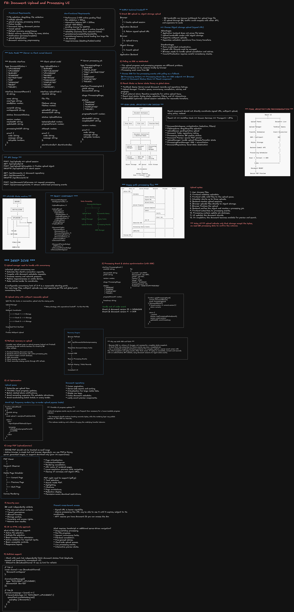
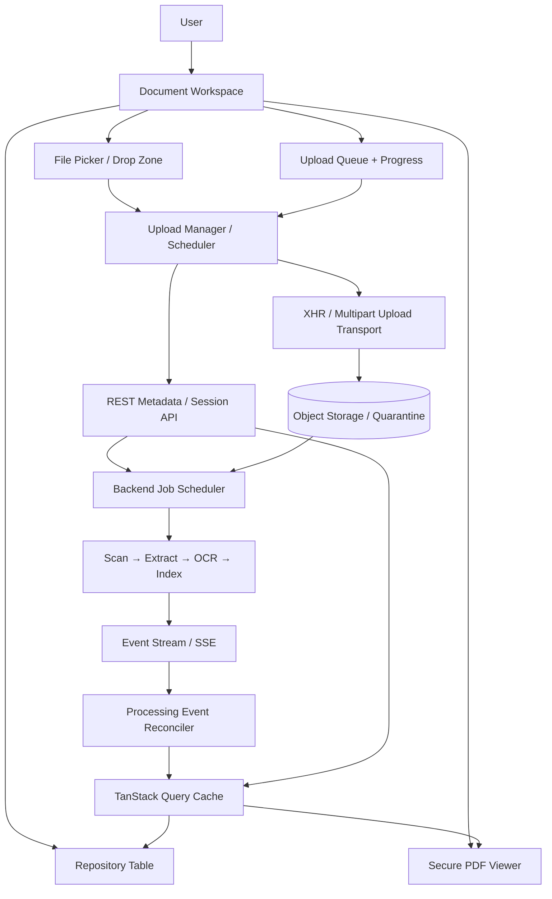
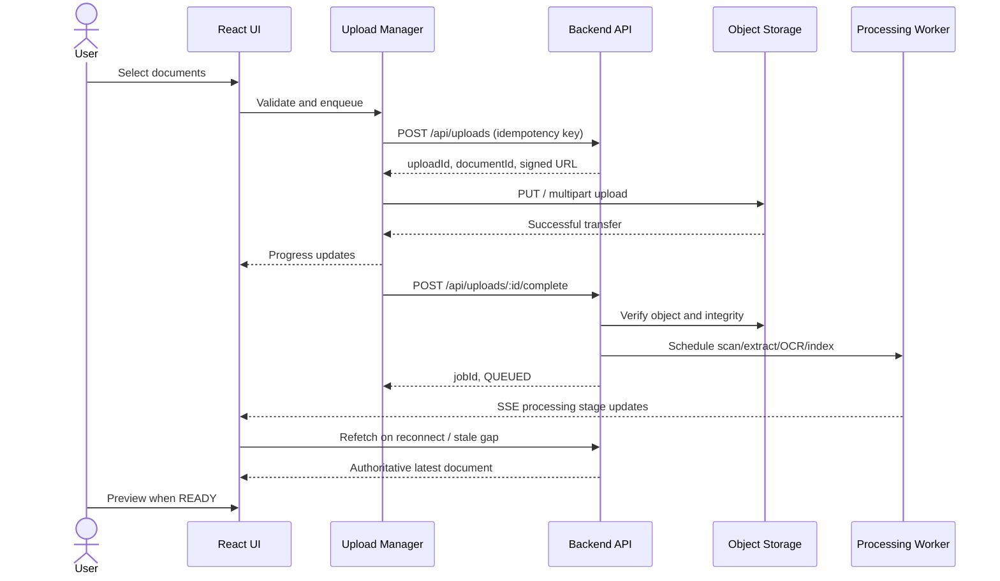
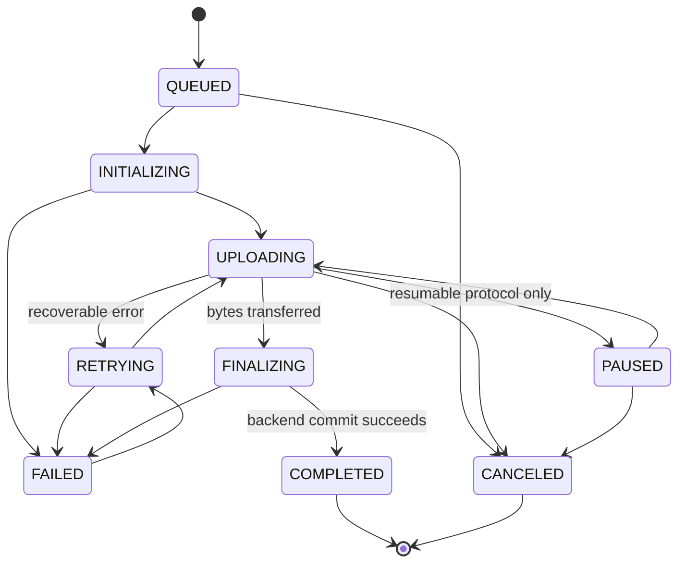

> **Editable diagram:** [Open in Excalidraw](https://excalidraw.com/#room=7f441ad1ffd67ca2cd04,n1azFYKuuxbg0R0B9iQmTg)



> **Design principle:** Separate three lifecycles: browser **file transfer**, backend **document processing**, and frontend **presentation**. Their state ownership, progress semantics, and failure recovery are different.

## 1. Requirements & Scope

### Clarifying questions

| Area       | Questions                                          | Impact                    |
| ---------- | -------------------------------------------------- | ------------------------- |
| Files      | PDF only or DOCX/images?                           | Validation, previews      |
| Size       | 10 MB vs 500 MB vs multi-GB?                       | Simple PUT vs multipart   |
| Batch      | 10 or 100 simultaneous selections?                 | Queue, concurrency        |
| Processing | Scanning, text extraction, OCR, indexing?          | State machine, job model  |
| Progress   | Exact transfer bytes? Exact processing percentage? | XHR vs stage-based status |
| Recovery   | Refresh, tab close, offline?                       | Rehydration, resumability |
| Access     | Multi-tenant and shared documents?                 | ACLs, signed URLs         |
| Viewer     | Native PDF vs annotations/citations?               | PDF viewer architecture   |

**Base assumptions:** PDF only, up to 500 MB/file, up to 100 files in a batch, 3 concurrent transfers, virus scanning → extraction → optional OCR → indexing. Processing is backend-owned and survives tab closure. Documents can be previewed once authorized and safe.

### Functional requirements

- **P0:** Pick files, drag/drop, validate type/size, upload multiple files, show per-file transfer status, processing stages, retry or cancel uploads, list files, preview ready documents.
- **P1:** Restore processing statuses after refresh, resumable upload where supported, batch actions, search/filter, completion notifications.
- **P2:** Deduplication, versioning, reprocessing.

### Nonfunctional requirements

| Concern          | Target / design                                                                        |
| ---------------- | -------------------------------------------------------------------------------------- |
| Responsiveness   | Smooth UI with ~100 queued/active files; minimize rerenders                            |
| Transfer load    | Max 3 active uploads initially; tune with data                                         |
| Status freshness | Active processing statuses update within ~2 seconds                                    |
| Reliability      | Idempotent completion; retries with exponential backoff and jitter                     |
| Security         | Backend authorization, tenant isolation, short-lived scoped URLs, quarantine           |
| Accessibility    | Keyboard-operable upload/queue/preview, semantic elements, sensible live announcements |
| Data volume      | Cursor-paginated repository; virtualized list when beneficial                          |
| Memory           | Do not read whole large files into JS memory                                           |
| Observability    | Stage-specific success, errors, latency, retry and reconnect metrics                   |

## 2. Technology Decisions and Tradeoffs

### Backend-proxied vs direct-to-object-storage upload

| Choice                       | Pros                                                             | Cons                                                           | When to choose                                 |
| ---------------------------- | ---------------------------------------------------------------- | -------------------------------------------------------------- | ---------------------------------------------- |
| Backend proxy                | Simple browser interaction, central control                      | Backend bandwidth bottleneck and increased infrastructure cost | Small files / modest traffic                   |
| Signed URL to object storage | Efficient, scales binary transfer separately, supports multipart | More orchestration, expiration and commit reconciliation       | **Recommended** for sizable enterprise uploads |

**Decision:** API creates authorized upload session, browser transfers directly to storage, API verifies and finalizes upload. A successful storage PUT is **not** equivalent to an accepted, scanned, indexed document.

### Polling vs SSE vs WebSocket for processing

| Choice    | Benefits                                      | Drawbacks                                          |
| --------- | --------------------------------------------- | -------------------------------------------------- |
| Polling   | Simple fallback/MVP                           | Extra requests and latency                         |
| SSE       | Natural one-way job status, browser reconnect | Requires replay/reconciliation and compatible auth |
| WebSocket | Bidirectional communication                   | More complex lifecycle than needed                 |

**Decision:** SSE for processing events + server refetch/reconciliation; polling fallback. For small MVP, polling alone is appropriate.

### State ownership

| Data                                                     | Owner                        | Notes                                                  |
| -------------------------------------------------------- | ---------------------------- | ------------------------------------------------------ |
| `File` handles, abort controllers, transfer bytes, queue | Dedicated `UploadManager`    | Memory-only; outside React render lifecycle            |
| Document records, pagination, current server job state   | TanStack Query               | Cache, invalidate, refetch                             |
| Incoming event connection / reconciliation               | Processing event coordinator | Apply only newer revisions for correct job             |
| Selected document, dialog, zoom, filters                 | React local state / URL      | UI concerns                                            |
| Optional multipart resume metadata                       | IndexedDB                    | Metadata alone cannot restore file bytes after refresh |

Do **not** store every network-progress tick in a high-level React Context. Subscribe per upload row and throttle visual refreshes.

## 3. High-Level Architecture



**Component responsibilities:**

- `DocumentWorkspace`: overall coordination, active selection, filtering.
- `FileDropZone`: accessible picker plus drag/drop enhancement.
- `UploadQueue` / `UploadItem`: render per-task progress, cancel/retry actions.
- `DocumentTable` / `DocumentRow`: search, pagination, sorting, processing states.
- `DocumentPreviewDialog`: preview navigation, load errors, focus management.
- `UploadManager`: scheduling, transport, cancellation, retries, task subscriptions.
- `ProcessingEventManager`: SSE reconnect, dedupe, reconciliation with server.

## 4. Happy Path & Failure Boundaries



Transfer progress represents **bytes sent**. Processing progress represents **server job stages**. A long OCR stage may not have a meaningful percent; show an indeterminate stage rather than fabricating smooth progress.

## 5. Data Model (TypeScript)

```ts
type DocumentStatus =
  | 'UPLOADING'
  | 'UPLOADED'
  | 'QUEUED'
  | 'SCANNING'
  | 'EXTRACTING'
  | 'OCR'
  | 'INDEXING'
  | 'READY'
  | 'FAILED';

interface DocumentRecord {
  id: string;
  workspaceId: string;
  ownerId: string;
  name: string;
  mimeType: string;
  sizeBytes: number;
  status: DocumentStatus;
  version: number; // monotonic server revision
  activeJobId?: string;
  createdAt: string;
  updatedAt: string;
  error?: { code: string; message: string; retryable: boolean };
}

type UploadStatus =
  | 'QUEUED'
  | 'INITIALIZING'
  | 'UPLOADING'
  | 'PAUSED'
  | 'RETRYING'
  | 'FINALIZING'
  | 'COMPLETED'
  | 'FAILED'
  | 'CANCELED';

interface UploadTask {
  clientId: string; // exists before backend responds
  file: File; // in-memory only
  uploadId?: string;
  documentId?: string;
  status: UploadStatus;
  bytesUploaded: number;
  progressPercent: number;
  attempt: number;
  abortController?: AbortController;
  error?: { code: string; message: string };
}

type ProcessingStage =
  | 'QUEUED'
  | 'VIRUS_SCAN'
  | 'TEXT_EXTRACTION'
  | 'OCR'
  | 'INDEXING'
  | 'COMPLETED'
  | 'FAILED';

interface ProcessingJob {
  jobId: string;
  documentId: string;
  stage: ProcessingStage;
  status: 'PENDING' | 'RUNNING' | 'COMPLETED' | 'FAILED';
  progressPercent?: number; // only if measurable
  version: number;
  startedAt?: string;
  completedAt?: string;
  error?: { code: string; message: string; retryable: boolean };
}

interface ProcessingEvent {
  eventId: string;
  documentId: string;
  jobId: string;
  version: number;
  stage: ProcessingStage;
  status: ProcessingJob['status'];
  progressPercent?: number;
  timestamp: string;
}
```

**Identity design:** `clientId` identifies a local queue item; `uploadId` identifies a resumable upload session; `documentId` identifies the server document; `jobId` identifies a specific processing run. Do not collapse them into one identifier.

## 6. REST and Streaming API

| Operation                | Interface                                          |
| ------------------------ | -------------------------------------------------- |
| Create upload session    | `POST /api/uploads`                                |
| Retrieve upload session  | `GET /api/uploads/:id`                             |
| Finalize uploaded object | `POST /api/uploads/:id/complete`                   |
| Abort session            | `DELETE /api/uploads/:id`                          |
| List documents           | `GET /api/documents?cursor=&limit=&status=&query=` |
| Get document             | `GET /api/documents/:id`                           |
| Authorized preview       | `GET /api/documents/:id/preview`                   |
| Delete document          | `DELETE /api/documents/:id`                        |
| Reprocess                | `POST /api/documents/:id/process`                  |
| Status stream            | `GET /api/processing/events`                       |

**Start upload:**

```http
POST /api/uploads
Content-Type: application/json
Idempotency-Key: request-abc123
```

```json
{
  "workspaceId": "workspace-123",
  "fileName": "contract.pdf",
  "fileSize": 10485760,
  "mimeType": "application/pdf"
}
```

```json
{
  "uploadId": "upload-456",
  "documentId": "doc-789",
  "uploadUrl": "https://storage.example.com/signed-url",
  "expiresAt": "2026-10-09T20:00:00Z",
  "requiredHeaders": { "Content-Type": "application/pdf" }
}
```

Browser performs a `PUT` to the signed URL, then:

```http
POST /api/uploads/upload-456/complete
```

```json
{ "documentId": "doc-789", "jobId": "job-123", "status": "QUEUED" }
```

**API correctness:** enforce permissions and quota before session creation; verify actual uploaded object before commit; make finalization idempotent; require authorization for every metadata, preview, delete and reprocess operation. Apply a stable cursor/version protocol to event stream reconciliation.

## 7. State Machines



_Cancellation during finalization requires backend-specific semantics: after commit, deletion is not equivalent to canceling an unfinished transfer._

For processing, transitions are owned by the backend. A new reprocessing attempt gets a **new job ID**; old job events must not overwrite the active job.

## 8. React Component Data Binding

```tsx
<DocumentWorkspace>
  <WorkspaceToolbar />
  <FileDropZone />
  <UploadPanel>
    <UploadQueue>
      <UploadItem />
    </UploadQueue>
  </UploadPanel>
  <DocumentTable />
  <DocumentPreviewDialog />
</DocumentWorkspace>
```

**Flow:** file selection → validation → `UploadManager.enqueue()` → task-specific snapshot subscription → `UploadItem` progress updates. After finalization, invalidate/refresh document queries, then merge authorized processing events into the cache. Each row subscribes to the smallest necessary state slice.

```tsx
function UploadItem({ clientId }: { clientId: string }) {
  const upload = useUploadTask(clientId); // external store selector, illustrative
  return (
    <div>
      <span>{upload.fileName}</span>
      <progress value={upload.progressPercent} max={100} />
    </div>
  );
}
```

## 9. Browser Upload Implementation

For upload progress, XHR remains a practical browser transport. Use ordinary `fetch` for metadata endpoints.

```ts
interface UploadOptions {
  file: File;
  url: string;
  headers?: Record<string, string>;
  signal?: AbortSignal;
  onProgress: (uploaded: number, total: number) => void;
}

function uploadFile({ file, url, headers = {}, signal, onProgress }: UploadOptions): Promise<void> {
  return new Promise((resolve, reject) => {
    if (signal?.aborted) {
      reject(new DOMException('Upload canceled', 'AbortError'));
      return;
    }
    const xhr = new XMLHttpRequest();
    xhr.open('PUT', url);
    Object.entries(headers).forEach(([key, value]) => xhr.setRequestHeader(key, value));
    xhr.upload.onprogress = (event) => {
      if (event.lengthComputable) onProgress(event.loaded, event.total);
    };
    xhr.onload = () => {
      if (xhr.status >= 200 && xhr.status < 300) resolve();
      else reject(new Error(`Upload failed: ${xhr.status}`));
    };
    xhr.onerror = () => reject(new Error('Network failure'));
    xhr.onabort = () => reject(new DOMException('Upload canceled', 'AbortError'));
    const abort = () => xhr.abort();
    signal?.addEventListener('abort', abort, { once: true });
    xhr.onloadend = () => signal?.removeEventListener('abort', abort);
    xhr.send(file);
  });
}
```

**Transport nuances:** CORS must allow requested headers; upload success only means storage accepted bytes; signed URLs expire; cancellation must suppress retries; XHR upload events may require appropriate cross-origin preflight configuration.

### Bounded upload scheduler (illustrative core)

```ts
type TaskRunner = (task: UploadTask) => Promise<void>;

class UploadManager {
  private queue: UploadTask[] = [];
  private activeCount = 0;
  private readonly maxConcurrent = 3;

  constructor(private readonly runTask: TaskRunner) {}

  enqueue(task: UploadTask) {
    this.queue.push(task);
    this.schedule();
  }

  private schedule() {
    while (this.activeCount < this.maxConcurrent && this.queue.length > 0) {
      const task = this.queue.shift()!;
      this.activeCount++;
      void this.runTask(task)
        .catch((error) => console.error('Upload task failed', task.clientId, error))
        .finally(() => {
          this.activeCount--;
          this.schedule();
        });
    }
  }
}
```

Production manager also needs an authoritative task map, publish/subscribe, queued-item removal, cancel/retry, multipart protocol, and task-state transition guards.

## 10. Processing Events: Ordering & Reconciliation

```ts
class ProcessingEventManager {
  private source?: EventSource;

  connect(onEvent: (event: ProcessingEvent) => void) {
    this.source = new EventSource('/api/processing/events', { withCredentials: true });
    this.source.addEventListener('processing-update', (message) => {
      onEvent(JSON.parse((message as MessageEvent).data) as ProcessingEvent);
    });
  }

  disconnect() {
    this.source?.close();
  }
}
```

Native `EventSource` does **not** accept arbitrary authorization headers; same-origin secure-cookie sessions are one viable pattern. Choose an alternate streaming client/protocol if bearer headers are required.

```ts
function applyProcessingEvent(current: DocumentRecord, event: ProcessingEvent): DocumentRecord {
  if (event.version <= current.version) return current;
  if (current.activeJobId && event.jobId !== current.activeJobId) return current;
  return {
    ...current,
    status: mapProcessingStatus(event), // project-specific mapping
    version: event.version,
    updatedAt: event.timestamp,
  };
}
```

**Do not use SSE as the sole source of truth.** On refresh, fetch active documents/jobs; connect to the stream with replay cursor if available; refetch when gaps or disconnects occur. Version/revision checks prevent regressions from stale events. A snapshot + stream requires careful race handling (cursor or post-connect reconciliation).

## 11. Large Upload Recovery

### Simple full retry

- **Pros:** Minimal protocol complexity.
- **Cons:** A 430 MB partial transfer of a 500 MB file may need to restart.

### Multipart/resumable upload

Split into parts, upload bounded parts in parallel, persist accepted part identifiers, query missing parts, finalize with storage's required manifest. This needs a backend/object-store-supported protocol—splitting files in the browser alone is insufficient.

```ts
interface MultipartUploadSession {
  uploadId: string;
  documentId: string;
  partSizeBytes: number;
  completedParts: { partNumber: number; etag: string }[];
}

function retryDelay(attempt: number): number {
  const exponential = Math.min(30_000, 500 * 2 ** attempt);
  return Math.random() * exponential; // full jitter
}
```

Handle expiration, transient 5xx/network errors, `429`/`Retry-After`, explicit cancellation, integrity checks, and orphaned-part cleanup. Do **not** blindly retry permission, quota, or validation errors.

**Refresh caveat:** `IndexedDB` can store session metadata but cannot magically restore an in-memory `File` handle after page reload. Require reselection, or explicitly design around available persistent file-access capabilities and permissions. Server processing jobs can recover independently because they are backend-owned.

## 12. Rendering, Large Lists & PDF Preview

### Upload queue

- Limit active transfers; publish progress snapshots every ~100–250 ms instead of every network callback.
- Subscribe to per-task selectors rather than rerendering 100 siblings from one context update.
- Derive batch progress from byte counts; avoid expensive re-aggregation at high frequency.
- Virtualize only when a large list warrants the added complexity.

### Repository table

- Cursor pagination, server-side search/filter/sort when dataset is large.
- Stable document IDs and memoized rows.
- Use virtualization for long lists; preserve keyboard semantics, focus, and screen-reader discoverability.
- Display distinct states: upload, processing, READY, FAILED.

### Viewer choices

| Viewer                        | Pros                                    | Cons                                       |
| ----------------------------- | --------------------------------------- | ------------------------------------------ |
| Native browser PDF viewer     | Low cost, quick MVP                     | Browser UI and behavior vary               |
| PDF.js                        | Precise control, selection/highlighting | Canvas/render worker and memory management |
| Server-rendered preview pages | Isolation and controlled output         | Backend cost, image bandwidth              |
| Download-only                 | Smallest implementation                 | Weak in-app UX                             |

For PDFs with hundreds/thousands of pages: render only visible/adjacent pages, cancel unnecessary renders, use LRU page caches, reuse workers appropriately, and clean up object URLs/canvases.

## 13. Security Threat Model

| Risk                       | Mitigation                                                                   |
| -------------------------- | ---------------------------------------------------------------------------- |
| Forged MIME or extension   | Inspect/validate content on backend; never trust `file.type`                 |
| Malware or hostile PDF     | Quarantine until scan; isolate processing and preview                        |
| Cross-tenant access        | Server-side ACLs on every document/preview/download operation                |
| Signed URL leakage         | Short expiry, narrow object+operation scope, avoid telemetry/logging of URLs |
| Oversized/upload flood     | Server-enforced size, type, quota, rate limiting                             |
| XSS via metadata           | Render filenames as text; avoid `dangerouslySetInnerHTML`                    |
| Duplicate/replayed commits | Idempotency keys and integrity verification                                  |
| Stale permissions          | Reject authorization server-side; invalidate sensitive caches on revocation  |
| Sensitive telemetry        | Log safe IDs/error codes, not document bodies or tokens                      |

**Rule:** Client validation is UX; backend validation is security. Signed URLs are bearer capabilities and must be handled accordingly.

## 14. Accessibility

- Native `<input type="file">` is the keyboard-operable foundation; drag/drop is an enhancement.
- Provide accessible action buttons for cancel, retry, preview, and close.
- Use `<progress>` with label (unique task ID; filenames are not unique IDs).
- Announce meaningful milestones (started, failed, completed), not every 1% increment.
- Maintain dialog focus trapping, Escape behavior, and return focus to trigger.
- Test screen readers, zoom/reflow, reduced motion, and keyboard-only operation.

```tsx
function UploadProgress({
  taskId,
  fileName,
  percent,
}: {
  taskId: string;
  fileName: string;
  percent: number;
}) {
  const id = `progress-${taskId}`;
  return (
    <div>
      <label htmlFor={id}>Uploading {fileName}</label>
      <progress id={id} value={percent} max={100} />
    </div>
  );
}

function UploadAnnouncements({ announcement }: { announcement: string }) {
  return (
    <div role="status" aria-live="polite" aria-atomic="true">
      {announcement}
    </div>
  );
}
```

## 15. HTML + CSS-Only MVP

Native form upload is enough if the product only requires **select files → submit → reload with server result**. It does _not_ provide JS-managed drag/drop, per-file progress, queueing, cancellation, SSE state, or interactive retries.

```html
<form action="/api/documents/upload" method="POST" enctype="multipart/form-data">
  <label for="files">Select PDF documents</label>
  <input id="files" name="files" type="file" accept=".pdf,application/pdf" multiple required />
  <button type="submit">Upload documents</button>
</form>
```

```css
form {
  max-width: 480px;
  padding: 24px;
  border: 1px solid #ddd;
  border-radius: 12px;
}
input[type='file'] {
  display: block;
  margin: 16px 0;
}
button {
  padding: 10px 16px;
  cursor: pointer;
}
button:focus-visible {
  outline: 3px solid #2563eb;
  outline-offset: 3px;
}
```

**Tradeoff:** HTML/CSS provides progressive enhancement and accessibility primitives. Add JS for interactive workflow; React becomes valuable when complexity justifies componentized state orchestration.

## 16. Failure Matrix & User Recovery

| Failure                         | System behavior                       | User experience                                   |
| ------------------------------- | ------------------------------------- | ------------------------------------------------- |
| Unsupported/too large           | Reject early and server-side          | Specific explanation                              |
| Network interruption            | Retry/resume eligible work            | “Retrying”; allow cancel                          |
| Signed URL expired              | Request renewed authorization         | Recover without reselecting if file handle exists |
| Storage accepted, commit failed | Retry idempotent finalize             | “Finalizing / recovering”                         |
| OCR/indexing failed             | Mark job FAILED; support reprocessing | Error + retry processing                          |
| SSE disconnected                | Reconnect/refetch                     | Keep most recent authoritative status             |
| Browser refresh                 | Fetch server jobs                     | Processing statuses return                        |
| User canceled transfer          | Abort and clean session               | “Canceled”; no auto-retry                         |
| Access revoked                  | Server denies + client cache clears   | “Access denied”                                   |
| Document deleted elsewhere      | Invalidate details                    | “No longer available”                             |

**Three retry types are different:** retransmit bytes, retry upload finalization, or re-run processing. Avoid one ambiguous `retry()` path.

## 17. Multiple Tabs and Background Behavior

- Independent tab queries are simplest but duplicate traffic.
- `BroadcastChannel` can propagate _invalidation hints_ across same-origin tabs; it is not a security authority.
- Server processing continues after tab close; browser-managed uploads generally are **not guaranteed** to continue after tab termination.

```ts
const channel = new BroadcastChannel('document-workspace');
channel.postMessage({ type: 'DOCUMENT_UPLOADED', documentId: 'doc-123' });
channel.onmessage = (event) => {
  if (event.data.type === 'DOCUMENT_UPLOADED') {
    queryClient.invalidateQueries({ queryKey: ['documents'] });
  }
};
```

## 18. Observability and Testing

### Core metrics

`upload_started`, `validation_failed`, `upload_completed`, `upload_failed`, `upload_retry_count`, `upload_duration_ms`, `processing_duration_ms`, `processing_failed`, `preview_load_duration_ms`, `sse_reconnect_count`, `upload_queue_wait_ms`.

Measure full funnel: selected → validated → session → binary transfer → committed → processing READY → previewed. **End-to-end readiness** is a more meaningful success metric than transfer alone.

### Test matrix

| Layer             | Coverage                                                                 |
| ----------------- | ------------------------------------------------------------------------ |
| Unit              | Validation, state transitions, retry policy, version handling            |
| Component         | Progress, error views, cancel/retry, accessible controls                 |
| Integration       | Session → PUT → commit → job                                             |
| Contract          | API schemas, SSE event identifiers/versions                              |
| End-to-end        | Upload through searchable/previewable READY state                        |
| Failure injection | Lost network, expired URL, duplicate/out-of-order events, commit timeout |
| Performance       | Batch of 100, React render counts, large PDFs, constrained mobile CPU    |
| Security          | Tenant isolation, unsafe metadata, leaked links, unauthorized preview    |
| Accessibility     | Keyboard, screen readers, focus on dialog close, status announcements    |

## 19. Staff Interview Deep-Dive Q&A

**Why a dedicated Upload Manager?** Upload lifecycles outlive individual component renders; the manager owns concurrency, transport and cancel/retry while UI subscribes to snapshots.

**Why XHR rather than fetch?** XHR offers mature upload-progress support; use fetch for regular metadata requests.

**What if PUT succeeds but commit fails?** Retry/query the **idempotent commit**, not the expensive binary upload.

**What if 100 documents are selected?** Bound concurrency, cap queue as necessary, scope subscriptions to rows, virtualize if large, avoid reading files fully into JS memory.

**What if status events arrive out of order?** Compare monotonically increasing document version and active job ID; reconcile authoritative server state.

**What if a job takes 30 minutes?** Durable backend job, stage-based UI, close/reopen workflow, notifications when ready; avoid fictional percentages.

**What if users refresh mid-upload?** Recover backend job immediately; resumable _transfer_ requires valid multipart session plus access to bytes (usually file reselection).

**How secure is preview?** Apply document ACL every time preview capabilities are issued; quarantine unscanned files; choose isolated viewer controls appropriate to threat model.

**How do you improve performance on low-end phones?** Adaptive/low bounded concurrency, fewer visual updates, memory-safe file streaming, cancel stale PDF renders, test bandwidth and CPU throttling.

**How test race conditions?** Simulate delayed commit responses, process events before/after initial fetch, duplicate messages, old jobs, tab refresh, URL expiration, and retries.

## 20. 45-Minute Interview Structure

| Time      | Topic                                                                |
| --------- | -------------------------------------------------------------------- |
| 0–5 min   | Clarify upload limits, processing, security, recovery                |
| 5–10 min  | Compare direct upload, event transport, state ownership              |
| 10–17 min | Architecture and sequence                                            |
| 17–23 min | Types, REST contracts, state machines                                |
| 23–29 min | Component bindings and rendering                                     |
| 29–38 min | Deep dive: multipart recovery, finalize idempotency, SSE consistency |
| 38–43 min | Threat model and accessibility                                       |
| 43–45 min | Evolution, observability, summary                                    |

### Decision Summary

| Decision           | Base recommendation                       | Reconsider when                                                    |
| ------------------ | ----------------------------------------- | ------------------------------------------------------------------ |
| Upload route       | Signed URL direct-to-storage              | Small files & simple backend proxy adequate                        |
| Transfer           | XHR                                       | Upload progress no longer required / other interoperable transport |
| Concurrency        | Bounded 3 uploads                         | Measured throughput/memory favors adaptation                       |
| Resume             | Multipart for large files                 | Strict small-file cap                                              |
| Processing updates | SSE + reconciliation                      | Polling-only MVP or bidirectional product features                 |
| Server state       | TanStack Query                            | Tiny product / limited caching needs                               |
| Transfer state     | External UploadManager                    | Single native form                                                 |
| Preview            | Native PDF initially                      | Advanced legal citations, annotations, redactions                  |
| Security           | Server ACL, quarantine, signed capability | Always a baseline for enterprise                                   |

## Closing Interview Answer

> I would explicitly separate browser transfer, server processing, and presentation. A dedicated upload manager handles bounded concurrency, cancellation, resumability and progress; the backend authorizes upload sessions and verifies finalization; server-owned jobs produce versioned processing updates that the client reconciles via SSE and API snapshots. React renders small slices of state, the repository is paginated, and previews are authorized and safe. I would start with a simpler polling-based implementation if product limits permit, then add multipart resume and richer viewer behavior as requirements demonstrate the need.
