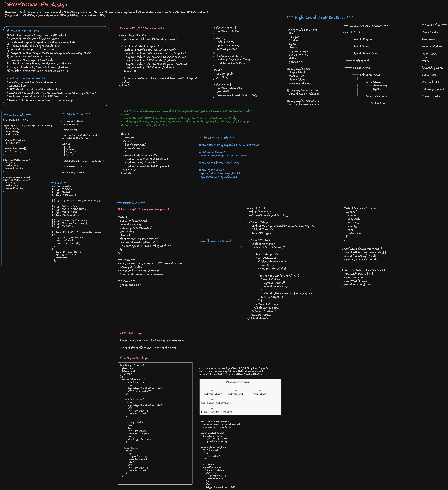

# Reusable Dropdown / Select Platform

> **Editable diagram:** [Open in Excalidraw](https://excalidraw.com/#room=001f15082cf65c4e9479,6bWBYZSLZ4cBwcW9Kx4iqA)



## 0. Minimal Working Example

A small, self-contained reference implementation of the core mechanic described below: a button-triggered menu rendered through a portal, closed on outside click/touch, and positioned relative to its trigger.

import Tabs from '@theme/Tabs';
import TabItem from '@theme/TabItem';

<Tabs>
  <TabItem value="jsx" label="DropdownMenu.jsx">

```jsx
import { useEffect, useRef, useState } from 'react';
import { createPortal } from 'react-dom';
import './styles.css';

function DropdownMenu() {
  const buttonRef = useRef();
  const menuRef = useRef();
  const [isOpen, setIsOpen] = useState(false);
  const [menuCoord, setMenuCoord] = useState(null);

  function clickOutsideListener(event) {
    // Clicked element is a descendant of
    // the menu or button.
    if (
      buttonRef.current?.contains(event.target) ||
      menuRef.current == null ||
      menuRef.current?.contains(event.target)
    ) {
      return;
    }

    setIsOpen(false);
  }

  useEffect(() => {
    document.addEventListener('mousedown', clickOutsideListener);
    document.addEventListener('touchstart', clickOutsideListener);

    return () => {
      document.removeEventListener('mousedown', clickOutsideListener);
      document.removeEventListener('touchstart', clickOutsideListener);
    };
  }, []);

  return (
    <>
      <button
        ref={buttonRef}
        onClick={() => {
          setIsOpen(!isOpen);
          if (!isOpen) {
            const buttonEl = buttonRef.current;
            const coord = {
              top: buttonEl.offsetTop + buttonEl.offsetHeight,
              left: buttonEl.offsetLeft,
            };
            setMenuCoord(coord);
          } else {
            setMenuCoord(null);
          }
        }}
      >
        Actions
      </button>
      {isOpen &&
        createPortal(
          <div
            ref={menuRef}
            className="menu-list"
            role="menu"
            style={{
              top: menuCoord.top,
              left: menuCoord.left,
            }}
          >
            <div>New File</div>
            <div>Save</div>
            <div>Delete</div>
          </div>,
          document.querySelector('body')
        )}
    </>
  );
}

export default function App() {
  return (
    <div className="app">
      <DropdownMenu position="start" />
    </div>
  );
}
```

  </TabItem>
  <TabItem value="css" label="styles.css">

```css
.app {
  font-family: sans-serif;
  font-size: 12px;
}

.menu-list {
  background-color: #fff;
  border: 1px solid #ccc;
  font-family: sans-serif;
  font-size: 12px;
  display: flex;
  flex-direction: column;
  row-gap: 4px;
  padding: 8px;
  width: 100px;
  position: absolute;
  margin-top: 4px;
  text-align: left;
}

.menu-list--end {
  right: 0;
}
```

  </TabItem>
</Tabs>

This snippet is deliberately minimal — the gaps are the interview talking points for the rest of this doc:

- No keyboard support (arrow keys, Home/End, Enter, Escape) — covered in Section 17, Accessibility.
- No collision/viewport-aware positioning or flipping — covered in Section 14, Positioning Strategy.
- `position` prop is accepted but not wired to the `.menu-list--end` class — a real implementation would branch on it to right-align the menu.
- No `aria-expanded`/`aria-controls`/`aria-activedescendant` — only a bare `role="menu"`.
- `offsetTop`/`offsetLeft` only work correctly when the trigger's offset parent is the document; a real overlay manager uses `getBoundingClientRect()` plus `position: fixed`, as covered in Section 14.

---

## 1. Scope

We are designing a **frontend dropdown/select platform**, not a single `<select>` element.

Supported use cases:

- Basic single-select
- Multi-select
- Searchable combobox
- Async remote search
- Grouped options
- Virtualized large option sets
- Custom option rendering
- Disabled / read-only states
- Clearable selection
- Creatable values
- Controlled and uncontrolled usage
- Form integration
- Portaled overlay rendering
- Mobile/touch interaction
- Server-driven option metadata

Out of scope for MVP:

- Arbitrary spreadsheet-like cell editors
- Tree select / cascader
- Drag-and-drop option reordering
- Rich text editing inside options

---

# 2. Requirements

## 2.1 Functional Requirements

| Area                 | Requirement                                                    |
| -------------------- | -------------------------------------------------------------- |
| Selection            | Single-select and multi-select                                 |
| Search               | Client-side filtering and optional async search                |
| Keyboard             | Arrow navigation, Home/End, Enter, Escape, Tab                 |
| Mouse/touch          | Click, tap, hover, outside click                               |
| Large data           | Smooth rendering for 10k–100k options through virtualization   |
| Forms                | `name`, required validation, form reset, serialized value      |
| Customization        | Custom trigger, option row, empty state, loading state         |
| Overlay              | Portal support, collision-aware positioning, viewport clipping |
| Async                | Debounce, cancellation, stale-response protection, cache       |
| State                | Controlled and uncontrolled modes                              |
| Accessibility        | ARIA combobox/listbox semantics, labels, focus management      |
| Theming              | Design tokens, size variants, density, dark mode               |
| Reliability          | Graceful network failure and retry for async mode              |
| Internationalization | RTL, locale-aware matching, long labels                        |

## 2.2 Non-functional Requirements

- Initial interaction should feel immediate.
- Open/close interaction should stay within one animation frame when local data is available.
- Do not render thousands of DOM nodes for large lists.
- API should be difficult to misuse.
- Core primitives should remain stable while teams customize presentation.
- Accessibility behavior should be enforced centrally, not reimplemented per product team.
- Support SSR/hydration without portal mismatch.
- Avoid global state unless the dropdown genuinely spans application boundaries.

---

# 3. Constraints / Scale

Example assumptions for interview discussion:

| Dimension                    |                                                                 Target |
| ---------------------------- | ---------------------------------------------------------------------: |
| Typical options              |                                                                 10–500 |
| Large option set             |                                                               10k–100k |
| Async result page            |                                                                 20–100 |
| Concurrent open dropdowns    |                              Usually 1, but architecture supports many |
| Keyboard interaction latency |                                                            under 50 ms |
| Search response display      |                                        under 100 ms after data arrives |
| Overlay reposition           |                                               ideally within one frame |
| Bundle budget                | core primitive kept small; optional async/virtualization modules split |

Important staff-level point:

> Scale is primarily a **DOM/rendering problem** on the client and a **query/cancellation/cache problem** for remote data. The data model itself is simple.

---

# 4. High-Level Architecture

```text
Application
   |
   v
<Select Root>
   |
   +-- Trigger
   |
   +-- Selection / Input
   |
   +-- Overlay Manager ----> Portal
   |                          |
   |                          v
   |                     Floating Listbox
   |                          |
   |                          +-- Virtualizer
   |                          +-- Option / Group
   |
   +-- State Machine
   |     - open/closed
   |     - activeIndex
   |     - selectedIds
   |     - query
   |     - loading/error
   |
   +-- Data Source Adapter
         |
         +-- Local options
         +-- Async fetch
         +-- Cache
         +-- AbortController
```

The design separates:

1. **Behavior/state**
2. **Data acquisition**
3. **Rendering**
4. **Positioning**
5. **Accessibility**

That separation is what allows customization without every product team recreating keyboard/focus behavior.

---

# 5. Data Model

## 5.1 Canonical Option Model

```ts
type OptionId = string;

export interface SelectOption<TMeta = unknown> {
  id: OptionId;
  label: string;
  value: string;
  disabled?: boolean;
  groupId?: string;
  keywords?: string[];
  meta?: TMeta;
}

export interface OptionGroup {
  id: string;
  label: string;
  disabled?: boolean;
}
```

Why store both `id` and `value`?

- `id` is the stable UI identity / React key.
- `value` is the application payload or serialized form value.
- Two options can theoretically display/serialize similarly but still require stable UI identity.

Avoid using array index as identity.

## 5.2 Async Data Envelope

```ts
export interface OptionPage<TMeta = unknown> {
  items: SelectOption<TMeta>[];
  nextCursor?: string;
  totalCount?: number;
}

export interface OptionQuery {
  query: string;
  cursor?: string;
  limit: number;
  signal?: AbortSignal;
}
```

## 5.3 Selection Model

```ts
type SingleSelection = OptionId | null;
type MultiSelection = Set<OptionId>;
```

For React state, a `Set` is convenient internally, but public APIs should avoid requiring callers to mutate `Set` instances.

Prefer:

```ts
type MultiValue = readonly OptionId[];
```

and normalize internally.

---

# 6. State Model

The dropdown is easiest to reason about as a state machine.

## 6.1 Core State

```ts
interface SelectState {
  open: boolean;
  query: string;

  activeId: OptionId | null;
  selectedIds: readonly OptionId[];

  status: 'idle' | 'loading' | 'success' | 'error';

  optionIds: readonly OptionId[];
  error: Error | null;

  isComposing: boolean;
}
```

## 6.2 Derived State

Do not duplicate data that can be derived.

```ts
const activeOption = optionsById[state.activeId ?? ""];
const hasSelection = state.selectedIds.length > 0;
const visibleOptions = filterAndSort(...);
```

## 6.3 Events

```ts
type SelectEvent =
  | { type: 'OPEN' }
  | { type: 'CLOSE' }
  | { type: 'TOGGLE' }
  | { type: 'QUERY_CHANGE'; query: string }
  | { type: 'MOVE_ACTIVE'; direction: 1 | -1 }
  | { type: 'MOVE_HOME' }
  | { type: 'MOVE_END' }
  | { type: 'SELECT_ACTIVE' }
  | { type: 'SELECT_ID'; id: OptionId }
  | { type: 'REMOVE_ID'; id: OptionId }
  | { type: 'CLEAR' }
  | { type: 'ASYNC_START'; requestId: number }
  | { type: 'ASYNC_SUCCESS'; requestId: number; items: SelectOption[] }
  | { type: 'ASYNC_ERROR'; requestId: number; error: Error };
```

## 6.4 State Ownership

### Local state

Use component-local state for:

- open/closed
- active option
- query
- temporary async loading state
- overlay position

### Parent/application state

Use controlled props for:

- selected value that affects business state
- form submission value
- URL/search parameters
- cross-page filters

### Do not put dropdown interaction state in Redux/global stores

Reasons:

- produces needless re-renders
- couples ephemeral UI state to app architecture
- makes focus and keyboard state harder to reason about

---

# 7. Public API Design

A staff-level API should support both **simple adoption** and **advanced composition**.

---

## 7.1 Pure Props Component

```tsx
<Select
  options={countries}
  value={country}
  onChange={setCountry}
  searchable
  clearable
  placeholder="Choose a country"
  renderOption={(option) => <CountryRow option={option} />}
/>
```

### Advantages

- Lowest learning curve
- Easy consistency
- Easy to document
- Easy to enforce accessibility defaults
- Good for 80% of use cases

### Problems

As feature count grows, props explode:

```tsx
<Select
  searchable
  multi
  async
  virtualized
  openOnFocus
  closeOnSelect={false}
  clearable
  creatable
  portal
  menuPlacement="auto"
  loadingMessage="..."
  renderOption={...}
  renderGroup={...}
  renderValue={...}
  renderEmpty={...}
/>
```

This becomes a "boolean prop matrix" with invalid combinations.

---

# 8. Composable Component API

Preferred architecture for a platform primitive:

```tsx
<Select.Root value={value} onValueChange={setValue}>
  <Select.Trigger>
    <Select.Value placeholder="Choose a country" />
    <Select.Icon />
  </Select.Trigger>

  <Select.Portal>
    <Select.Content>
      <Select.SearchInput />
      <Select.Viewport>
        <Select.Group>
          <Select.GroupLabel>Countries</Select.GroupLabel>

          {options.map((option) => (
            <Select.Option key={option.id} value={option.id}>
              <CountryRow option={option} />
            </Select.Option>
          ))}
        </Select.Group>
      </Select.Viewport>
    </Select.Content>
  </Select.Portal>
</Select.Root>
```

Internally, compound components share state through context.

```ts
interface SelectContextValue {
  state: SelectState;
  dispatch: React.Dispatch<SelectEvent>;
  getOptionProps(id: OptionId): React.HTMLAttributes<HTMLElement>;
  getTriggerProps(): React.HTMLAttributes<HTMLElement>;
}
```

---

# 9. Pure Props vs Composable Components

| Dimension                 | Pure Props                    | Composable                            |
| ------------------------- | ----------------------------- | ------------------------------------- |
| Learning curve            | Lower                         | Higher                                |
| Custom layouts            | Limited                       | Excellent                             |
| API surface               | Can become huge               | Distributed across primitives         |
| Invalid combinations      | Easier to accidentally create | Structure removes some invalid states |
| Accessibility enforcement | Strong                        | Strong if primitives own semantics    |
| Product variation         | Harder                        | Much easier                           |
| Testing                   | Simple initially              | More combinations                     |
| Migration                 | Easy for basic users          | More deliberate                       |
| Design-system fit         | Good for simple controls      | Better for platform primitives        |

### Recommended approach

Use **both layers**:

```tsx
<SimpleSelect ... />
```

implemented on top of:

```tsx
<Select.Root>...</Select.Root>
```

This gives:

- simple API for most consumers
- composable primitives for advanced product teams
- one shared behavior engine

That is usually the strongest staff-level answer.

---

# 10. API Interface for Remote Data

The dropdown should not directly know backend endpoints. Inject a data source.

```ts
export interface SelectDataSource<TMeta = unknown> {
  search(input: OptionQuery): Promise<OptionPage<TMeta>>;
  getByIds?(ids: readonly OptionId[], signal?: AbortSignal): Promise<SelectOption<TMeta>[]>;
}
```

Usage:

```tsx
<AsyncSelect dataSource={countryDataSource} value={country} onValueChange={setCountry} />
```

Example backend contract:

```http
GET /v1/options/countries?q=uni&cursor=abc&limit=50
```

Response:

```json
{
  "items": [
    {
      "id": "US",
      "label": "United States",
      "value": "US"
    }
  ],
  "nextCursor": "def",
  "totalCount": 12
}
```

### Do not expose arbitrary raw HTML from the server

The API should return data, not markup.

---

# 11. Async Search Flow

```text
User types
   |
   v
query state
   |
   +--> debounce 150-250 ms
   |
   v
Abort previous request
   |
   v
search(query, signal)
   |
   +--> stale request? ignore
   |
   +--> cache hit? use immediately
   |
   v
normalize items
   |
   v
render visible window
```

Implementation sketch:

```ts
const requestIdRef = useRef(0);

async function runSearch(query: string) {
  const requestId = ++requestIdRef.current;

  controllerRef.current?.abort();
  const controller = new AbortController();
  controllerRef.current = controller;

  dispatch({ type: 'ASYNC_START', requestId });

  try {
    const page = await dataSource.search({
      query,
      limit: 50,
      signal: controller.signal,
    });

    if (requestId !== requestIdRef.current) return;

    dispatch({
      type: 'ASYNC_SUCCESS',
      requestId,
      items: page.items,
    });
  } catch (error) {
    if (controller.signal.aborted) return;

    dispatch({
      type: 'ASYNC_ERROR',
      requestId,
      error: error as Error,
    });
  }
}
```

Key interview discussion:

- debounce reduces request volume
- abort reduces wasted work
- request ID prevents stale response overwrite
- cache avoids repeat queries
- keep previous results during refetch to prevent visual flicker

---

# 12. Client Cache

A simple query cache is enough:

```ts
type CacheKey = string; // e.g. normalized query + filters

interface CacheEntry {
  items: SelectOption[];
  expiresAt: number;
}
```

Policy:

- Cache normalized query results.
- Small TTL, e.g. 30–120 seconds depending on domain.
- LRU bound, e.g. 50–200 query keys.
- Do not cache security-sensitive responses across users.
- Clear cache when auth scope or tenant changes.

For app-wide query libraries, integrate with TanStack Query / Apollo instead of inventing a second cache.

---

# 13. Rendering Architecture

```text
<Select.Root>
   |
   +-- Trigger
   |
   +-- Hidden form input
   |
   +-- Portal
         |
         +-- Content
               |
               +-- SearchInput
               +-- Listbox
                      |
                      +-- Virtualizer
                            |
                            +-- Visible Option rows
```

## 13.1 Why Portal?

Without a portal, dropdown content can be clipped by:

```css
overflow: hidden;
transform: translateZ(0);
contain: paint;
```

Portaling to `document.body` avoids ancestor clipping.

---

# 14. Positioning Strategy

Use trigger geometry:

```ts
const rect = trigger.getBoundingClientRect();
```

Then choose a candidate placement:

```text
below-start
below-end
above-start
above-end
```

Collision logic:

1. Prefer below.
2. If insufficient space below and more above, flip.
3. Clamp width/height to viewport.
4. Reposition on resize/scroll.
5. Account for zoom and device pixel ratio.

Prefer `position: fixed` for portaled content because coordinates come from viewport-relative `getBoundingClientRect()`.

Do not recompute on every scroll event synchronously.

Use:

- `requestAnimationFrame`
- ResizeObserver
- optionally IntersectionObserver
- passive scroll listeners

---

# 15. Virtualization

For 100k options, never mount all rows.

Instead render only:

```text
visible rows
+ small overscan
```

Example:

```ts
const start = Math.max(0, Math.floor(scrollTop / rowHeight) - overscan);
const end = Math.min(
  options.length,
  Math.ceil((scrollTop + viewportHeight) / rowHeight) + overscan
);
```

DOM count becomes O(viewport rows), not O(total options).

Tradeoffs:

- Fixed row height is simpler and faster.
- Dynamic heights require measurement cache.
- Screen reader behavior must still expose correct set position/count where appropriate.

---

# 16. Performance Deep Dive

## 16.1 Avoid expensive filtering on every keystroke

For local options:

```ts
const normalizedQuery = query.trim().toLocaleLowerCase(locale);

const filtered = useMemo(() => index.search(normalizedQuery), [index, normalizedQuery]);
```

For thousands of items, build a normalized search index once:

```ts
{
  id,
  searchableText: normalize(`${label} ${keywords.join(" ")}`)
}
```

## 16.2 Avoid rerendering every option

Bad:

```tsx
<SelectContext.Provider value={{ state, dispatch }}>
```

Every state change rerenders every consumer.

Better:

- split contexts
- use selector-based context
- memoize option rows
- store active/selected membership efficiently

Example split:

```text
SelectConfigContext
SelectInteractionContext
SelectSelectionContext
```

## 16.3 Event delegation

For extremely large virtualized menus, option click handlers can be delegated from the list container using `data-option-id`.

## 16.4 Input responsiveness

For expensive local filtering:

```tsx
const deferredQuery = useDeferredValue(query);
```

or move heavy fuzzy matching to a Web Worker if truly necessary.

Do not use a Worker for a 100-item list.

## 16.5 Bundle strategy

Keep base select primitive independent from:

- fuzzy search
- virtualization
- async query cache
- analytics integrations

Load optional modules only when needed.

---

# 17. Accessibility

This is one of the most important interview areas.

## 17.1 Semantic Model

Searchable dropdown:

```text
role="combobox"
aria-expanded
aria-controls
aria-activedescendant
```

Popup:

```text
role="listbox"
```

Options:

```text
role="option"
aria-selected
aria-disabled
```

For multi-select:

```text
aria-multiselectable="true"
```

## 17.2 Keyboard Behavior

When closed:

- Enter / Space / ArrowDown opens
- ArrowUp may open and move to last item

When open:

- ArrowDown → next enabled option
- ArrowUp → previous enabled option
- Home → first enabled
- End → last enabled
- Enter → select active
- Escape → close and restore trigger focus
- Tab → close and allow focus to continue

Searchable combobox:

- typing updates input
- do not hijack text-editing keys
- handle IME composition correctly

## 17.3 Focus

Preferred model:

- DOM focus stays on the input/trigger
- visual active option tracked with `aria-activedescendant`

This avoids repeatedly moving DOM focus through a virtualized list.

## 17.4 Screen Reader Announcements

Use a visually hidden live region for dynamic messages:

```text
"12 results available"
"United States selected"
"Loading results"
"No results"
```

Avoid excessive chatter on every arrow key.

## 17.5 Touch

- Minimum target size approximately 44 CSS px where possible.
- Do not rely on hover.
- Keep menu within visual viewport when mobile keyboard is open.

---

# 18. Security

A dropdown is not a major security boundary, but important risks exist.

## 18.1 XSS

Never render server option labels with raw `innerHTML`.

Safe:

```tsx
<span>{option.label}</span>
```

Unsafe:

```tsx
<div dangerouslySetInnerHTML={{ __html: option.label }} />
```

If rich content is required, sanitize at a trusted boundary.

## 18.2 Authorization

Client-side disabling is UX only.

Example:

```tsx
<Option disabled={!canTransferFunds}>
```

The backend must still reject unauthorized actions.

## 18.3 Tenant Isolation

For async data:

```text
query cache key =
tenantId + userScope + query + filters
```

Never reuse tenant-scoped results across authentication contexts.

## 18.4 Sensitive Search Terms

Avoid logging search text when it can contain:

- email addresses
- customer names
- secrets
- account identifiers

Analytics should prefer event metadata such as result count and latency, not raw search input.

## 18.5 CSRF / Auth

If mutations are supported, such as "create new option", use the application's normal authenticated mutation path and CSRF protections.

---

# 19. Reliability / Error Handling

Async dropdown states:

```text
idle
loading
success
empty
error
offline
```

Example UI behavior:

```tsx
<Select.Content>
  {status === 'loading' && <Loading />}
  {status === 'error' && <Retry />}
  {status === 'success' && options.length === 0 && <Empty />}
  {status === 'success' && options.length > 0 && <OptionList />}
</Select.Content>
```

Use stale-while-revalidate when possible:

```text
cached results visible
+
small loading indicator
+
background refresh
```

Do not blank the menu during every query.

---

# 20. Observability

Useful metrics:

| Metric                    | Why                             |
| ------------------------- | ------------------------------- |
| open latency              | catches rendering regressions   |
| search-to-results latency | UX quality                      |
| async error rate          | backend/data-source health      |
| empty-result rate         | data/search quality             |
| option render count       | catches missing virtualization  |
| dropped frames            | animation/scroll health         |
| selection success rate    | usability                       |
| escape/cancel rate        | possible discoverability issues |

Example event:

```ts
track('select_search_complete', {
  component: 'country-select',
  durationMs,
  resultCount,
  cacheHit,
});
```

Do not log raw query values by default.

---

# 21. Testing Strategy

## Unit

- reducer/state-machine transitions
- disabled-option skipping
- selection toggling
- async stale response handling
- cache behavior

## Component

- keyboard navigation
- focus restoration
- ARIA state
- outside click
- portal rendering
- multi-select

## Accessibility

- axe checks
- keyboard-only test
- VoiceOver / NVDA manual passes for critical flows

## Performance

- 10k/100k-option benchmark
- interaction trace
- render count assertions
- virtualization DOM-node budget

## Visual

- themes
- long labels
- RTL
- viewport edges
- mobile sizes

---

# 22. Suggested Internal Hook Architecture

```ts
function useSelectState(config) {}
function useSelectKeyboard(ctx) {}
function useSelectTypeahead(ctx) {}
function useSelectAsync(dataSource) {}
function useSelectPositioning(anchorRef, contentRef) {}
function useVirtualizedOptions(options, viewport) {}
function useSelectA11y(ctx) {}
```

The public components compose these hooks rather than duplicating logic.

---

# 23. Detailed Component Architecture

```text
Select.Root
  |
  +-- owns controlled/uncontrolled contract
  +-- creates state machine
  +-- exposes contexts
  |
  +-- Select.Trigger
  |     +-- button / combobox behavior
  |
  +-- Select.Value
  |     +-- selected label(s)
  |
  +-- Select.SearchInput
  |     +-- query input
  |     +-- aria-activedescendant
  |
  +-- Select.Portal
  |     |
  |     +-- Select.Content
  |           +-- floating position
  |           +-- click-outside
  |
  |           +-- Select.Viewport
  |                 +-- virtualization
  |                 +-- role=listbox
  |
  |                 +-- Select.Option
  |                       +-- role=option
  |                       +-- selected/active/disabled
  |
  +-- HiddenInput
        +-- form serialization
```

---

# 24. Data Binding

```text
Parent business state
       |
       | value / onValueChange
       v
Select.Root
       |
       +--> selection state
       |
       +--> Select.Value
       |
       +--> Option aria-selected
       |
       +--> hidden form input
```

For async:

```text
SearchInput
   |
 query
   v
useSelectAsync
   |
 cache / request
   v
normalized options
   |
   v
virtualized viewport
```

---

# 25. Controlled vs Uncontrolled

Controlled:

```tsx
<Select.Root value={country} onValueChange={setCountry} />
```

Uncontrolled:

```tsx
<Select.Root defaultValue="US" />
```

Internal helper:

```ts
function useControllableState<T>({
  value,
  defaultValue,
  onChange,
}: {
  value?: T;
  defaultValue: T;
  onChange?: (value: T) => void;
}) {
  const [internal, setInternal] = useState(defaultValue);
  const controlled = value !== undefined;

  const current = controlled ? value : internal;

  const set = useCallback(
    (next: T) => {
      if (!controlled) setInternal(next);
      onChange?.(next);
    },
    [controlled, onChange]
  );

  return [current, set] as const;
}
```

---

# 26. Staff-Level Deep Dive Topics

## 26.1 Why not just use native `<select>`?

Use native select when:

- option count is small
- styling requirements are modest
- search is unnecessary
- mobile native picker is desirable

Use custom select when:

- async search is required
- rich option rendering is required
- virtualization is required
- advanced filtering/grouping is required

Important principle:

> Do not replace native controls unless product requirements justify the accessibility and complexity cost.

## 26.2 Why a state machine?

Keyboard navigation, async loading, selection, and open/close behavior create many cross-cutting states.

A reducer/state machine:

- centralizes transitions
- prevents impossible state combinations
- is easy to unit-test
- improves debugging

## 26.3 Why compound components?

A component library used by many teams needs controlled extensibility.

The platform team owns:

- semantics
- state
- keyboard behavior
- positioning

Product teams own:

- visual content
- option layout
- surrounding UX

## 26.4 Why not expose internal DOM refs everywhere?

Too much imperative control creates fragile consumers.

Expose only scoped escape hatches:

```ts
<Select.Root apiRef={ref} />
```

with:

```ts
interface SelectImperativeApi {
  open(): void;
  close(): void;
  focus(): void;
}
```

## 26.5 How to support custom option rendering safely?

Prefer render slots where the primitive still owns the option wrapper.

Good:

```tsx
<Select.Option value={user.id}>
  <UserOption user={user} />
</Select.Option>
```

Riskier:

```tsx
renderOption={(props) => <Whatever />}
```

because consumers may forget required roles, IDs, events, and ARIA attributes.

---

# 27. Tradeoffs

| Decision                | Benefit                        | Cost                           |
| ----------------------- | ------------------------------ | ------------------------------ |
| Portal menu             | avoids clipping                | more positioning complexity    |
| `aria-activedescendant` | works well with virtualization | ID management required         |
| Compound components     | flexible                       | more API concepts              |
| Virtualization          | scales large lists             | more scroll/a11y complexity    |
| Async adapter           | backend-agnostic               | extra abstraction              |
| Local reducer           | predictable                    | more code than scattered hooks |
| Native select fallback  | accessibility + simplicity     | styling/feature limitations    |

---

# 28. Recommended Final Design

Use a **headless/composable core** plus a **simple convenience wrapper**.

```text
@company/select-core
  - Root
  - Trigger
  - Input
  - Content
  - Viewport
  - Option
  - Group
  - state machine
  - keyboard
  - accessibility
  - positioning

@company/select
  - SimpleSelect
  - AsyncSelect
  - MultiSelect
  - styled defaults

@company/select-virtual
  - optional virtualization adapter
```

This architecture scales across product teams without forcing every use case into one giant prop-driven component.

---

# 29. Interview Summary

A strong staff-level narrative:

1. Start with product requirements and accessibility.
2. Separate behavior, rendering, data loading, and positioning.
3. Use a local state machine for interaction state.
4. Keep selected business value controlled by the parent when needed.
5. Support both pure-props convenience API and composable primitives.
6. Use portals and collision-aware positioning.
7. Use virtualization for large option sets.
8. For async search, debounce + abort + stale-response protection + bounded cache.
9. Make accessibility behavior a platform responsibility.
10. Instrument latency, errors, empty results, and render performance.
11. Treat client authorization and disabled states as UX only; backend remains authoritative.
12. Keep the core primitive small and layer advanced features as optional modules.
