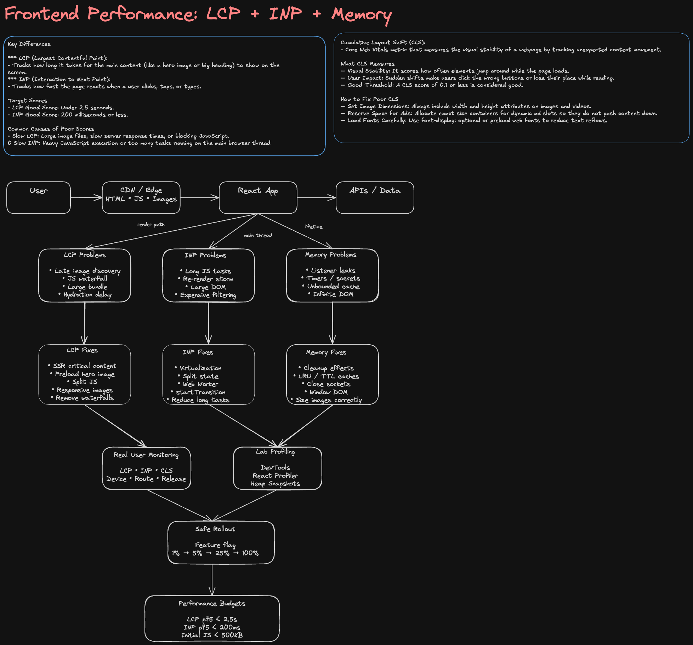

> **Editable diagram:** [Open in Excalidraw](https://excalidraw.com/#room=077053970ce8b1171d1b,rMsU5tVyIXhROUHsorDjww)



# Improve Poor LCP, INP, and Memory Usage

## Interview Prompt

> A page has poor Core Web Vitals and users report sluggish interactions after using the page for a while.
>
> Current symptoms:
>
> - LCP is ~5 seconds
> - INP is consistently above 400 ms
> - Memory usage grows over time
> - Scrolling becomes janky after prolonged usage
>
> Design an approach to diagnose and improve the frontend.

---

# 1. How I Would Start the Interview

I would avoid jumping immediately into optimization.

First, I would clarify:

### Product Context

- Which surface is affected?
  - Discover / Home?
  - Marketplace?
  - Creator dashboard?
  - Game detail page?
- Desktop web only or mobile web too?
- Logged-in only or public page?
- Is SEO important?
- Does the page contain:
  - large image grids?
  - infinite scrolling?
  - real-time updates?
  - video?
  - heavy analytics?
- What are current performance targets?

### Performance Targets

Example goals:

| Metric    |         Current |          Target |
| --------- | --------------: | --------------: |
| LCP       |            5.0s |          < 2.5s |
| INP       |           450ms |         < 200ms |
| CLS       |            0.18 |           < 0.1 |
| JS bundle |           1.8MB | < 500KB initial |
| Memory    | +200MB / 20 min |          stable |

I would explicitly separate the problem into:

```txt
1. Measure
2. Identify bottleneck
3. Fix highest-impact bottleneck
4. Validate
5. Prevent regression
```

---

# 2. High-Level Architecture

```txt
                          +----------------------+
                          |     User Browser     |
                          +----------+-----------+
                                     |
                                     v
                          +----------------------+
                          |      CDN / Edge      |
                          | HTML / JS / Images   |
                          +----------+-----------+
                                     |
                                     v
                          +----------------------+
                          |      React App       |
                          +----------------------+
                            |        |        |
                            |        |        |
                         Render    Data     Events
                            |        |        |
                            v        v        v
                         DOM     API Cache   Handlers
                            |        |        |
                            +----+---+---+----+
                                 |
                                 v
                          Performance Metrics
                                 |
                    +------------+-------------+
                    |                          |
                    v                          v
                 RUM / Logs               DevTools
             Core Web Vitals          Profiling / Traces
```

The important interview point is:

> I would distinguish network/rendering problems, main-thread execution problems, and lifetime/resource-management problems because LCP, INP, and memory usually have different root causes.

---

# 3. LCP: Largest Contentful Paint

## What LCP Measures

LCP measures when the largest visible content element in the initial viewport finishes rendering.

For a -style page, the LCP element might be:

- hero image
- game thumbnail
- recommendation carousel
- banner
- large title/content block

---

## Possible LCP Bottlenecks

```txt
Navigation
   |
   v
Slow HTML
   |
   v
Large JS bundle
   |
   v
JS parse / execute
   |
   v
React hydration
   |
   v
API request
   |
   v
Image request
   |
   v
LCP rendered
```

Common causes:

### 1. Large JavaScript Bundle

Bad:

```txt
HTML
 |
 +--> download 2 MB JS
 |
 +--> parse
 |
 +--> execute
 |
 +--> render content
```

Fix:

- route-level code splitting
- component lazy loading
- remove unused dependencies
- tree shaking
- avoid loading analytics synchronously
- delay noncritical features

Example:

```jsx
const Recommendations = React.lazy(() => import('./Recommendations'));
```

---

### 2. Client-Side Data Waterfall

Bad:

```txt
HTML
  |
  v
JS
  |
  v
React mount
  |
  v
/profile
  |
  v
/recommendations
  |
  v
/images
```

This creates sequential latency.

Better:

```txt
               +--> profile
HTML / SSR ----+--> recommendations
               +--> image preload
```

Use:

- SSR or server rendering for critical content
- parallel requests
- preload
- streaming
- server-side aggregation where appropriate

---

### 3. Poor Image Loading

Game thumbnails can dominate LCP.

Use:

```jsx

```

For the LCP image:

- do **not** lazy load
- use `fetchpriority="high"`
- preload if known
- serve responsive sizes
- use CDN
- modern image format
- avoid massive source image

For images below fold:

```jsx

```

---

### 4. Render-Blocking CSS

Potential fixes:

- inline critical CSS
- defer noncritical styles
- reduce global CSS
- remove unused CSS
- split route-specific styles

---

### 5. Hydration Cost

If server HTML exists but React takes too long to become interactive:

```txt
HTML visible
   |
   +----- huge hydration task ------+
                                    |
                              page interactive
```

Possible approaches:

- partial hydration
- lazy hydration
- islands-style rendering
- defer noninteractive components
- smaller component tree
- server components where stack allows it

---

# 4. INP: Interaction to Next Paint

## What INP Measures

INP measures interaction responsiveness.

Examples:

- clicking a game card
- opening a dropdown
- typing in search
- changing filters
- opening a modal
- scrolling + clicking during updates

A poor INP usually means the browser's **main thread is busy**.

---

# 5. Main Thread Model

```txt
Main Thread

| JS task: 180ms |
                  | React render: 160ms |
                                        | layout: 80ms |
                                                       | paint |

User Click
   |
   +-------------------------------------------> response
```

The interaction cannot run until the main thread becomes available.

---

# 6. Causes of Poor INP

## Cause 1: Long JavaScript Tasks

Example:

```js
function handleFilter(items, query) {
  return items.filter(expensiveFilter).sort(expensiveSort).map(expensiveTransformation);
}
```

If this processes 20,000 items on every keystroke, INP suffers.

Better:

- debounce
- memoize
- server filtering
- pagination
- Web Worker for CPU-heavy processing

---

## Cause 2: React Re-render Explosion

Example component tree:

```txt
<App>
   |
   +-- ContextProvider  <-- changing value
        |
        +-- Header
        +-- Sidebar
        +-- Search
        +-- 500 GameCards
```

A context update can accidentally re-render the entire page.

Fix:

```txt
Split state ownership

SearchState
   |
   +--> SearchInput
   +--> SearchResults

PresenceState
   |
   +--> FriendsPanel
```

Strategies:

- colocate state
- split contexts
- selectors
- `React.memo`
- stable callbacks
- memoize expensive derived state
- avoid storing unrelated global state together

---

# 7. Example React Optimization

Before:

```jsx
function GameGrid({ games, selectedId }) {
  return games.map((game) => <GameCard game={game} selected={selectedId === game.id} />);
}
```

Every selected item change potentially re-renders all cards.

Improvement:

```jsx
const GameCard = React.memo(function GameCard({ game, selected, onSelect }) {
  return <button onClick={() => onSelect(game.id)}>{game.name}</button>;
});
```

But in an interview I would say:

> I would profile before adding memoization. `React.memo` itself adds complexity and comparison overhead.

---

# 8. Virtualization

If Discover renders thousands of games:

Bad:

```txt
5000 games
=
5000 card components
=
5000 DOM nodes+
```

Better:

```txt
5000 data items

Visible viewport:
------------------
Game 101
Game 102
Game 103
Game 104
Game 105
------------------

Only ~10-30 rows rendered
```

Use windowing / virtualization.

Benefits:

- less DOM
- less React work
- lower memory
- faster layout
- smoother scrolling

---

# 9. Scheduling Work

For noncritical work:

```js
requestIdleCallback(() => {
  processAnalytics();
});
```

or:

```js
requestAnimationFrame(() => {
  updateVisualState();
});
```

React concepts:

```js
startTransition(() => {
  setSearchResults(results);
});
```

Critical input:

```txt
typing
   |
   +--> update input immediately
   |
   +--> lower priority result rendering
```

This keeps the UI responsive.

---

# 10. Memory Usage

This is a different problem from LCP and INP.

Symptoms:

```txt
Initial page: 100 MB

5 min:   140 MB
10 min:  220 MB
20 min:  430 MB
```

The important question:

> Does memory eventually stabilize, or does retained memory continuously increase?

---

# 11. Common React Memory Leaks

## Event Listener Leak

Bad:

```jsx
useEffect(() => {
  window.addEventListener('resize', handleResize);
}, []);
```

Missing cleanup.

Correct:

```jsx
useEffect(() => {
  window.addEventListener('resize', handleResize);

  return () => {
    window.removeEventListener('resize', handleResize);
  };
}, []);
```

---

## Timer Leak

Bad:

```jsx
useEffect(() => {
  setInterval(refreshData, 5000);
}, []);
```

Correct:

```jsx
useEffect(() => {
  const timer = setInterval(refreshData, 5000);

  return () => clearInterval(timer);
}, []);
```

---

## WebSocket Leak

Bad:

```jsx
useEffect(() => {
  const socket = new WebSocket(url);

  socket.onmessage = handleMessage;
}, []);
```

Correct:

```jsx
useEffect(() => {
  const socket = new WebSocket(url);

  socket.onmessage = handleMessage;

  return () => {
    socket.close();
  };
}, []);
```

---

# 12. Unbounded Cache Growth

This is especially relevant for a -style app.

Suppose:

```txt
User visits game 1
User visits game 2
User visits game 3
...
User visits game 10,000
```

If every result stays cached forever:

```js
cache.set(gameId, game);
```

memory grows indefinitely.

Better:

```txt
LRU cache

max entries = N

new entry
   |
   v
cache full?
   |
   +-- yes --> evict least recently used
```

Other strategies:

- TTL expiration
- max entries
- cache by page
- garbage collection
- normalized entities
- query-cache expiration

---

# 13. Infinite Scroll Memory

A common trap:

```txt
Page 1
Page 2
Page 3
...
Page 200
```

Even with lazy loading, keeping every DOM node defeats the purpose.

Use:

```txt
Infinite pagination + virtualization
```

not merely:

```txt
Infinite pagination
```

---

# 14. Image Memory

Large decoded images consume significantly more memory than compressed file size.

Example:

```txt
Image:
2000 x 2000

RGBA decoded memory:
2000 × 2000 × 4
≈ 16 MB
```

20 large images could consume hundreds of MB.

Fix:

- request correct image dimensions
- responsive images
- thumbnails rather than original assets
- unload offscreen media when appropriate
- CDN resizing

---

# 15. Data Fetching

I would separate:

```txt
Initial critical data
vs
Below-fold data
vs
Realtime data
```

Example:

```txt
Initial request

GET /discover

returns:
- first recommendation section
- hero
- essential user state
```

Then:

```txt
scroll
  |
  v
GET /discover?cursor=...
```

Friends/presence can use a separate real-time channel.

---

# 16. Avoiding Request Races

Example search:

```txt
Request A: "ro"
Request B: "rob"
Request C: ""

Response C arrives
Response A arrives later
```

Without cancellation, A could overwrite C.

Use:

```jsx
useEffect(() => {
  const controller = new AbortController();

  fetch(`/search?q=${query}`, {
    signal: controller.signal,
  });

  return () => controller.abort();
}, [query]);
```

This improves correctness and avoids wasted work.

---

# 17. Performance Measurement

I would use two complementary approaches.

## Lab Measurement

Developer environment:

- Chrome DevTools
- Performance profiler
- React Profiler
- Memory heap snapshots
- Lighthouse
- network throttling
- CPU throttling

Useful for finding root cause.

---

# 18. Real User Monitoring

Lab tests are not enough.

Collect:

```txt
LCP
INP
CLS
TTFB
JS errors
route
device
browser
network class
release/version
```

Example event:

```json
{
  "metric": "INP",
  "value": 420,
  "route": "/discover",
  "device": "mobile",
  "release": "2026.09.16"
}
```

Then segment:

```txt
p50
p75
p95
```

by:

- page
- browser
- device
- geographic region
- release version

---

# 19. Debugging LCP

Use DevTools to answer:

```txt
What is the LCP element?
       |
       v
Why was it delayed?
```

Breakdown:

```txt
TTFB
+
resource discovery delay
+
resource download
+
element render delay
=
LCP
```

Then optimize whichever portion dominates.

---

# 20. Debugging INP

Record a performance trace.

Look for:

```txt
User interaction
     |
     v
Long task
     |
     +--> JavaScript
     +--> React rendering
     +--> style calculation
     +--> layout
     +--> paint
```

Then inspect React Profiler:

```txt
Which components rendered?
Why did they render?
How long did each render take?
```

---

# 21. Debugging Memory

Workflow:

```txt
1. Load page
2. Heap snapshot A
3. Perform workflow 20x
4. Trigger GC
5. Heap snapshot B
6. Compare retained objects
```

Look for:

- detached DOM nodes
- retained component closures
- event listeners
- timers
- WebSocket handlers
- large arrays
- unbounded Maps/Sets
- image objects
- application caches

---

# 22. Architecture After Optimization

```txt
                         Browser
                            |
            +---------------+----------------+
            |                                |
            v                                v
      Critical Route                    Lazy Features
            |                                |
            v                                v
       Small JS Bundle                  Code Split Chunks
            |
            +------------+
            |            |
            v            v
        SSR Data      Image CDN
            |            |
            v            v
      Initial Render  Optimized Images
            |
            v
       React Hydration
            |
      +-----+------+
      |            |
      v            v
Input/UI      Async Rendering
Priority       / Worker
      |
      v
Virtualized UI
      |
      v
Bounded Client Cache
      |
      v
RUM / Core Web Vitals
```

---

# 23. Prioritization

If all three metrics are bad, I would not fix everything simultaneously.

I would rank fixes based on user impact and trace evidence.

Example:

### Phase 1 — LCP

1. Optimize LCP image.
2. Remove render-blocking request waterfall.
3. Reduce initial JavaScript.
4. SSR critical content.

### Phase 2 — INP

1. Identify long tasks.
2. Reduce unnecessary renders.
3. Virtualize long lists.
4. Move expensive computations off main thread.
5. Schedule noncritical work.

### Phase 3 — Memory

1. Profile heap.
2. Fix subscriptions/listeners/timers.
3. Bound caches.
4. Virtualize infinite lists.
5. resize/unload large media.

---

# 24. Rollout Strategy

Staff-level answer:

I would avoid releasing a large optimization rewrite to 100% of users.

```txt
New implementation
       |
       v
Feature flag
       |
       +--> 1%
       +--> 5%
       +--> 25%
       +--> 50%
       +--> 100%
```

Compare:

```txt
control vs treatment

LCP
INP
error rate
memory
conversion
engagement
```

This protects against performance improvements that accidentally hurt product metrics.

---

# 25. Performance Budgets

Prevent regression with CI.

Example:

```txt
Initial JS < 500 KB
LCP p75 < 2.5s
INP p75 < 200ms
CLS < 0.1
No route chunk > 250 KB
```

CI can reject significant bundle regressions.

---

# 26. Frontend Observability

I would instrument:

```txt
                Frontend
                   |
          +--------+--------+
          |        |        |
          v        v        v
        RUM      Errors   Traces
          |        |        |
          +--------+--------+
                   |
                   v
               Dashboard
                   |
          +--------+---------+
          |                  |
          v                  v
      Release View       Route View
```

Questions we should be able to answer:

- Which release caused LCP regression?
- Which routes have poor INP?
- Which devices are most affected?
- Did memory increase after a feature launch?
- Is the issue limited to a browser version?

---

# 27. Testing Strategy

## Unit

Test:

- expensive transformation logic
- cache eviction logic
- utility functions

## Component

Test:

- loading states
- error states
- pagination
- virtualized rendering behavior

## Integration

Test:

- data fetching
- route transitions
- stale cache behavior
- retries

## Performance

Automated:

```txt
Lighthouse CI
bundle size checks
render benchmarks
Core Web Vital thresholds
```

---

# 28. Staff-Level Tradeoffs

## SSR vs CSR

SSR improves:

- initial content
- LCP
- SEO

But adds:

- server complexity
- hydration cost
- infrastructure cost

I would SSR only content that benefits from it.

---

## Memoization

Useful when:

```txt
expensive render
+
same props frequently
```

Avoid blindly memoizing every component.

---

## Web Worker

Use for CPU-intensive work such as:

- large data transforms
- parsing
- sorting
- analytics processing

Do not use for ordinary simple React rendering.

---

## Virtualization

Excellent for huge lists.

Tradeoffs:

- accessibility complexity
- scroll restoration
- dynamic row heights
- focus management

---

# 29. Example Interview Walkthrough

If the interviewer says:

> The Discover page has LCP = 5 seconds and clicking filters freezes the UI.

I would answer:

### Step 1

Measure production RUM to identify affected devices/routes.

### Step 2

Use DevTools to identify the LCP element.

Suppose it is a hero game image.

I find:

```txt
HTML               300ms
JS download         900ms
JS execution        700ms
API request         800ms
image download     1500ms
```

The image is discovered very late.

### Step 3

Change architecture:

```txt
Server knows hero
      |
      +--> render hero HTML
      |
      +--> preload image
```

And:

```html
<link rel="preload" as="image" href="/hero.webp" />
```

This removes the JS/API waterfall from the hero image request.

### Step 4

For poor INP, profiler shows:

```txt
Filter click
  |
  v
12,000 games sorted
  |
  v
12,000 React cards rendered
```

Change to:

```txt
server filtering
+
virtualized results
+
transition
```

### Step 5

Memory profile shows the application retains every loaded page.

Replace:

```txt
unbounded cache
```

with:

```txt
TTL + max-size / LRU
```

and window the DOM.

---

# 30. Strong Closing Answer

I would summarize with:

> I would treat LCP, INP, and memory as related but separate signals. For LCP, I would optimize the critical rendering and network path. For INP, I would reduce main-thread work and React render cost. For memory, I would look for retained objects, unbounded caches, and long-lived resources. I would validate each change with both lab profiling and real-user metrics, roll it out behind a feature flag, and add performance budgets so we do not regress.

---

# 31. Follow-Up Questions to Practice

### LCP

- What if the LCP image URL is only known after an API request?
- SSR or preload?
- What if CDN latency is high?
- What if LCP improves but TTI gets worse?

### INP

- What if `React.memo` does not improve performance?
- When do you use Web Workers?
- How do you identify a long task?
- What if scrolling is still janky after virtualization?

### Memory

- How do you identify a detached DOM node?
- How do you distinguish a memory leak from normal caching?
- How do you implement an LRU cache?
- What happens to WebSocket handlers when components unmount?

### Architecture

- How would this work with millions of users?
- How do you prevent one team from introducing a bundle regression?
- How do you monitor performance by release?
- How do you gradually roll out an optimization?
