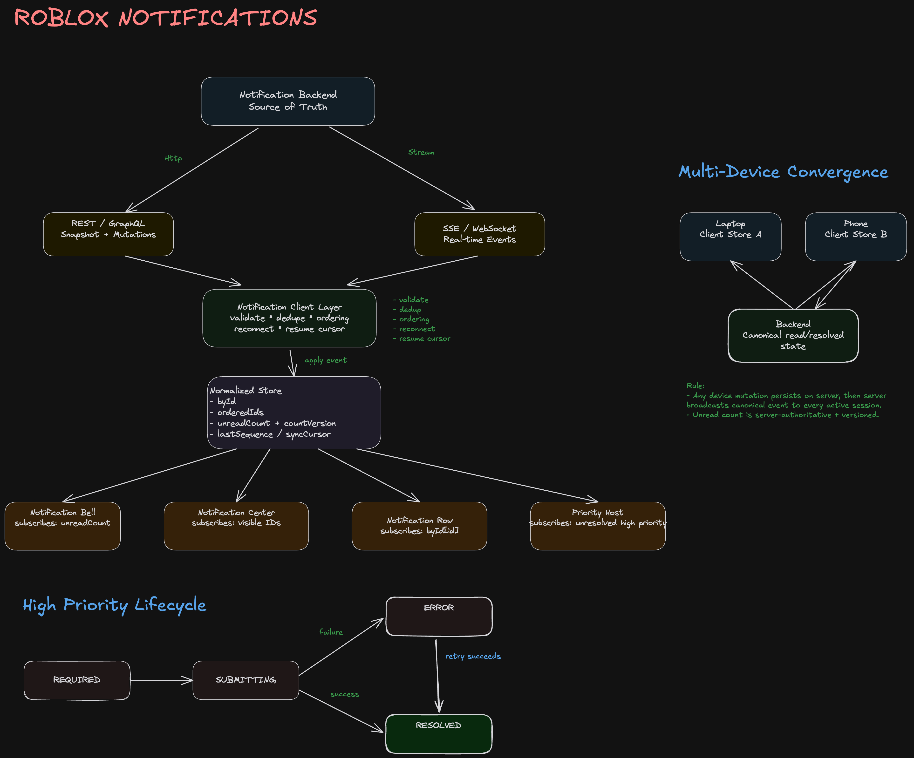

> **Editable diagram:** [Open in Excalidraw](https://excalidraw.com/#room=cfae358e4d9068cbf697,eL3m2E1-pVSop2NxGIOfxw)



# Notifications — Frontend System Design

> Staff-level focus: **requirements → architecture → data model → component binding/rendering → multi-device consistency → failure/reconnect → tradeoffs**.

---

# 1. Problem Statement

Design the client side of a notification system that:

- surfaces account, profile, friends, favorite experiences, and system activity
- updates users in near real time
- supports multiple logged-in devices
- provides a global unread indicator
- allows users to open prior notifications
- supports high-priority notifications that require an action before dismissal

For the MVP, optimize for:

1. correctness across devices
2. low event-to-render latency
3. predictable rendering behavior
4. clear backend/frontend ownership

---

# 2. Requirements

## Functional

- Receive notifications in near real time while the app is open.
- Render global unread count.
- Render notification center/history.
- Mark individual notifications read.
- Mark all notifications read.
- Support high-priority, required-action notifications.
- Synchronize read/resolved state across devices.
- Navigate to the relevant experience/profile/account surface.

## Non-functional

- Target event-to-visible latency: ~1–2 seconds under normal conditions.
- Avoid duplicate notifications.
- Preserve correctness across reconnects.
- Do not rerender the whole application for one notification.
- Support potentially large notification history.
- Remain accessible.

---

# 3. Key State Semantics

Do **not** collapse all state into a single `read` boolean.

```ts
notification.deliveryState;
notification.readState;
notification.actionState;
```

A high-priority notification can be:

```ts
{
  delivered: true,
  readAt: 1710000000,
  resolvedAt: null,
}
```

Meaning:

```text
Delivered != Read != Resolved
```

This distinction is critical for required-action notifications.

---

# 4. High-Level Architecture

```text
                   Notification Backend
                  /                    \
         REST / GraphQL              SSE / WebSocket
       snapshot + mutation             real-time
               |                          |
               +-----------+--------------+
                           |
                           v
                Notification Client Layer
                - transport abstraction
                - event validation
                - deduplication
                - ordering/version checks
                - reconnect/resume
                           |
                           v
                 Normalized Client Store
                 - byId
                 - orderedIds
                 - unreadCount
                 - cursor/sequence
                 - UI state
                 /      |       \
                v       v        v
              Bell     List    Priority Host
             Badge     Rows    Modal/Banner
```

### Staff-level principle

> Backend is authoritative for notification lifecycle and unread aggregate. Frontend owns presentation, working-set cache, render scheduling, optimistic UX, and reconnection behavior.

---

# 5. Transport Choice

For the MVP, **SSE is a strong fit** because notifications are primarily server → client.

Use HTTP for:

```text
mark read
mark all read
perform required action
pagination
initial snapshot
```

Use SSE for:

```text
notification.created
notification.updated
notification.read
notification.resolved
notification.deleted
notification.count.updated
```

If the product already has a shared WebSocket gateway for chat/presence/party activity, reuse it instead.

Hide the transport:

```ts
interface NotificationTransport {
  connect(cursor?: string): Promise<void>;
  disconnect(): void;
  subscribe(handler: (event: NotificationEvent) => void): () => void;
}
```

---

# 6. API Contracts

## Initial snapshot

```http
GET /v1/notifications?limit=50
```

```json
{
  "notifications": [],
  "nextCursor": "cursor_abc",
  "unreadCount": 12,
  "syncCursor": "evt_93842",
  "countVersion": 201
}
```

`syncCursor` prevents the race between initial fetch and opening the live stream.

## Fetch older notifications

```http
GET /v1/notifications?cursor=cursor_abc&limit=50
```

## Mark read

```http
POST /v1/notifications/:id/read
```

## Mark all read

```http
POST /v1/notifications/read-all
```

## Resolve required action

```http
POST /v1/notifications/:id/actions/:actionType
```

The server must validate the action. The client must not mark it resolved until confirmed.

---

# 7. Real-Time Event Envelope

```ts
type NotificationEvent = {
  eventId: string;
  sequence: number;
  type:
    | 'notification.created'
    | 'notification.updated'
    | 'notification.read'
    | 'notification.resolved'
    | 'notification.deleted'
    | 'notification.count.updated';

  notification?: Notification;
  notificationId?: string;

  unreadCount?: number;
  countVersion?: number;

  occurredAt: string;
};
```

Example:

```json
{
  "eventId": "evt_10003",
  "sequence": 10003,
  "type": "notification.created",
  "notification": {
    "id": "n_908",
    "version": 1,
    "type": "friend_request",
    "priority": "normal"
  },
  "unreadCount": 14,
  "countVersion": 300
}
```

---

# 8. Frontend Data Model

Normalize notification entities.

```ts
type NotificationId = string;

type Notification = {
  id: NotificationId;
  version: number;

  type:
    'friend_request' | 'experience_update' | 'favorite_update' | 'account' | 'security' | 'system';

  priority: 'normal' | 'high';

  title: string;
  body: string;
  imageUrl?: string;

  createdAt: number;
  updatedAt: number;
  readAt: number | null;

  deepLink?: string;

  action?: {
    type: string;
    label: string;
    payload?: Record<string, unknown>;
  };

  resolution: {
    required: boolean;
    resolvedAt: number | null;
  };

  presentation?: {
    surface: 'center' | 'toast' | 'banner' | 'modal';
  };
};
```

Store shape:

```ts
type NotificationState = {
  byId: Record<NotificationId, Notification>;
  orderedIds: NotificationId[];

  unreadCount: number;
  countVersion: number;

  nextCursor?: string;

  stream: {
    connectionState: 'connecting' | 'connected' | 'disconnected';
    lastSequence?: number;
    syncCursor?: string;
  };

  ui: {
    centerOpen: boolean;
    activePriorityId?: string;
  };
};
```

---

# 9. Why Normalize the Store

Avoid duplicating arrays into multiple component trees.

Bad:

```text
Bell owns notifications[]
List owns notifications[]
Toast owns notifications[]
Modal owns notifications[]
```

Good:

```text
                 Notification Store
                      |
        +-------------+-------------+
        |             |             |
        v             v             v
 unreadCount      visibleIds   prioritySelector
        |             |             |
        v             v             v
      Bell           List       PriorityHost
```

One entity update happens once.

Every component subscribes through a selector.

---

# 10. Component Architecture

```text
<App>
 |
 +-- <NotificationProvider>
 |     +-- bootstrap snapshot
 |     +-- connection manager
 |     +-- repository
 |     +-- store
 |
 +-- <Navigation>
 |     +-- <NotificationBell>
 |           +-- <UnreadBadge>
 |
 +-- <NotificationCenter>
 |     +-- <NotificationHeader>
 |     +-- <VirtualizedNotificationList>
 |           +-- <NotificationRow id=...>
 |                 +-- <NotificationIcon>
 |                 +-- <NotificationContent>
 |                 +-- <NotificationActions>
 |
 +-- <NotificationToastHost>
 |
 +-- <PriorityNotificationHost>
       +-- <RequiredActionModal / Banner>
```

---

# 11. Data Binding and Render Boundaries

Avoid prop drilling:

```tsx
<App notifications={notifications}>
  <Header notifications={notifications}>
    <Bell notifications={notifications} />
  </Header>
</App>
```

Instead, subscribe directly to narrow slices.

```tsx
function NotificationBell() {
  const unreadCount = useNotificationStore((s) => s.unreadCount);

  return (
    <BellButton>
      <NotificationIcon />
      {unreadCount > 0 && <Badge>{unreadCount}</Badge>}
    </BellButton>
  );
}
```

List subscribes to IDs:

```tsx
function NotificationCenter() {
  const ids = useNotificationStore(selectVisibleNotificationIds);

  return <NotificationList ids={ids} />;
}
```

Each row subscribes to only one entity:

```tsx
function NotificationRow({ id }: { id: string }) {
  const notification = useNotificationStore((s) => s.byId[id]);

  return <NotificationCard notification={notification} />;
}
```

### Why this matters

When notification `n_123` changes:

```text
store.byId[n_123] changes
       |
       +--> row n_123 rerenders
       |
       +--> badge rerenders only if unreadCount changed
```

The entire notification list and app shell should not rerender.

---

# 12. Render Flow for a New Notification

```text
Backend emits notification.created
               |
               v
       SSE / WebSocket client
               |
               v
      Connection Manager
       - validate
       - dedupe eventId
       - check sequence
               |
               v
     applyNotificationEvent()
               |
      +--------+---------+
      |                  |
      v                  v
 insert entity      update unreadCount
      |                  |
      v                  v
 row/list selector       Bell selector
      |                  |
      v                  v
 render row           render badge
      |
      +--> ToastHost may render toast
```

Use a single deterministic reducer/transaction path for all live events.

```ts
function applyNotificationEvent(state: NotificationState, event: NotificationEvent) {
  if (event.sequence <= (state.stream.lastSequence ?? -1)) {
    return;
  }

  switch (event.type) {
    case 'notification.created':
      upsertNotification(state, event.notification!);
      break;

    case 'notification.updated':
      upsertNotification(state, event.notification!);
      break;

    case 'notification.read':
      applyReadEvent(state, event);
      break;

    case 'notification.resolved':
      applyResolvedEvent(state, event);
      break;
  }

  state.stream.lastSequence = event.sequence;
}
```

---

# 13. Entity Versioning

Do not trust delivery order alone.

```ts
function upsertNotification(state: NotificationState, incoming: Notification) {
  const current = state.byId[incoming.id];

  if (current && incoming.version <= current.version) {
    return;
  }

  state.byId[incoming.id] = incoming;
}
```

Protects against:

```text
version 7 arrives
version 6 arrives later
```

The older payload must not overwrite the newer one.

---

# 14. Multi-Device Consistency

This is a core requirement.

```text
                    Notification Backend
                     /               \
                    /                 \
                 SSE A               SSE B
                   |                   |
                   v                   v
                Laptop               Phone
```

Both devices subscribe to a **user/account-level notification stream**.

## Example: phone marks a notification read

```text
Phone
  |
  | POST /notifications/n_1/read
  v
Backend
  |
  | persist authoritative state
  |
  +---- emit notification.read ----+
  |                                |
  v                                v
Phone stream                    Laptop stream
  |                                |
  v                                v
update store                    update store
```

The initiating device also receives the canonical server event.

This guarantees eventual convergence.

---

# 15. Unread Count Across Devices

Do **not** derive global unread count from loaded rows:

```ts
notifications.filter((n) => !n.readAt).length;
```

The client may only hold 50 of thousands of notifications.

Use a server-authoritative aggregate:

```json
{
  "unreadCount": 8,
  "countVersion": 421
}
```

Client application logic:

```ts
if ((event.countVersion ?? 0) > state.countVersion) {
  state.unreadCount = event.unreadCount!;
  state.countVersion = event.countVersion!;
}
```

This also handles races between devices.

---

# 16. Multi-Device Race Example

Initial state:

```text
Laptop unreadCount = 5
Phone unreadCount  = 5
```

At the same moment:

```text
Phone marks one notification read
Laptop receives a new notification
```

If each device only increments/decrements locally, they can diverge.

Instead, backend publishes canonical aggregates:

```text
mutation result / stream event
{
  unreadCount: 5,
  countVersion: 903
}
```

Both devices eventually accept the latest count version.

---

# 17. Optimistic Updates

For low-risk UI actions like `markRead`:

```text
user clicks notification
       |
       v
optimistically set readAt
       |
       +--> badge decreases locally
       |
       v
POST /read
       |
       +--> success: reconcile with server version/count
       |
       +--> failure: rollback or refetch
```

For high-priority resolution:

```text
DO NOT resolve optimistically
```

The backend must confirm the required action completed successfully.

---

# 18. Required-Action Notification State Machine

```text
              REQUIRED
                  |
               click
                  v
              SUBMITTING
               /      \
              v        v
           SUCCESS    ERROR
              |        |
              v        | retry
           RESOLVED <--+
```

Suggested model:

```ts
type ActionState = 'required' | 'submitting' | 'error' | 'resolved';
```

Never couple dismissal directly to `readAt`.

---

# 19. Snapshot + Stream Synchronization

Avoid this race:

```text
GET snapshot
   |
[event created here]
   |
connect stream
```

That notification may be missed.

Instead:

```text
GET /notifications
  -> notifications
  -> unreadCount
  -> syncCursor = evt_1000

connect stream(resumeAfter=evt_1000)
```

Then the server sends events from:

```text
evt_1001 onward
```

---

# 20. Reconnect / Resume

```text
CONNECTED
    |
 network loss
    v
DISCONNECTED
    |
 exponential backoff + jitter
    v
RECONNECTING
    |
 send lastSequence / Last-Event-ID
    v
CONNECTED
```

If the cursor is too old:

```text
server: resync_required
        |
        v
fetch new snapshot
        |
        v
replace/reconcile store
        |
        v
resume stream
```

---

# 21. Deduplication

At-least-once delivery may produce duplicates.

Use:

```text
eventId     -> transport duplicate protection
entity.version -> stale entity protection
```

Example:

```ts
if (seenEventIds.has(event.eventId)) {
  return;
}
```

Keep `seenEventIds` bounded with an LRU.

---

# 22. Rendering Large Histories

For MVP:

```text
initial load: 30–50 rows
cursor pagination
load more near viewport end
```

For larger histories:

```text
VirtualizedNotificationList
```

Do not keep rendering thousands of DOM nodes.

---

# 23. Event Batching

If 100 normal notifications arrive together:

```text
100 network events
      |
      v
buffer events
      |
      v
single store transaction
      |
      v
React render batch
```

But high-priority notifications should bypass long batching delays.

```text
high priority -> process immediately
normal burst  -> batch within same task/frame
```

---

# 24. Backend vs Frontend Ownership

## Backend owns

- persistence
- notification lifecycle truth
- unread aggregate
- event ordering metadata
- event replay
- multi-device fan-out
- authorization
- required-action validation
- retention

## Frontend owns

- local normalized working set
- transport lifecycle
- optimistic interaction
- UI composition
- rendering performance
- virtualization
- accessibility
- retry/reconnect UX

---

# 25. Observability

Measure the thing the requirement actually promises.

```text
backend emitted timestamp
          |
          v
client received timestamp
          |
          v
component committed timestamp
```

Metrics:

```text
notification_event_to_render_ms
stream_connect_success_rate
stream_reconnect_rate
sequence_gap_rate
duplicate_event_rate
notification_action_success_rate
notification_action_error_rate
snapshot_fetch_latency
```

At Staff level, explicitly define an SLO for event-to-render latency.

---

# 26. Interview Summary

> I would model the notification backend as the source of truth and the frontend as a normalized, reactive working set. The client fetches an initial snapshot containing a synchronization cursor, opens an SSE/WebSocket stream from that cursor, and applies all events through one deterministic reducer. UI components subscribe to narrow selectors so the bell, notification rows, toast host, and priority surface rerender independently. For multi-device support, every device subscribes to the same account-level stream; mutations from any device are persisted server-side and broadcast back to all sessions. Unread count is server-authoritative and versioned because a client may only hold a subset of the notification history. Required-action notifications separate read state from resolved state and only resolve after server confirmation.

---

# 27. Staff-Level Talking Points Checklist

- [ ] Clarify read vs resolved semantics.
- [ ] Discuss snapshot + stream cursor race.
- [ ] Use normalized state.
- [ ] Explain component subscription boundaries.
- [ ] Make unread count server-authoritative.
- [ ] Explain cross-device mutation fan-out.
- [ ] Add event IDs and entity versions.
- [ ] Discuss reconnect/resume and resync.
- [ ] Prevent render fan-out.
- [ ] Discuss high-priority state machine.
- [ ] Measure event-to-render latency.
- [ ] Define backend/frontend ownership.
