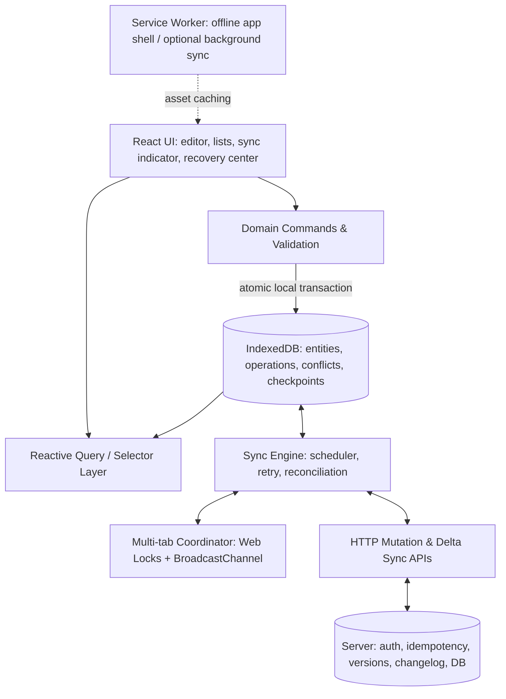
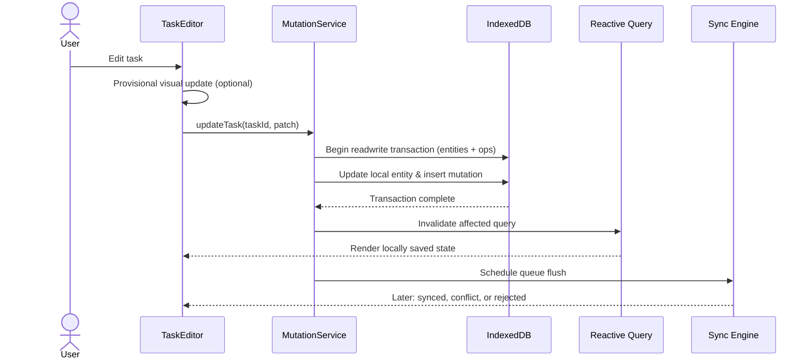
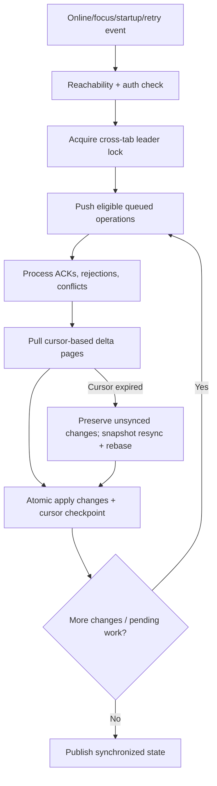

> **Editable diagram:** [Open in Excalidraw](https://excalidraw.com/#room=1ba838a8dfe45711f3b6,TSNr7MENfkeOLZO6bldpew)


> **Core principle:** Treat the local database as the application's durable read/write interface. The server remains authoritative for shared state, authorization, and cross-device synchronization. Never claim an edit has synced until it is acknowledged and reconciled.

## 0. Architecture tradeoffs — lead with these decisions

Before drawing components, explain what you optimize and where complexity belongs.

| Decision            | Option A                        | Option B                                               | Recommendation / reason                                        | Revisit when                                      |
| ------------------- | ------------------------------- | ------------------------------------------------------ | -------------------------------------------------------------- | ------------------------------------------------- |
| State source        | Network-first API/cache         | **Local-first IndexedDB**                              | Local DB supports offline reads/writes and reload durability   | Highly regulated or strictly online workflows     |
| Write path          | Write through to server         | **Local commit + durable queue**                       | Interaction stays usable without network; queue records intent | Operations require immediate global validation    |
| Optimism            | Update memory before storage    | **Persist atomically, then confirm local save**        | Strong semantics; optionally show provisional UI before commit | Sub-50-ms input response is essential             |
| Data storage        | localStorage                    | **IndexedDB**                                          | Transactions, structured records, indexes, async access        | Tiny preference-only apps                         |
| Sync model          | Full dataset refresh            | **Cursor-based delta + snapshot fallback**             | Bandwidth efficient; safely handles long offline gaps          | Very small datasets                               |
| Push delivery       | WebSocket as source of truth    | **Push as invalidation + durable pull**                | Reconnect can recover missed events                            | True collaborative operations need live transport |
| Conflict handling   | Last-write-wins globally        | **Domain-specific merge policies**                     | Preserve intent and avoid silent overwrite                     | All data is low-risk and replaceable              |
| Versioning          | Timestamps                      | **Server revisions + local revision + base version**   | Avoid client clock assumptions and support OCC                 | Distributed multi-master collaboration            |
| Queue scheduling    | Global FIFO                     | **Per-entity order + independent parallelism**         | Maintain dependencies without serializing unrelated work       | MVP can start with FIFO                           |
| Multi-tab           | Each tab syncs                  | **One coordinator + BroadcastChannel**                 | Reduce duplicates and race conditions                          | Unsupported Web Locks require lease fallback      |
| Runtime             | Service Worker does all syncing | **Page sync + opportunistic SW**                       | SW can be terminated; foreground sync is dependable            | Background API support improves                   |
| Generic vs specific | One global sync algorithm       | **Common infrastructure + per-domain conflict policy** | Reusable platform without incorrect generic merges             | Single-resource prototype                         |

### Explicit invariants

1. **Local edit durability:** Entity update and queued mutation commit within one IndexedDB transaction; do not show “saved on device” before commit.
2. **Idempotent server effect:** Retry can resend an operation; the server applies its logical effect once per idempotency key within the retention contract.
3. **No stale ACK overwrite:** Server responses never erase newer unacknowledged local revisions.
4. **Truthful UX:** `locally saved`, `queued`, `syncing`, `synced`, `conflict`, and `rejected` are distinct states.
5. **Recovery over deletion:** Snapshot refresh, migration, logout, or revocation must follow explicit policies for unsynced edits.

### State the strategic choice

“I am choosing IndexedDB plus a durable mutation journal and a cursor-based sync protocol. This adds client complexity but makes reads and writes usable offline. I will preserve server authority through version checks, authorization, idempotency, and domain-specific conflict rules.”

---

## 1. Requirements and assumptions

### Functional

| Priority | Requirement                | Details                                                          |
| -------- | -------------------------- | ---------------------------------------------------------------- |
| P0       | Offline read               | Previously synchronized projects/tasks available without network |
| P0       | Offline create/edit/delete | Capture user intent locally and show changes immediately         |
| P0       | Refresh survival           | Queue and entity state persist across tab/browser restart        |
| P0       | Reconnect sync             | Retry pending mutations and pull remote changes                  |
| P0       | Conflict handling          | Automatic safe merges; user resolution when ambiguous            |
| P0       | Recovery interface         | Inspect, retry, resolve, copy/export where permitted             |
| P1       | Multi-device               | Eventually converge with accepted remote state                   |
| P1       | Multi-tab                  | Coordinated queue flush and local query invalidation             |
| P1       | Offline search             | Indexed local search for synchronized records                    |
| P2       | Attachments                | Resumable uploads and quota-aware caches                         |

### Non-functional (proposed SLOs, not browser guarantees)

| Category       | Target and constraint                                                                 |
| -------------- | ------------------------------------------------------------------------------------- |
| Interaction    | Optimistic perceived response under 100 ms for normal edits                           |
| Local read     | Indexed query p95 under 50 ms under a tested dataset                                  |
| Durability     | No locally confirmed save without successful durable transaction                      |
| Sync           | Initiate within ~5 seconds of reachable reconnect; backlog time is workload dependent |
| Scale          | 10k–100k local entities, thousands of queued operations                               |
| Offline window | Support 7–30 days; expired cursor triggers safe full reconciliation                   |
| Consistency    | Eventual convergence; no global ordering assumption without server contract           |
| Security       | Server revalidates every mutation and access scope                                    |
| Accessibility  | Screen-reader status announcements, keyboard-operable conflict UI                     |

**Clarifying questions:** Multi-user editing? Multiple devices? Offline window? Strictly server-validated actions? Dataset size? Attachment sizes? Security constraints? Can offline state be stored on shared devices?

**Example domain:** Projects and tasks, with offline editing and concurrent multi-device usage; not real-time collaborative cursor editing or offline financial settlement.

---

## 2. High-level design



### Component responsibility and data binding

| Component             | Responsibility                                 | Reads / writes                            |
| --------------------- | ---------------------------------------------- | ----------------------------------------- |
| `TaskEditor`          | Inputs, validation feedback, editing state     | Calls `TaskCommands.update`               |
| `TaskList`            | Virtualized/reactive list                      | `useTasks(projectId, filter)`             |
| `TaskRepository`      | IndexedDB access and indexed queries           | Durable entities                          |
| `MutationService`     | Atomic entity update + queue append            | Entities + operations in one transaction  |
| `SyncEngine`          | Push, pull, retry, rebase, checkpoints         | Operations, entities, checkpoints         |
| `ConflictResolver`    | Domain merge policy and manual fallback        | Conflicts and new mutations               |
| `ConnectivityManager` | Online signals plus actual server reachability | Scheduling hints                          |
| `SyncCoordinator`     | One active cross-tab sync leader               | Web Locks + channel, stale lease recovery |
| `RecoveryCenter`      | Pending, rejected, conflicting changes         | Query derived status                      |
| `MigrationManager`    | Schema and operation payload upgrades          | IndexedDB `versionchange`                 |

React owns **ephemeral editor state**. IndexedDB owns **durable domain state**. A reactive query adapter publishes stable snapshots (e.g., Dexie live queries or `useSyncExternalStore` with cached snapshots), scoped to a project/page rather than loading the entire DB into memory.

---

## 3. Data model and API contracts

```ts
interface LocalRecord<T> {
  id: string;
  data: T;
  serverVersion: number; // last accepted server version
  localRevision: number; // advances for local unacknowledged edits
  deleted: boolean;
}

type OpState = 'pending' | 'inflight' | 'conflict' | 'rejected';
interface PendingOperation {
  id: string; // stable idempotency key
  schemaVersion: number;
  entityType: 'task' | 'project';
  entityId: string;
  type: 'CREATE' | 'PATCH' | 'DELETE';
  patch: Record<string, unknown>; // user intent, not whole stale entity
  baseVersion: number | null;
  dependsOn: string[];
  createdAt: number;
  attempts: number;
  nextRetryAt?: number;
  state: OpState;
  lastError?: string;
}

interface SyncCheckpoint {
  scopeId: string;
  cursor: string | null; // server-issued opaque token
  protocolVersion: number;
  lastSuccessfulSyncAt?: number;
}

interface Conflict<T> {
  id: string;
  entityId: string;
  base: T;
  local: T;
  remote: T;
  fields: string[];
  state: 'unresolved' | 'resolved';
}
```

### REST sync interface

```http
POST /api/sync/mutations
Content-Type: application/json
```

```json
{
  "clientId": "device-a",
  "operations": [
    {
      "operationId": "op-123",
      "entityId": "task-456",
      "type": "PATCH",
      "baseVersion": 8,
      "changes": { "completed": true }
    }
  ]
}
```

```json
{
  "results": [
    {
      "operationId": "op-123",
      "status": "applied",
      "serverVersion": 9
    }
  ]
}
```

```http
GET /api/sync/changes?scopeId=project-1&cursor=opaque&limit=500
```

```json
{
  "changes": [
    { "entityId": "task-456", "type": "UPSERT", "version": 9, "entity": { "completed": true } },
    { "entityId": "task-200", "type": "DELETE", "version": 12 }
  ],
  "nextCursor": "opaque-next",
  "hasMore": false
}
```

Server contract: authenticate and authorize each mutation; check concurrency versions; atomically store domain mutation + idempotency outcome; return per-operation acceptance/rejection; expose ordered, cursor-consistent change pages and tombstones; signal expired cursors (e.g., `410 Gone`). The server must define changelog retention, consistency scope, and batch partial-failure semantics.

---

## 4. Atomic local mutations + optimistic rendering



**Important implementation detail:** No unawaited network call inside the IndexedDB transaction. Use a transaction-aware IndexedDB library (or request/event flow); the entity change and operation insertion must commit together. If persistence fails, do not show “saved on this device.” Keep provisional form input available and offer retry/copy/export.

### Acknowledgment race

`Op X` is in flight; user makes `Op Y`; ACK for X arrives. The server response can advance the confirmed base, **but cannot replace the projection containing Y**. Maintain confirmed base plus pending operation overlay, or rebase/replay pending operations after applying remote changes.

---

## 5. Operation queue, retries, and idempotency

```mermaid
stateDiagram-v2
  [*] --> Pending
  Pending --> Inflight: Eligible; dependencies satisfied
  Inflight --> Acknowledged: Server accepted
  Inflight --> Pending: Retryable timeout, 429, 5xx
  Inflight --> Conflict: Version conflict
  Inflight --> Rejected: Permanent validation/auth failure
  Conflict --> Pending: Resolve / rebase as new op
  Acknowledged --> [*]: Reconciled and removed
```



**Ordering:** Start with FIFO for an MVP. At scale, guarantee per-entity order and dependency edges; flush unrelated entities concurrently with bounded concurrency. A create must succeed before dependent updates if the server cannot accept client-generated stable IDs.

**Retry:** Exponential backoff + jitter; honor `Retry-After`; cap concurrency; restore stale `inflight` items after browser/tab crash using leases or safe retry. `navigator.onLine` is only a hint, not a guarantee of API reachability.

**Ambiguous ACK:** Server commits, response is lost, client retries `operationId`. The server must dedupe and return the prior result. Network is at-least-once; server logic is effectively once-per-key under its retention contract.

**Error policy:** Timeout/5xx → retry; 429 → server-directed backoff; 401 → refresh/login; 403 → reject and apply data-security policy; 409 → conflict/rebase; malformed 400 → permanent rejection until correction.

---

## 6. Reconnect, push/pull and catch-up



Push-before-pull is one reasonable simple sequence; pull-before-push may reduce conflicts, depending on semantics. Whatever the order, define atomic checkpoint advancement: do not advance the cursor unless all associated page changes are durably applied.

**Catch-up after weeks offline:** Pull bounded batches, use opaque server cursors, apply tombstones, rebase local operations, handle permission changes and expired cursor. Never clear IndexedDB as a shortcut when unsynced work exists.

**Push notifications:** SSE/WebSocket announces _something changed_; delta HTTP endpoint remains the recovery source of truth after missed events.

---

## 7. Conflict resolution: domain policy beats generic LWW

| Policy                      | Works well for                                          | Main risk                            |
| --------------------------- | ------------------------------------------------------- | ------------------------------------ |
| Server wins                 | Authoritative settings and permission-controlled fields | Discards local intent                |
| Client wins                 | Narrow user-owned fields                                | Overwrites remote work               |
| Last-write-wins             | Low-stakes replaceable values                           | Clock/order ambiguity and lost edits |
| Field-level three-way merge | Structured task records                                 | Nested data and delete semantics     |
| Append-only                 | Comments, audit events                                  | Ordering and deduplication           |
| CRDT                        | High-concurrency collaborative document data            | Metadata/implementation costs        |
| OT                          | Centralized collaborative rich-text editing             | Transform logic complexity           |
| Manual merge                | High-value same-field conflicts                         | User interruption                    |

### Three-way merge rule

For each independent field compare common `base`, `local`, and `remote`:

- `local == base` → remote wins.
- `remote == base` → local wins.
- `local == remote` → either.
- Otherwise → conflict record and explicit policy.

```ts
function mergeField<T>(base: T, local: T, remote: T) {
  if (Object.is(local, base)) return { value: remote, conflict: false };
  if (Object.is(remote, base)) return { value: local, conflict: false };
  if (Object.is(local, remote)) return { value: local, conflict: false };
  return { value: local, conflict: true, remote };
}
```

This is deliberately scalar/shallow. For nested objects, arrays, moves, counters, and delete-vs-edit races use domain-specific semantics. Resolve against the latest server version: resolving a conflict produces a new version-checked operation, not a blind overwrite.

---

## 8. IndexedDB, storage and rendering

| Storage          | Role                                                   | Caveat                                      |
| ---------------- | ------------------------------------------------------ | ------------------------------------------- |
| React memory     | Ephemeral draft and visible view                       | Lost at restart                             |
| IndexedDB        | Entities, queue, conflict records, checkpoints         | Browser quota, schema migrations            |
| Cache Storage    | Static assets and offline app shell                    | Must version and invalidate correctly       |
| Service Worker   | Intercept app shell requests; optional background sync | Browser may terminate worker                |
| OPFS / Blob data | Large attachments                                      | Quota and lifecycle complexities            |
| localStorage     | Small preferences                                      | Synchronous and not suited to durable queue |

**Indexes:** `tasks(projectId, updatedAt)`, `operations(state, nextRetryAt)`, `operations(entityId)`. Use indexed pagination and list virtualization; do not load 100k records into React. A reactive IndexedDB query layer emits scoped updates and stable snapshots for `useSyncExternalStore`.

**Quota policy:** Never auto-evict unsynced operations, local drafts, or unresolved conflicts; reclaim derived thumbnails, historical query caches, and safely re-downloadable data first. `navigator.storage.estimate()` is advisory, and `navigator.storage.persist()` may be denied. Provide recovery/export for storage failure.

**Migration policy:** Version DB schema and queued operation payloads. Old open tabs can block IndexedDB upgrades. Prefer expand → backfill incrementally → migrate readers → contract. Never wipe unsynced operations in a migration or rollback.

---

## 9. Multi-tab, lifecycle, security and UX

### Cross-tab orchestration

Web Locks elect one flush coordinator where available. BroadcastChannel distributes invalidation hints; tabs reread IndexedDB on visibility/focus because channel messages may be missed. Handle a crashed leader by recovering stale inflight queue entries. Treat idempotency as the final protection against duplicate delivery.

### Offline boot and Service Worker

Cache the versioned app shell so a returning user can load HTML/JS/CSS offline. Never assume a Service Worker runs indefinitely. Page-based sync provides the primary execution path; optional SW background sync is best effort and browser support varies.

### User-facing recovery UX

| State                       | User-facing language / action                      |
| --------------------------- | -------------------------------------------------- |
| Form change not persisted   | “Saving on this device…”                           |
| IndexedDB commit done       | “Saved on this device · waiting to sync”           |
| Network request running     | “Syncing…”                                         |
| Server ACK + reconciliation | “Synced across devices”                            |
| Conflict                    | “Needs your review” → local/remote/base comparison |
| Permanent validation error  | Show rejected edit and edit/retry path             |
| Auth expired                | Sign in again; preserve permitted pending edits    |
| Storage full                | No false success; copy/export/recover              |

Design a **Recovery Center** listing pending, rejected, and conflicting operations with retry, compare-and-merge, and policy-permitted export. Use keyboard-accessible dialogs and concise `aria-live` status announcements rather than repeated noisy updates.

### Security

Server validates every mutation and its authorization; client cache and offline permission claims are not authority. Prevent cross-account data leaks by scoping local DB usage. Address XSS, CSP, retention, logout, revoked permissions, stolen devices, and sensitive offline data policy. Client-side encryption only helps with a defined threat model and key management; it is not a universal fix for XSS.

---

## 10. Failure matrix — what happens when things go wrong?

| Fault                                   | Correct recovery                                               |
| --------------------------------------- | -------------------------------------------------------------- |
| Crash before local transaction commit   | No partial entity/queue mutation                               |
| Crash after local commit                | Replay durable pending operation                               |
| Server commit, ACK lost                 | Retry same idempotency key                                     |
| New local edit arrives during ACK       | Advance confirmed base, reapply newer pending intent           |
| Two tabs sync concurrently              | Leader lock where possible + idempotent backend                |
| Delete races remote edit                | Tombstone + domain conflict policy                             |
| Server cursor expired                   | Preserve pending edits, snapshot refresh, rebase               |
| Schema changes while operations pending | Compatible migration of data and operation payloads            |
| Server permission revoked               | Reject operation; follow data-retention/security policy        |
| Device storage exhausted                | Stop claiming local durability; actionable recovery            |
| App shell unavailable offline           | SW cached app shell with controlled asset versioning           |
| Sync worker terminated                  | Pending durable operations survive; resume on next opportunity |

---

## 11. Observability, testing and rollout

**Metrics:** queue depth, median/p95 sync lag, operation retry count, conflict rate, unrecoverable rejection rate, DB transaction failure/latency, cursor age, reconnect catch-up duration, storage pressure, failed migrations, lost-edit incidents. Use stable operation IDs in client logs and server tracing, avoid logging sensitive payloads, and bound offline telemetry buffers.

**Testing pyramid:**

1. Unit: state-machine transitions, backoff, merge rules, dependency graphs, serialization versions.
2. IndexedDB integration: atomic commit/abort, reload survival, migration, quota errors.
3. Sync integration: ambiguous ACK, 409, permission revocation, cursor expiration, delayed and reordered responses.
4. Browser E2E: offline/online transitions, repeated rapid edits, browser restart, multi-tab race, SW upgrade, low storage.
5. Fault injection: crash after every critical boundary; assert invariants and eventual convergence.

**Rollout:** offline reads → durable write journal + server idempotency → multi-device deltas + conflict recovery → attachments/collaboration. Feature flags must preserve the ability to synchronize existing queued edits even if new offline writes are disabled.

---

## 12. Staff-level interviewer Q&A

**Q: Why isn't a persisted React Query cache sufficient?**  
A: It caches responses and may persist mutations, but our correctness contract requires an explicit durable per-domain operation journal, atomic local entity + operation writes, dependency semantics, version-aware rebase, conflict records, and controlled recovery. A query library can complement this architecture.

**Q: How do you avoid duplicated operations after a timeout?**  
A: Stable client-generated operation IDs and atomic server-side deduplication. Delivery is at least once; logical application is idempotent.

**Q: What if the server response overwrites a second offline edit?**  
A: Don't replace the optimistic projection. Track confirmed base plus unacknowledged operations, and reapply/rebase newer revisions.

**Q: Why not CRDT everywhere?**  
A: Conflict semantics are domain-specific. A task checkbox, server-owned permission, financial operation, and multi-user rich text have different invariants. CRDTs are useful for certain collaborative data but impose costs and don't supersede authorization rules.

**Q: Is `navigator.onLine` trustworthy?**  
A: No. It triggers attempted sync; use authenticated API reachability and classify failures.

**Q: How do you guarantee progress if browser background work is throttled?**  
A: No guarantee of always-on background execution. Persist the queue and resume on app start, focus, reconnect, or supported background sync opportunities. Clearly communicate pending state.

**Q: How do you handle 100k records?**  
A: Indexed queries and compound indexes, pagination, virtualization, selective hydration, batching, no full-store React state.

**Q: What happens after 90 days offline?**  
A: Cursor may expire. Reconcile from authoritative snapshot without deleting pending operations; rebuild projection and resume deltas.

**Q: How do you coordinate across teams?**  
A: Publish a sync platform with mutation envelope/version/idempotency rules, domain conflict policy interface, observability/SLOs, migration guidelines, and ownership contracts. Start with one domain and expand gradually.

---

## 13. Interview flow: 45 minutes

| Time      | Focus                                                                       |
| --------- | --------------------------------------------------------------------------- |
| 0–5 min   | Clarify offline scope, users/devices, consistency, security and data volume |
| 5–10 min  | **Architecture tradeoffs and five invariants**                              |
| 10–15 min | Component architecture, data model, reactive query binding                  |
| 15–23 min | Atomic local write, operation queue, ACK and idempotency                    |
| 23–31 min | Push/pull sync, reconnect, cursor recovery, multi-tab                       |
| 31–38 min | Domain conflicts, three-way merge, versioning                               |
| 38–43 min | Security, quota, migration, recovery UX, observability                      |
| 43–45 min | Summarize tradeoffs and safe rollout                                        |

### Two-minute closing narrative

> I chose local-first IndexedDB with an atomic mutation journal because offline capability is a write-path correctness problem, not just an API caching problem. React renders reactive local queries, while a framework-independent sync engine sends durable operations with stable idempotency keys and pulls server changes through opaque cursors. Server revisions protect shared state, local revisions protect newer optimistic intent, and domain-specific merge policies distinguish safe automatic convergence from conflicts that require user review. The design recovers from lost acknowledgments, tab crashes, cursor expiration, schema changes, and storage failures, and surfaces precise saved/synced/rejected states to users. I would validate the invariants with fault-injection tests and roll out the shared infrastructure incrementally across product teams.
