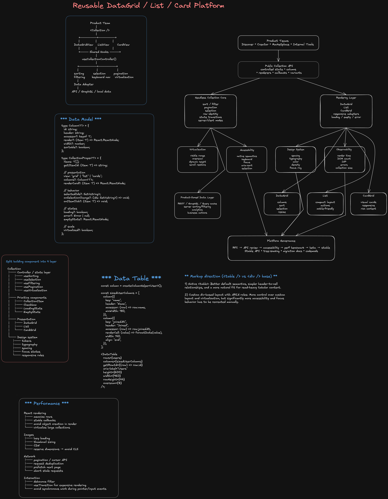

> **Editable diagram:** [Open in Excalidraw](https://excalidraw.com/#room=fe7266b2d3d515d8e2d2,2stgswol55jDdlMNUPYbow)



# Reusable DataGrid / List / Card System

## Prompt

Design a reusable DataGrid / List / Card system for many teams.

The system should support:

- multiple product surfaces
- large datasets
- sorting, filtering, pagination, selection
- virtualization
- custom renderers
- responsive behavior
- accessibility
- consistent styling
- extensibility without turning into one giant component

---

# 1. Clarify Requirements

Ask:

- Is this consumer-facing, internal tooling, or both?
- How many rows/items?
- Client-side or server-side sorting/filtering?
- Pagination or infinite scrolling?
- Multi-select?
- Inline editing?
- Pinned/resizable columns?
- Mobile support?
- SSR?
- Accessibility requirements?
- Can product teams provide custom cells/cards?

Important distinction:

```txt
100 rows != 100,000 rows
```

At large scale, server-side data operations and virtualization become mandatory.

---

# 2. Core Architecture

Do not build three unrelated systems.

```txt
Shared Collection Model
        |
        +--> Shared behavior
        |     sort
        |     filter
        |     pagination
        |     selection
        |     virtualization
        |
        +--> Renderer
              |
              +--> DataGrid
              +--> List
              +--> CardGrid
```

Separate:

```txt
Data
Behavior
Rendering
Styling
```

---

# 3. Platform Ownership vs Product Ownership

## Platform owns

- selection semantics
- sorting state
- filtering contracts
- pagination state
- virtualization
- keyboard behavior
- accessibility
- loading / empty / error states
- design tokens
- performance constraints

## Product team owns

- data fetching
- business-specific actions
- analytics
- business filters
- custom cells/cards
- domain-specific API calls

The reusable library should not know how games or marketplace items are fetched.

---

# 4. Headless Core

Prefer a headless controller:

```tsx
const collection = useCollection({
  items,
  getRowId,
  sort,
  filter,
  selection,
});
```

Then render it:

```tsx
<DataGrid collection={collection} columns={columns} />
```

or:

```tsx
<CardGrid collection={collection} renderCard={renderGameCard} />
```

This avoids duplicating behavior across Grid/List/Card.

---

# 5. Why Headless + Opinionated Renderers

Headless core gives:

- flexibility
- shared state model
- shared behavior
- easier testing

Opinionated default renderers give:

- consistency
- accessibility defaults
- faster adoption
- standard design

Recommended approach:

```txt
headless behavior core
+
opinionated default renderers
```

---

# 6. Data Model

```ts
type RowId = string;

type SortState = {
  key: string;
  direction: 'asc' | 'desc';
};

type SelectionState =
  | { mode: 'none' }
  | { mode: 'single'; selectedId?: RowId }
  | { mode: 'multiple'; selectedIds: Set<RowId> };
```

---

# 7. Column Definition

```ts
type ColumnDefinition<T> = {
  id: string;
  header: string;

  accessor?: (item: T) => unknown;
  cell?: (item: T) => React.ReactNode;

  sortable?: boolean;

  width?: number;
  minWidth?: number;
  maxWidth?: number;

  align?: 'left' | 'center' | 'right';
};
```

Example:

```tsx
const columns = [
  {
    id: 'name',
    header: 'Game',
    accessor: (game) => game.name,
    cell: (game) => <GameName name={game.name} thumbnail={game.thumbnail} />,
    sortable: true,
  },
  {
    id: 'players',
    header: 'Players',
    accessor: (game) => game.playerCount,
    sortable: true,
    align: 'right',
  },
];
```

---

# 8. Public API

```tsx
<DataCollection
  data={games}
  getRowId={(game) => game.id}
  mode="grid"
  columns={columns}
  sort={sort}
  onSortChange={setSort}
  selection={selection}
  onSelectionChange={setSelection}
/>
```

For more advanced teams:

```tsx
const collection = useCollection(...);

return (
  <DataGrid
    collection={collection}
    columns={columns}
  />
);
```

---

# 9. Controlled State

Prefer controlled state:

```tsx
<DataGrid sort={sort} onSortChange={setSort} />
```

Why?

Teams may need to:

- synchronize state with URL
- persist filters
- trigger server requests
- record analytics
- share state with sibling components

Optional uncontrolled defaults can still be supported:

```tsx
<DataGrid
  defaultSort={{
    key: 'players',
    direction: 'desc',
  }}
/>
```

---

# 10. Client vs Server Sorting

## Client-side

Best when:

```txt
small dataset
all data already loaded
instant interaction
```

## Server-side

Best when:

```txt
large dataset
millions of records
authoritative ranking
complex filters
```

The grid emits intent:

```tsx
onSortChange(nextSort);
```

The consuming app decides whether to sort locally or refetch.

---

# 11. Pagination

Support:

```txt
page-based
cursor-based
infinite scrolling
```

For large changing datasets, prefer cursor pagination.

```ts
type PaginationState = {
  cursor?: string;
  pageSize: number;
};
```

The component should expose:

```tsx
onLoadMore();
```

and not own network calls.

---

# 12. Virtualization

Without virtualization:

```txt
10,000 rows
=
10,000 React components
=
large DOM
=
slow layout
=
high memory
```

With virtualization:

```txt
10,000 records in data

DOM:
only visible rows + overscan
```

Architecture:

```txt
Scroll Container
      |
      v
Virtualizer
      |
      +--> visible range
      +--> overscan
      |
      v
Rendered Rows
```

Possible API:

```tsx
<DataGrid
  virtualization={{
    enabled: true,
    estimatedRowHeight: 48,
    overscan: 8,
  }}
/>
```

---

# 13. Virtualization Tradeoffs

Virtualization complicates:

- keyboard focus
- accessibility
- dynamic heights
- browser find
- printing
- scroll restoration

I would not blindly enable it for every table.

Possible policy:

```txt
< 100 rows:
normal rendering

>= 100 rows:
consider virtualization

large/infinite:
virtualization expected
```

---

# 14. Selection

```tsx
<DataGrid selectionMode="multiple" selectedIds={selectedIds} onSelectionChange={setSelectedIds} />
```

Support:

- click
- checkbox
- keyboard
- shift-select
- select all
- deselect all

---

# 15. Select All at Scale

Do not store millions of IDs.

Bad:

```txt
selectedIds = 2,000,000 IDs
```

Better:

```ts
type Selection =
  | {
      mode: 'explicit';
      selectedIds: Set<string>;
    }
  | {
      mode: 'all';
      excludedIds: Set<string>;
    };
```

If user selects all 2 million rows but deselects 3:

```txt
mode = all
excludedIds = 3 IDs
```

This is an important Staff-level design point.

---

# 16. Filtering

Composable toolbar:

```tsx
<CollectionToolbar>
  <SearchInput />
  <FilterMenu />
  <SortMenu />
</CollectionToolbar>
```

Shared state:

```ts
type FilterState = {
  query?: string;
  status?: string[];
  creator?: string[];
};
```

The component should not care whether filtering is local or remote.

---

# 17. Search

Remote search:

```tsx
useEffect(() => {
  const controller = new AbortController();

  const timer = setTimeout(() => {
    search(query, controller.signal);
  }, 300);

  return () => {
    clearTimeout(timer);
    controller.abort();
  };
}, [query]);
```

Use:

- debounce
- request cancellation
- stale response protection

---

# 18. Grid / List / Card Relationship

Same collection data:

```txt
Collection State
      |
      +----------+----------+
      |          |          |
      v          v          v
   DataGrid     List      CardGrid
```

Keep shared:

- row identity
- selection
- sort
- filter
- pagination
- collection state

Keep separate:

- DOM structure
- visual layout
- semantics
- renderer-specific keyboard behavior

Do not force false abstraction.

---

# 19. Responsive Design

Desktop:

```txt
| Thumbnail | Name | Creator | Players | Status |
```

Mobile:

```txt
+----------------------+
| Thumbnail            |
| Game Name            |
| 80K players          |
| Creator              |
+----------------------+
```

Use the same collection controller:

```tsx
return isMobile ? <CardGrid collection={collection} /> : <DataGrid collection={collection} />;
```

---

# 20. Accessibility

Prefer native HTML when possible.

For normal tables:

```html
<table>
  <thead></thead>
  <tbody></tbody>
</table>
```

For true interactive spreadsheet-style grids:

```txt
role="grid"
role="row"
role="columnheader"
role="gridcell"
```

Important:

- keyboard navigation
- focus management
- visible focus ring
- `aria-sort`
- semantic buttons/links
- screen-reader announcements
- selected-row semantics

Example:

```tsx
<th aria-sort="ascending">Name</th>
```

---

# 21. Keyboard Navigation

Only implement spreadsheet-style navigation if needed.

Possible behavior:

```txt
Arrow Up / Down
Arrow Left / Right
Home / End
Space = select
Enter = activate
```

Do not add complexity for a read-only table that only contains links/buttons.

---

# 22. Styling

Use design tokens:

```txt
spacing
color
typography
border
radius
focus
density
```

Example:

```css
.dataGrid {
  --row-height: 48px;
  --border-color: var(--color-border-subtle);
  --focus-ring: var(--color-focus);
}
```

Prefer controlled variants:

```tsx
<DataGrid density="compact" />
<DataGrid density="comfortable" />
```

Avoid dozens of arbitrary style props.

---

# 23. Composition Over Boolean Props

Bad:

```tsx
<DataGrid isCompact useBlueHeader teamXMode enableFancyRows specialMobileBehavior />
```

This becomes impossible to maintain.

Prefer:

```tsx
<DataGrid
  renderEmpty={...}
  renderLoading={...}
  renderRow={...}
/>
```

or slots:

```tsx
<DataGrid
  slots={{
    header: CustomHeader,
    empty: EmptyGamesState,
    rowActions: GameActions,
  }}
/>
```

---

# 24. Loading / Empty / Error States

These should be built in:

```tsx
<DataGrid
  loading={isLoading}
  error={error}
  renderLoading={() => <SkeletonRows />}
  renderEmpty={() => <EmptyState />}
  renderError={() => <RetryState />}
/>
```

This avoids every team inventing inconsistent behavior.

---

# 25. Performance

Main risks:

```txt
too many DOM nodes
too many React renders
expensive cell renderers
large context updates
unbounded cached pages
heavy column calculations
```

Mitigations:

- virtualization
- stable row keys
- localize state
- memoize only after profiling
- avoid giant shared context
- selectors
- lazy-render expensive details
- bound caches

---

# 26. Bundle Size

Avoid forcing every consumer to download every feature.

Bad:

```txt
Grid user downloads:
drag/drop
editing
export
charts
virtualization
resizing
everything
```

Prefer tree-shakeable entry points:

```ts
import { DataGrid } from '@platform/collection/grid';
import { VirtualizedRows } from '@platform/collection/virtualization';
```

Optional features should be lazy or modular.

---

# 27. Module Structure

```txt
collection/
  core/
    useCollection.ts
    useSort.ts
    useSelection.ts
    usePagination.ts

  grid/
    DataGrid.tsx
    GridHeader.tsx
    GridRow.tsx
    GridCell.tsx

  list/
    List.tsx
    ListItem.tsx

  cards/
    CardGrid.tsx
    Card.tsx

  virtualization/
    useVirtualizer.ts

  accessibility/
    keyboard.ts
    aria.ts

  styles/
    tokens.css
```

---

# 28. Testing

## Unit

- sort behavior
- selection
- pagination
- select-all model
- filter state

## Component

- keyboard navigation
- sorting UI
- focus
- loading state
- error state
- row selection

## Accessibility

- semantic assertions
- axe checks
- keyboard-only flows
- screen-reader smoke tests

## Performance

Benchmark:

```txt
100 rows
1,000 rows
10,000 rows
complex custom cells
rapid filter changes
scroll performance
```

---

# 29. Observability

The shared platform can emit performance telemetry:

```txt
render duration
collection size
visible row count
DOM count
interaction latency
virtualization enabled
errors
```

This helps the platform team find misuse and regressions across products.

---

# 30. API Stability

With many teams, breaking changes are expensive.

Lifecycle:

```txt
experimental
   |
   v
beta
   |
   v
stable
```

Experimental features could include:

```txt
pinned columns
drag and drop
inline editing
```

For breaking migrations:

- codemods
- deprecation warnings
- migration docs
- compatibility window

---

# 31. Governance

New shared features should go through:

```txt
RFC
 |
 v
API review
 |
 v
Accessibility review
 |
 v
Performance benchmark
 |
 v
Beta adoption
 |
 v
Stable
```

Ask:

- Is this broadly reusable?
- Can composition solve it?
- Does it increase bundle size?
- Does it hurt accessibility?
- Does it introduce another state model?

---

# 32. Migration Strategy

Suppose 20 teams already have custom tables.

Do not require a rewrite.

Migration:

```txt
Phase 1:
shared design tokens

Phase 2:
shared primitives

Phase 3:
shared collection hooks

Phase 4:
full DataGrid/List/Card adoption
```

Allow gradual migration.

---

# 33. Example Integration

```tsx
function GamesTable({ games, isLoading }) {
  const [sort, setSort] = useState({
    key: 'players',
    direction: 'desc',
  });

  const [selectedIds, setSelectedIds] = useState(new Set());

  const collection = useCollection({
    items: games,
    getRowId: (game) => game.id,
    sort,
    selection: {
      mode: 'multiple',
      selectedIds,
    },
  });

  return (
    <DataGrid
      collection={collection}
      columns={columns}
      loading={isLoading}
      onSortChange={setSort}
      onSelectionChange={setSelectedIds}
      virtualization={{
        enabled: games.length > 100,
        estimatedRowHeight: 48,
      }}
    />
  );
}
```

---

# 34. Strong Interview Closing

> I would design this as a shared collection platform rather than three independent components. The headless core owns common behavior such as sorting, filtering, selection, pagination, and virtualization, while DataGrid, List, and CardGrid are separate renderers over the same state model. I would keep data fetching and business logic with product teams, use composition instead of hundreds of feature flags, and treat accessibility, bundle size, performance, API stability, and migration tooling as first-class concerns because the real challenge is supporting many teams without creating a brittle platform.

---

# 35. Follow-Up Questions

## Architecture

- Why not build one giant DataGrid?
- What belongs in core vs product code?
- Why headless?
- What should Grid/List/Card share?

## Scale

- What happens at 100,000 rows?
- How do you select all across server pagination?
- How do you handle dynamic row height?
- When should virtualization turn on?

## Accessibility

- Table vs `role="grid"`?
- What happens to focus if a virtualized row unmounts?
- How do keyboard interactions differ for List vs Grid?

## Performance

- How do you prevent every row from re-rendering?
- How do you prevent bundle growth?
- How do you benchmark the component?

## Organization

- How do 50 teams request features?
- How do you prevent team-specific boolean props?
- How do you ship breaking changes?
- How do you migrate legacy tables?
