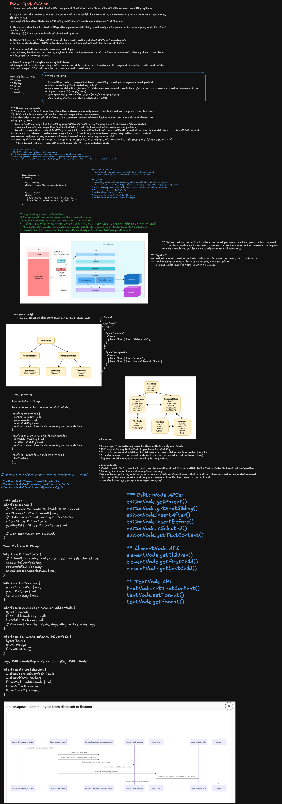

> **Editable diagram:** [Open in Excalidraw](https://excalidraw.com/#room=fdbe1de8df3bbb857d8a,kKeX8Kd9wcx1MpHRg9i72A)



# Frontend System Design: Rich Text Editor

## Interview Prompt

Design a rich-text editor component — the kind that powers a comment box, a CMS content field, or a full document editor like Notion or Google Docs.

The editor should support bold/italic/underline, headings, lists, links, and inline images, with predictable undo/redo, safe paste from external sources (Word, Google Docs, plain text), and a toolbar that reflects the formatting under the cursor at all times.

The Staff-level goal is not to wire up `document.execCommand`. The design should define a document model independent of the DOM, a mapping between that model and `contentEditable`, and explicit strategies for selection, input, history, sanitization, and — optionally — real-time collaboration.

---

# 1. Requirements

## Functional requirements

1. Apply and remove inline marks: bold, italic, underline, strikethrough, code, link.
2. Apply block-level formatting: paragraph, headings, blockquote, ordered/unordered list, code block.
3. Insert and resize inline images and embeds.
4. Undo and redo edits, including formatting changes.
5. Reflect current formatting state in a toolbar (e.g. **B** is highlighted when the cursor is inside bold text).
6. Support keyboard shortcuts (`Cmd+B`, `Cmd+Z`, `Tab` to indent a list item, etc.).
7. Paste from external sources (Word, Google Docs, browser, plain text) without breaking the document or injecting unsafe markup.
8. Serialize the document to a storable format and back (round-trip safe).
9. Export to HTML and/or Markdown.

## Non-functional requirements

### Performance

- Typing latency stays imperceptible (sub-16ms per keystroke) even in a multi-thousand-word document.
- Formatting toolbar updates do not cause a full document re-render.
- Large documents do not degrade paste, undo, or scroll performance.

### Correctness

- The model is always the source of truth; the DOM is a rendering of the model, never the reverse.
- Selection is never silently lost or shifted to the wrong position after a re-render.
- Undo/redo never produces a document that couldn't have been reached by direct editing.

### Compatibility

- Works across Chrome, Safari, Firefox with their differing `contentEditable`/`beforeinput` quirks.
- Supports IME composition (Japanese, Chinese, Korean input) without corrupting text.

### Security

- Pasted HTML is sanitized before entering the document model.
- Rendered output never executes arbitrary scripts or styles from pasted/stored content.

### Accessibility

- Screen readers can navigate and announce document structure (headings, lists, links).
- All formatting actions are reachable by keyboard.

---

# 2. Clarifying Questions

- Is this a single-line/comment-box editor, or a full multi-page document editor?
- Is real-time multi-user collaboration required, or single-user with autosave?
- Which block types are in scope (headings, lists, tables, embeds, code blocks)?
- Does content need to export to Markdown, HTML, or a proprietary format?
- Is mobile/touch input in scope?
- What is the expected maximum document size?

A reasonable interview scope: single-user editing, bold/italic/underline/link marks, paragraph/heading/list/blockquote blocks, inline images, undo/redo, safe paste, and a toolbar — with collaboration and virtualization discussed as extensions.

---

# 3. Why Not `document.execCommand` and Raw `contentEditable`

The naive approach lets the browser own everything:

```html
<div contenteditable="true"></div>
```

```js
document.execCommand('bold');
```

This breaks down quickly:

- `execCommand` is deprecated, inconsistently implemented, and produces different DOM output per browser (`<b>` vs `<strong>`, nested vs merged spans).
- The DOM _is_ the state — there is no independent model to validate, diff, serialize, undo, or collaborate over.
- Pasted HTML lands directly in the document with whatever markup the source produced.
- There is no reliable way to ask "what formatting is currently under the cursor?" without walking the live DOM on every selection change.

The staff-level answer: treat `contentEditable` purely as an **input surface**, and own a separate, serializable **document model** that the DOM is rendered from — the same pattern used by ProseMirror, Slate, Lexical, and Draft.js.

```text
Browser input events (keydown, beforeinput, paste)
                 │
                 ▼
         Editor Command Layer
        (interprets intent, not DOM mutation)
                 │
                 ▼
           Document Model
         (source of truth, immutable)
                 │
                 ▼
        Reconciler / DOM Renderer
       (model → contentEditable DOM)
```

---

# 4. Document Model

## Option A: Node tree (ProseMirror/Slate style)

A recursive tree of typed nodes, where inline formatting is represented as **marks** on text nodes rather than nested DOM elements.

```ts
type Mark = 'bold' | 'italic' | 'underline' | 'strike' | 'code' | { type: 'link'; href: string };

type TextNode = {
  type: 'text';
  text: string;
  marks: Mark[];
};

type BlockNode = {
  type: 'paragraph' | 'heading' | 'blockquote' | 'list-item' | 'code-block';
  attrs?: { level?: 1 | 2 | 3 };
  children: (TextNode | InlineNode)[];
};

type InlineNode = {
  type: 'image' | 'link' | 'mention';
  attrs: Record<string, unknown>;
};

type DocNode = {
  type: 'doc';
  children: BlockNode[];
};
```

Marks living on text nodes (instead of `<b><i>text</i></b>` nesting) is what makes "toggle bold on this partial selection" a clean, order-independent set operation rather than a DOM-splicing problem.

## Option B: Flat delta/operations (Quill style)

A flat sequence of `insert`/`retain`/`delete` operations, each carrying formatting attributes:

```ts
type DeltaOp =
  | { insert: string; attributes?: Record<string, unknown> }
  | { retain: number; attributes?: Record<string, unknown> }
  | { delete: number };

const delta: DeltaOp[] = [
  { insert: 'Hello ' },
  { insert: 'world', attributes: { bold: true } },
  { insert: '\n' },
];
```

## Choosing between them

```text
Node tree
  + natural fit for nested block structure (lists inside quotes, tables)
  + easier to reason about per-node schema/validation
  - more code to diff/patch against the DOM

Flat delta
  + trivially composable and invertible (great for undo, OT-based collab)
  + simple, linear serialization
  - awkward for deeply nested block structures
```

For a document editor with rich block structure (headings, nested lists, tables), a **node tree** is the stronger default. For a comment box or chat composer with only inline formatting, a **flat delta** is simpler and sufficient.

---

# 5. Selection Model

`contentEditable` selection is a native browser `Range` over live DOM nodes — it is not addressable once the model changes and the DOM re-renders. The editor needs its own selection representation expressed in model coordinates:

```ts
type ModelPosition = {
  path: number[]; // path of child indices from the doc root
  offset: number; // character offset within the leaf text node
};

type Selection = {
  anchor: ModelPosition;
  focus: ModelPosition;
};
```

Two mapping functions do all the work:

```ts
function domPositionToModel(node: Node, offset: number): ModelPosition;
function modelPositionToDom(position: ModelPosition): { node: Node; offset: number };
```

Flow on every input:

```text
1. Browser fires selectionchange / beforeinput
2. domPositionToModel() converts the native Range to model coordinates
3. Command layer mutates the model
4. Reconciler patches the DOM
5. modelPositionToDom() converts the (possibly shifted) model selection
   back to a native Range and calls selection.setBaseAndExtent(...)
```

Step 5 is the part naive implementations skip — after any DOM patch, the browser's native selection must be explicitly restored, or the cursor visibly jumps.

---

# 6. Rendering: Model → DOM Reconciliation

The DOM cannot simply be replaced wholesale on every keystroke — that destroys native browser state (IME composition, native selection, spellcheck underlines) and is far too slow for real typing.

```text
New model
    │
    ▼
Diff against previous model (structural, not full DOM diff)
    │
    ▼
Minimal set of DOM patches
 (text content update, add/remove mark span, reorder block)
    │
    ▼
Apply patches
    │
    ▼
Restore native selection from model selection
```

Practical rule: never let a re-render happen _during_ an in-progress native composition (IME) or drag — buffer the model update and flush it on `compositionend`.

```ts
let isComposing = false;

editorRoot.addEventListener('compositionstart', () => {
  isComposing = true;
});

editorRoot.addEventListener('compositionend', () => {
  isComposing = false;
  flushPendingModelUpdate();
});
```

---

# 7. Input Handling

Prefer the `beforeinput` event over `keydown` for text mutations — it fires before the browser touches the DOM and exposes `inputType` (`insertText`, `deleteContentBackward`, `insertFromPaste`, `insertParagraph`, …), which is far more reliable across browsers/IMEs than reconstructing intent from raw keystrokes.

```ts
editorRoot.addEventListener('beforeinput', (event: InputEvent) => {
  event.preventDefault(); // the model owns the mutation, not the browser

  switch (event.inputType) {
    case 'insertText':
      applyInsertText(currentSelection, event.data ?? '');
      break;
    case 'deleteContentBackward':
      applyDeleteBackward(currentSelection);
      break;
    case 'insertParagraph':
      applySplitBlock(currentSelection);
      break;
    case 'insertFromPaste':
      // handled separately — see Paste Handling
      break;
  }
});
```

Reserve `keydown` for shortcuts that don't correspond to a text-mutation `inputType`:

```ts
function handleKeyDown(event: KeyboardEvent) {
  if (isFormattingShortcut(event)) {
    event.preventDefault();
    toggleMark(currentSelection, shortcutToMark(event));
  }
}
```

---

# 8. Formatting Commands and Toolbar State

Commands are the only way the model changes — they encapsulate "what does toggling bold across this selection mean" so the same logic drives the toolbar button, the keyboard shortcut, and any future API/plugin call.

```ts
type Command = (selection: Selection, model: DocNode) => DocNode;

const toggleBold: Command = (selection, model) => {
  const isActive = isMarkActive(model, selection, 'bold');
  return isActive ? removeMark(model, selection, 'bold') : addMark(model, selection, 'bold');
};
```

The toolbar derives its active/inactive state the same way — by asking the model, not the DOM:

```tsx
function BoldButton() {
  const isActive = useEditorSelector((state) => isMarkActive(state.model, state.selection, 'bold'));

  return (
    <ToolbarButton active={isActive} onClick={() => dispatch(toggleBold)}>
      B
    </ToolbarButton>
  );
}
```

This is the same "subscribe to a narrow selector" pattern used for chat/notification UIs elsewhere in this guide set — the toolbar re-renders on selection/formatting change, not on every keystroke of unrelated document content.

---

# 9. Undo / Redo

Model immutability makes undo straightforward: every command produces a new model version, and history is a stack of those versions (or, more memory-efficiently, a stack of inverse operations).

```ts
type HistoryEntry = {
  before: DocNode;
  after: DocNode;
  selectionBefore: Selection;
  selectionAfter: Selection;
};

class HistoryStack {
  private undoStack: HistoryEntry[] = [];
  private redoStack: HistoryEntry[] = [];

  push(entry: HistoryEntry) {
    this.undoStack.push(entry);
    this.redoStack = [];
  }

  undo(): HistoryEntry | undefined {
    const entry = this.undoStack.pop();
    if (entry) this.redoStack.push(entry);
    return entry;
  }

  redo(): HistoryEntry | undefined {
    const entry = this.redoStack.pop();
    if (entry) this.undoStack.push(entry);
    return entry;
  }
}
```

Two correctness details matter at staff level:

- **Coalescing**: don't push one history entry per keystroke — group consecutive `insertText` operations into one entry until a selection change, a pause, or a formatting command breaks the run. Otherwise `Cmd+Z` undoes one character at a time.
- **Selection is part of history**: restoring `after.model` without restoring `selectionAfter` leaves the cursor in the wrong place after undo/redo.

---

# 10. Paste Handling and Sanitization

Pasted content is untrusted input, whether it comes from Word, Google Docs, or a malicious clipboard payload.

```text
paste event
     │
     ▼
read text/html (preferred) or text/plain from clipboardData
     │
     ▼
parse HTML → intermediate DOM (not inserted into the page)
     │
     ▼
sanitize: allowlist tags/attributes, strip <script>/<style>/event handlers,
          drop inline styles that don't map to a supported mark
     │
     ▼
convert sanitized DOM → editor document-model nodes
     │
     ▼
insert into model at current selection
```

```ts
const ALLOWED_TAGS = new Set([
  'p',
  'b',
  'strong',
  'i',
  'em',
  'u',
  'a',
  'ul',
  'ol',
  'li',
  'h1',
  'h2',
  'h3',
]);
const ALLOWED_ATTRS: Record<string, string[]> = { a: ['href'] };

function sanitizeNode(node: Element) {
  if (!ALLOWED_TAGS.has(node.tagName.toLowerCase())) {
    // unwrap: keep children, drop the wrapping element
  }
  for (const attr of Array.from(node.attributes)) {
    if (!ALLOWED_ATTRS[node.tagName.toLowerCase()]?.includes(attr.name)) {
      node.removeAttribute(attr.name);
    }
  }
}
```

Never render pasted or stored HTML directly with `dangerouslySetInnerHTML`/`innerHTML` — always go through the model, which only knows how to render the node/mark types it defines. That constraint is what prevents stored-XSS by construction: the model has no `type: 'script'`.

---

# 11. Collaboration (Extension)

If multiple users can edit the same document concurrently, the model needs a merge strategy.

```text
Operational Transform (OT)
  + smaller wire payloads
  + mature (Google Docs, early collab editors)
  - transform functions are notoriously hard to get correct for every op pair

CRDT (e.g. Yjs)
  + operations commute — no central transform function to prove correct
  + strong offline support, easy peer-to-peer
  - larger memory/metadata overhead per character
```

For most staff-level interviews, naming the tradeoff and picking CRDT (e.g. binding the document model to a Yjs shared type) as the more incrementally adoptable default is enough — go deeper only if the interviewer steers there.

```text
Local edit
    │
    ▼
Apply to local CRDT doc (instant, optimistic)
    │
    ▼
Broadcast update via WebSocket
    │
    ▼
Remote peers merge (commutative — order doesn't matter)
    │
    ▼
Re-render from merged CRDT state
```

---

# 12. Performance

## Avoid full-document re-render

Every keystroke should patch only the affected text node and its mark spans — never re-render the whole tree. This is the same "narrow selector" principle from section 8, applied to rendering instead of just the toolbar.

## Large documents

```text
< 10k words   -> render normally
10k-100k      -> virtualize by block: only mount blocks near the viewport
100k+         -> paginate into sections; load/unload sections on scroll
```

Virtualizing `contentEditable` is harder than virtualizing a read-only list — unmounting a block the user is actively editing must never happen, and native browser find/spellcheck degrade once content leaves the DOM. Treat virtualization as an optimization to reach for after profiling proves it's needed, not a default.

## Debounce expensive side effects

Autosave, collaborative broadcast, and analytics should batch on an idle/interval boundary, not fire per keystroke:

```ts
const scheduleAutosave = debounce((doc: DocNode) => {
  api.saveDocument(doc);
}, 800);
```

---

# 13. Accessibility

`contentEditable` accessibility is one of the hardest parts of this component to get right.

- Render semantic HTML from the model (`<h2>`, `<ul><li>`, `<a href>`) — screen readers rely on real elements, not styled `<div>`s.
- Every formatting action must be reachable via keyboard shortcut, not only mouse/toolbar click.
- Use `aria-label` on icon-only toolbar buttons, and reflect active state with `aria-pressed`.
- Announce structural changes (e.g. "heading applied") through a polite live region rather than relying on the screen reader to infer it from DOM mutation.
- Respect `prefers-reduced-motion` for any caret/selection animation.

---

# 14. Serialization and Export

The model should never leak into storage directly if it needs to remain free to evolve — version the stored schema and provide a migration path.

```ts
type StoredDocument = {
  schemaVersion: 2;
  content: DocNode;
};
```

Export walks the model rather than serializing the DOM:

```ts
function toMarkdown(node: DocNode): string {
  /* ... */
}
function toHtml(node: DocNode): string {
  /* ... */
}
```

Round-trip correctness (`parse(serialize(doc)) === doc`) should be enforced with tests — a lossy export/import cycle silently corrupts user content over time.

---

# 15. Extensibility

Real editors (ProseMirror, Slate, Lexical) expose a plugin architecture so product teams can add node types, marks, and commands without forking the core:

```ts
type EditorPlugin = {
  nodes?: Record<string, NodeSpec>;
  marks?: Record<string, MarkSpec>;
  commands?: Record<string, Command>;
  inputRules?: InputRule[]; // e.g. "## " -> convert to heading
};
```

Keeping the core editor (model, selection, reconciler, history) plugin-agnostic — and shipping bold/italic/lists/images themselves as plugins — is what prevents the core from accumulating every product's one-off requirement.

---

# 16. Testing Strategy

## Unit tests

- Command correctness (`toggleBold` on a partial/multi-block selection).
- Model ↔ DOM position mapping round-trips.
- History coalescing and undo/redo selection restoration.
- Sanitizer allowlist behavior against adversarial HTML.
- Serialization round-trip fidelity.

## Integration tests

- `beforeinput` sequences for typing, IME composition, and backspace across block boundaries.
- Paste from HTML, plain text, and an empty clipboard.
- Toolbar reflects formatting state after arrow-key and mouse selection changes.

## Performance tests

- Keystroke latency in a large (50k+ word) document.
- Paste of a large external HTML document.
- Undo/redo stack depth under sustained typing.

---

# 17. Key Tradeoffs

## `contentEditable` vs canvas-rendered editor

`contentEditable` gets native text input, IME, spellcheck, and accessibility largely for free, at the cost of fighting browser inconsistencies. A canvas-rendered editor (closer to Notion's block-drag interactions in some areas) gives full control over rendering and selection, at the cost of reimplementing text input, IME, and accessibility from scratch. Default to `contentEditable` unless the product specifically needs pixel-level custom rendering.

## Node tree vs flat delta model

Covered in section 4 — node tree for nested block structure, flat delta for simpler inline-only editors.

## OT vs CRDT for collaboration

Covered in section 11 — CRDT is the more incrementally adoptable default for most teams today.

## Virtualize vs render everything

Covered in section 12 — only virtualize after profiling shows the document size actually causing jank.

---

# 18. Interview Walkthrough

A strong 45-minute sequence:

1. Clarify scope: comment box vs full document editor, collaboration, export formats.
2. Define functional and non-functional requirements.
3. Explain why raw `contentEditable`/`execCommand` isn't sufficient; introduce the model-owns-truth principle.
4. Design the document model (node tree vs delta) and justify the choice for the given scope.
5. Cover selection as model coordinates, and the DOM↔model mapping functions.
6. Walk through the render loop: model diff → minimal DOM patch → selection restore.
7. Cover input handling (`beforeinput`, IME composition) and paste sanitization.
8. Cover undo/redo with coalescing and selection-in-history.
9. Touch performance (virtualization threshold) and accessibility (semantic output, keyboard reachability).
10. Close with collaboration as an extension, and the plugin architecture for extensibility.

---

# 19. Staff-Level Closing Answer

> I would treat `contentEditable` purely as an input surface and own an independent, immutable document model as the source of truth — a node tree for nested block structure, or a flat delta for a simpler inline-only editor. Selection is represented in model coordinates, with explicit DOM↔model mapping functions used on every input and every render, so the native cursor is always restored after a patch. Input is driven by `beforeinput`'s `inputType`, with IME composition explicitly buffered until `compositionend`. Rendering patches only the changed nodes rather than replacing the DOM. Undo/redo is a stack of model versions with selection attached and consecutive typing coalesced into single entries. Pasted HTML is parsed into an intermediate DOM, sanitized against an allowlist, and converted into the model — never inserted as raw HTML — which prevents stored-XSS by construction. Collaboration, if required, layers a CRDT under the same model rather than replacing it, and virtualization is added only once profiling shows document size is the actual bottleneck.

---

# References

- ProseMirror guide, "ProseMirror concepts and document model": https://prosemirror.net/docs/guide/
- Yjs documentation, "Shared types and CRDT collaboration": https://docs.yjs.dev/
