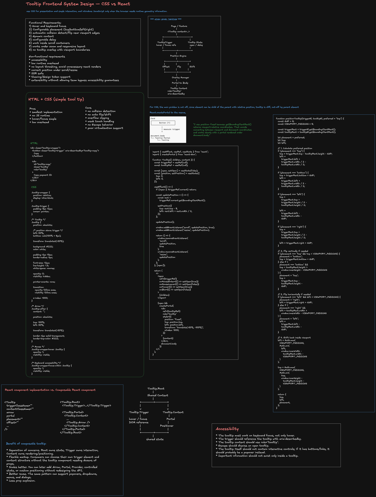

# Frontend System Design: Tooltip

> **Editable diagram:** [Open in Excalidraw](https://excalidraw.com/#room=e50a07c588bdeaec5aec,W_dlFsTe4ZJQxC0qT02H8A)



## 1. Problem Statement

Design a reusable tooltip system for a large web application.

The solution should support:

- Desktop and mobile
- Mouse, keyboard, and touch
- Placement: top / bottom / left / right
- Viewport collision handling
- Nested scroll containers
- `overflow: hidden`
- Large-scale usage such as DataGrid cells
- Accessibility
- Good rendering and runtime performance
- Reuse across many product teams

A good Staff-level framing is:

> Start with the simplest primitive that satisfies the requirements, then introduce JavaScript only when runtime geometry or application state is necessary.

---

# 2. Requirements

## Functional

- Show tooltip on hover
- Show tooltip on keyboard focus
- Support optional delay
- Support top / bottom / left / right placement
- Reposition on scroll / resize
- Flip when there is insufficient space
- Shift when partially outside the viewport
- Close when the trigger disappears
- Support mobile tap where appropriate
- Support controlled and uncontrolled usage
- Support design-system styling and theming

## Non-functional

- Accessible by default
- Minimal DOM overhead
- Avoid unnecessary React rerenders
- Avoid layout thrashing
- SSR-safe
- Reusable across many products
- Easy to test
- Works in virtualized lists / tables
- Consistent z-index / overlay behavior

---

# 3. Two Implementation Levels

## Option A — Pure HTML + CSS

Best for:

- Simple informational hints
- Local positioning
- No viewport-aware collision logic
- Small components
- Low complexity

```html
<div class="tooltip-wrapper">
  <button class="tooltip-trigger" aria-describedby="tooltip-copy">
    Copy
  </button>

  <div id="tooltip-copy" class="tooltip" role="tooltip">
    Copy payment ID
  </div>
</div>
```

```css
.tooltip-wrapper {
  position: relative;
  display: inline-block;
}

.tooltip {
  position: absolute;
  left: 50%;
  bottom: calc(100% + 8px);
  transform: translateX(-50%);

  padding: 6px 10px;
  border-radius: 4px;
  background: #222;
  color: #fff;

  font-size: 12px;
  line-height: 1.3;
  white-space: nowrap;

  opacity: 0;
  visibility: hidden;
  pointer-events: none;

  transition:
    opacity 120ms ease,
    visibility 120ms ease;

  z-index: 1000;
}

.tooltip-wrapper:hover .tooltip,
.tooltip-wrapper:focus-within .tooltip {
  opacity: 1;
  visibility: visible;
}
```

### Advantages

- Small implementation
- No JavaScript bundle cost
- Browser handles hover/focus states
- Easy to understand
- Very low runtime overhead

### Drawbacks

- No real viewport collision detection
- Cannot reliably flip from top to bottom
- Can be clipped by `overflow: hidden`
- No portal rendering
- Harder to support nested scrolling
- Weak touch/mobile interaction model
- No Escape-key behavior
- No shared-tooltip optimization for large tables
- Harder to coordinate virtualized triggers
- Limited delayed open/close state

---

# 4. Why CSS Can Be Cut Off

```text
Card
┌────────────────────────────┐
│ overflow: hidden           │
│                            │
│        [ Button ]          │
│           ▲                │
│       Tooltip              │ ← clipped
└────────────────────────────┘
```

Even a high `z-index` does not escape `overflow: hidden`.

---

# 5. React Solution

Use:

- React state for open/close
- DOM refs for trigger and tooltip
- `getBoundingClientRect()` for geometry
- `createPortal()` to escape clipping
- `position: fixed` to use viewport-relative coordinates
- Flip / shift logic
- Scroll / resize updates

```text
Trigger
  ↓
Open tooltip
  ↓
Measure trigger
  ↓
Measure tooltip
  ↓
Calculate preferred position
  ↓
Collision?
  ├─ No → keep placement
  └─ Yes → flip
  ↓
Shift / clamp inside viewport
  ↓
Portal to document.body
  ↓
Render with position: fixed
```

---

# 6. Why `createPortal`

```jsx
createPortal(
  <TooltipContent />,
  document.body
)
```

Without portal:

```text
Card
└── Button
    └── Tooltip
        ↑ subject to parent's overflow / stacking context
```

With portal:

```text
Card
└── Button

document.body
└── Tooltip
```

Benefits:

- Escape `overflow: hidden`
- Escape many stacking-context issues
- Centralize overlays
- Easier z-index management
- Useful for tooltip, popover, modal, dropdown, toast

> Portal solves DOM placement, not geometry.

---

# 7. Why `position: fixed`

`getBoundingClientRect()` returns coordinates relative to the viewport.

That matches `position: fixed`.

```js
const rect = trigger.getBoundingClientRect();
```

```css
.tooltip {
  position: fixed;
}
```

```text
getBoundingClientRect()
      ↓
viewport coordinates
      ↓
position: fixed
      ↓
same coordinate system
```

With `position: absolute` under `document.body`, you often need:

```js
top = rect.bottom + window.scrollY;
left = rect.left + window.scrollX;
```

---

# 8. Positioning Logic

Core algorithm:

```text
MEASURE
   ↓
PLACE
   ↓
FLIP
   ↓
SHIFT
   ↓
RENDER
```

```js
function positionTooltip(
  triggerEl,
  tooltipEl,
  preferred = "top"
) {
  const GAP = 8;
  const PADDING = 8;

  const trigger =
    triggerEl.getBoundingClientRect();

  const tooltip =
    tooltipEl.getBoundingClientRect();

  let placement = preferred;

  function calculate(side) {
    switch (side) {
      case "top":
        return {
          top:
            trigger.top -
            tooltip.height -
            GAP,

          left:
            trigger.left +
            trigger.width / 2 -
            tooltip.width / 2,
        };

      case "bottom":
        return {
          top: trigger.bottom + GAP,

          left:
            trigger.left +
            trigger.width / 2 -
            tooltip.width / 2,
        };

      case "left":
        return {
          top:
            trigger.top +
            trigger.height / 2 -
            tooltip.height / 2,

          left:
            trigger.left -
            tooltip.width -
            GAP,
        };

      case "right":
        return {
          top:
            trigger.top +
            trigger.height / 2 -
            tooltip.height / 2,

          left: trigger.right + GAP,
        };
    }
  }

  let { top, left } = calculate(placement);

  if (
    placement === "top" &&
    top < PADDING
  ) {
    placement = "bottom";
    ({ top, left } = calculate(placement));
  }

  if (
    placement === "bottom" &&
    top + tooltip.height >
      window.innerHeight - PADDING
  ) {
    placement = "top";
    ({ top, left } = calculate(placement));
  }

  if (
    placement === "left" &&
    left < PADDING
  ) {
    placement = "right";
    ({ top, left } = calculate(placement));
  }

  if (
    placement === "right" &&
    left + tooltip.width >
      window.innerWidth - PADDING
  ) {
    placement = "left";
    ({ top, left } = calculate(placement));
  }

  left = Math.max(
    PADDING,
    Math.min(
      left,
      window.innerWidth -
        tooltip.width -
        PADDING
    )
  );

  top = Math.max(
    PADDING,
    Math.min(
      top,
      window.innerHeight -
        tooltip.height -
        PADDING
    )
  );

  return {
    top,
    left,
    placement,
  };
}
```

---

# 9. Positioning Diagram

```text
           Tooltip
     ┌────────────────┐
     │                │
     └────────────────┘
              ↑
             GAP
              ↑
         ┌─────────┐
         │ Trigger │
         └─────────┘
```

```js
top =
  trigger.top -
  tooltip.height -
  GAP;

left =
  trigger.left +
  trigger.width / 2 -
  tooltip.width / 2;
```

Decision flow:

```text
Preferred = TOP
      ↓
Calculate TOP
      ↓
top < viewport padding?
   ┌───────┴────────┐
   │                │
  No               Yes
   │                │
Keep TOP       Try BOTTOM
                    ↓
              Bottom fits?
               ┌────┴────┐
               │         │
              Yes       No
               │         │
         Use BOTTOM    Clamp
```

---

# 10. React Component Architecture

```text
Tooltip.Root
   |
   +-- shared state
   |
   +-- Tooltip.Trigger
   |      hover / focus / refs
   |
   +-- Tooltip.Content
          portal
          positioning
          role=tooltip
```

Recommended API:

```jsx
<Tooltip.Root delay={300}>
  <Tooltip.Trigger>
    <button>Copy</button>
  </Tooltip.Trigger>

  <Tooltip.Content placement="top">
    Copy payment ID
  </Tooltip.Content>
</Tooltip.Root>
```

---

# 11. Why Composable Components

Benefits:

- Separation of concerns
- Avoids prop explosion
- Consumer controls markup
- Easy to add `Arrow`, `Portal`, or custom content
- Root owns shared behavior
- Trigger owns interaction
- Content owns rendering / positioning
- Easier to reuse infrastructure for popovers / menus
- Easier to enforce accessibility centrally

> Composition gives consumers flexibility without exposing positioning or accessibility implementation details.

---

# 12. Data Model / State

```ts
type TooltipState = {
  open: boolean;
  placement:
    | "top"
    | "bottom"
    | "left"
    | "right";

  coordinates: {
    top: number;
    left: number;
  };
};
```

Keep this local rather than in Redux/global state because it is ephemeral, local, and potentially high-frequency.

---

# 13. Data Binding

```text
Business data
     ↓
Tooltip content

Trigger DOM ref
     ↓
getBoundingClientRect()
     ↓
Positioning engine
     ↓
{top, left, placement}
     ↓
Tooltip.Content
```

---

# 14. Accessibility

Accessibility should be guaranteed by the design system.

Trigger:

```jsx
<button
  aria-describedby={
    open ? tooltipId : undefined
  }
>
  Copy
</button>
```

Tooltip:

```jsx
<div
  id={tooltipId}
  role="tooltip"
>
  Copies the payment identifier
</div>
```

Relationship:

```text
Trigger
aria-describedby="tooltip-123"
        |
        v
Tooltip
id="tooltip-123"
role="tooltip"
```

Required interactions:

- Hover opens tooltip
- Keyboard focus opens tooltip
- Blur closes tooltip
- Escape closes tooltip
- Tooltip should not require mouse-only interaction

Important rule:

> Tooltip content should be supplementary, not essential.

Tooltip vs Popover:

| Tooltip | Popover |
|---|---|
| Supplementary text | Rich content |
| Usually non-interactive | Interactive |
| Hover / focus | Click / explicit action |
| `role="tooltip"` | Popover/dialog/menu semantics |
| Short-lived | Can stay open |
| No focusable controls | Can contain controls |

Reduced motion:

```css
@media (prefers-reduced-motion: reduce) {
  .tooltip {
    transition: none;
  }
}
```

---

# 15. Mobile Design

```text
Desktop:
hover / focus
   ↓
tooltip

Mobile:
tap explicit info icon
   ↓
open
   ↓
tap outside / second tap
   ↓
close
```

Recommended:

- Explicit info icon
- Large enough touch target
- Tap to open
- Tap outside to dismiss
- Recalculate placement after viewport changes
- Close or reposition on scroll
- Avoid long-press as the primary gesture

Content escalation:

```text
short hint
  → tooltip

longer content
  → popover

interactive / large content
  → bottom sheet / modal
```

---

# 16. Rendering Strategy

Avoid 10,000 hidden tooltip nodes for a 10,000-row table.

Better:

```jsx
{open &&
  createPortal(
    <Tooltip.Content />,
    document.body
  )
}
```

For dense UIs:

```text
Cell A ─┐
Cell B ─┤
Cell C ─┤
Cell D ─┤
        ↓
Shared Tooltip Manager
        ↓
One tooltip DOM node
```

---

# 17. Performance

Main principle:

> Do almost nothing while the tooltip is closed.

Closed:

```text
No tooltip DOM
No scroll listener
No resize observer
No geometry measurement
No animation work
```

Open:

```text
Mount one tooltip
Measure trigger/content
Attach only necessary listeners
Batch updates
```

On close:

```text
Remove listeners
Cancel RAF
Remove tooltip DOM
Clear timers
```

Use RAF batching:

```js
let rafId = null;

function scheduleUpdate() {
  if (rafId) return;

  rafId = requestAnimationFrame(() => {
    updatePosition();
    rafId = null;
  });
}
```

Avoid layout thrashing:

```text
READ
trigger.getBoundingClientRect()
tooltip.getBoundingClientRect()

   ↓

CALCULATE

   ↓

WRITE
apply transform / top / left
```

For very frequent movement, direct DOM style updates may avoid repeated React renders:

```js
tooltipRef.current.style.transform =
  `translate3d(${left}px, ${top}px, 0)`;
```

---

# 18. CSS vs React Comparison

| Topic | HTML + CSS | React + JS |
|---|---|---|
| Hover | Excellent | Excellent |
| Keyboard focus | Good | Excellent |
| Bundle/runtime cost | Lowest | Higher |
| Viewport collision | Weak | Strong |
| Auto flip | No | Yes |
| `overflow: hidden` escape | No | Yes via portal |
| Nested scrolling | Fragile | Stronger |
| Escape key | No | Yes |
| Touch behavior | Weak | Configurable |
| Virtualized list support | Weak | Strong |
| Shared tooltip host | Difficult | Easy |
| Large design-system extensibility | Limited | Strong |
| Dynamic placement | Weak | Strong |

---

# 19. When to Choose Each

Choose CSS-only when:

- Tooltip is simple
- Parent clipping is controlled
- Fixed placement is acceptable
- Desktop-first surface
- No touch-specific requirement
- No dynamic positioning

Choose React + JS when:

- Design-system primitive
- Nested scroll areas
- Viewport-edge placement
- DataGrids / virtualized surfaces
- Portal required
- Mobile support required
- Controlled state required
- Shared overlay infrastructure is valuable

---

# 20. Overlay / Z-Index Architecture

Avoid random values like:

```css
z-index: 99999999;
```

Prefer design-system layers:

```text
base          0
sticky       100
dropdown     200
popover      300
tooltip      400
modal        500
toast        600
```

Long-term:

```text
Tooltip
Popover
Dropdown
Modal
Toast
   ↓
Overlay Manager
   ↓
Portal roots + stacking policy
```

---

# 21. Edge Cases

## Trigger unmounts

```text
tooltip open
   ↓
user scrolls
   ↓
virtualized trigger unmounts
   ↓
close tooltip
```

## Viewport edge

Use flip, shift, clamp.

## Nested scroll container

Recalculate position on ancestor scroll.

## Orientation change

Recalculate on resize.

## Browser zoom

Use real DOM measurements.

## Mobile keyboard

The visual viewport can shrink. Consider a popover or bottom sheet for longer-form help.

---

# 22. Staff-Level Architecture

```text
                         Application
                              |
                      Tooltip primitive
                              |
          +-------------------+-------------------+
          |                   |                   |
       Trigger            State machine       Content
          |                   |                   |
  hover/focus/tap      delay/open/close       portal
          |                   |                   |
          +-------------------+-------------------+
                              |
                      Positioning engine
                              |
                +-------------+-------------+
                |             |             |
              Offset         Flip          Shift
                |             |             |
                +-------------+-------------+
                              |
                       Overlay Manager
                              |
                       document.body
```

This can later be shared with:

- Popover
- Dropdown
- Menu
- Select
- Date picker

---

# 23. Testing

Unit:

- top / bottom / left / right placement
- flip
- shift
- clamp
- delay logic

Component:

```text
mouseenter → opens
mouseleave → closes
focus → opens
blur → closes
Escape → closes
```

Accessibility:

- `aria-describedby`
- `role="tooltip"`
- Keyboard access
- Screen-reader description
- Reduced-motion behavior

Visual regression:

- All placements
- Every viewport edge
- Nested scroll container
- Dark mode
- 200% zoom
- Mobile viewport
- Long tooltip content

---

# 24. Interview Summary

> I would start with CSS when the requirements are only hover, focus, and fixed placement. Once we need viewport-aware collision handling, nested scrolling, portal rendering, touch behavior, or large-scale reuse, I would move to a React/JavaScript solution.
>
> In React, the tooltip should separate interaction state, positioning, and rendering. The trigger owns hover/focus behavior and a DOM ref. The positioning engine reads the trigger and tooltip bounds, applies offset, flip, and shift, and returns viewport-relative coordinates. The content is rendered through `createPortal` under `document.body` using `position: fixed` to escape clipping.
>
> For accessibility, the trigger uses `aria-describedby`, the content uses `role="tooltip"`, keyboard focus must provide the same information as hover, and Escape should dismiss the tooltip. Interactive content should use a popover instead.
>
> For performance, I would lazy-mount tooltip content, attach listeners only while open, batch geometry updates with `requestAnimationFrame`, separate DOM reads from writes, and use a shared tooltip host for dense surfaces like DataGrids.
