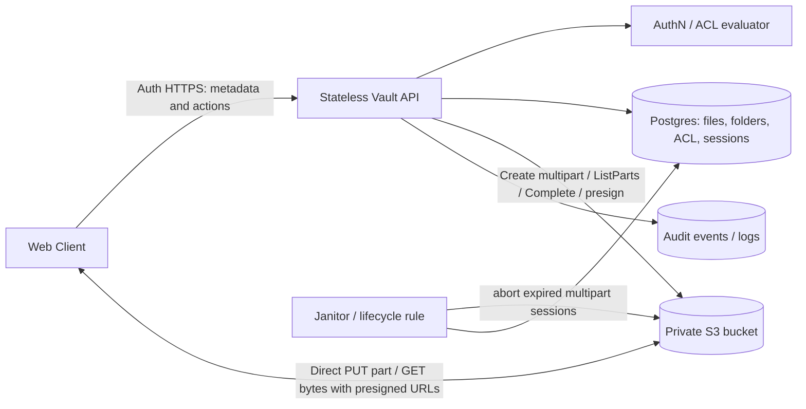

> **Editable diagram:** [Open in Excalidraw](https://excalidraw.com/#room=976ba30829fca7d14aa3,gReymXDTCV-tiIV62t44Sg)

> **Interview thesis:** For ~100k users, optimize for **secure, correct upload and authorization**, not distributed-scale complexity. Store metadata in Postgres and bytes in private S3; use multipart presigned uploads with integrity checks and principal-based, inherited ACLs. PDFs are immutable: **no collaborative editing or cross-device sync engine**.

## 1. Scope and requirements

### Functional requirements

- Upload immutable PDFs, including multi-GB files, with resumable multipart uploads.
- Download PDFs after authorization.
- List folders and files with cursor pagination; create folders and move documents/folders.
- Share files and folders with a user or an organization at viewer/editor roles; revoke sharing.
- Folder grants inherit to descendants; audit access and changes.

### Out of scope

- In-place edits, version conflict resolution, cross-device synchronization, real-time collaboration.
- Content indexing/OCR, previews, eDiscovery workflow, multi-region active-active and advanced group management (possible later).

### Nonfunctional requirements

| Category        | Goal / design implication                                                                                                              |
| --------------- | -------------------------------------------------------------------------------------------------------------------------------------- |
| Scale           | ~100k users, ~20k DAU; simple single-region design.                                                                                    |
| Durability      | S3-class managed object durability; do not equate object durability with total system recoverability. Back up metadata, test restores. |
| Confidentiality | AuthN and AuthZ on each control-plane request, tenant isolation, encrypted transit/storage, audit logs.                                |
| Availability    | 99.9%+ service target; degraded operations and retryable uploads.                                                                      |
| Large files     | 10 MB chunks (illustrative), per-part retries, resume, expiry cleanup.                                                                 |
| Correctness     | No file is visible until storage completion and validation; avoid cross-tenant ACL leaks.                                              |

### Capacity estimates (illustrative)

| Metric            | Assumption / estimate                                                        |
| ----------------- | ---------------------------------------------------------------------------- |
| Total users / DAU | 100k / 20k                                                                   |
| Files             | 100k × 1,000 = ~100M                                                         |
| Mean PDF size     | ~5 MB; heavy tail up to several GB                                           |
| Object bytes      | ~500 TB                                                                      |
| Metadata          | 100M × ~500 B ≈ 50 GB **base row estimate**, excluding indexes/ACLs/overhead |
| Requests          | 20k × 50/day ≈ 1M/day ≈ 12 QPS average (plan for peaks)                      |

**Say aloud:** One Postgres primary can be an appropriate starting point, but validate indexes, workload distribution, peaks, backup/recovery, and largest-tenant hotspots. S3 absorbs bulk bytes.

## 2. Data model

```sql
Organization(org_id UUID PK, name TEXT)
User(user_id UUID PK, org_id UUID FK, email TEXT UNIQUE)
Folder(folder_id UUID PK, org_id UUID FK, parent_folder_id UUID NULL,
       name TEXT, created_by UUID, acl_epoch BIGINT DEFAULT 0)
File(file_id UUID PK, org_id UUID FK, folder_id UUID FK, name TEXT,
     size_bytes BIGINT, content_type TEXT CHECK(content_type='application/pdf'),
     s3_key TEXT UNIQUE, checksum_sha256 CHAR(64),
     status TEXT CHECK(status IN ('uploading','available','failed')),
     created_by UUID, created_at TIMESTAMPTZ)
UploadSession(session_id UUID PK, org_id UUID FK, file_id UUID FK,
              s3_upload_id TEXT, part_size_bytes INT, total_parts INT,
              manifest JSONB, -- per-part number, size, base64 SHA-256
              status TEXT CHECK(status IN ('open','completing','completed','aborted')),
              expires_at TIMESTAMPTZ)
AclEntry(acl_id UUID PK, org_id UUID FK,
         resource_type TEXT CHECK(resource_type IN ('file','folder')),
         resource_id UUID,
         principal_type TEXT CHECK(principal_type IN ('user','organization')),
         principal_id UUID,
         role TEXT CHECK(role IN ('viewer','editor','owner')),
         granted_by UUID, created_at TIMESTAMPTZ)
```

**Indexes/constraints:** `(org_id, parent_folder_id, name)` on folders, `(org_id, folder_id, created_at, file_id)` on files; ACL `(org_id, resource_type, resource_id, principal_type, principal_id)` unique when the model allows one grant per principal; sessions indexed by `(file_id, status, expires_at)`. Enforce that parent-child resources and ACL principals belong to permissible tenants. Validate acyclic folder moves transactionally.

**Key modeling choice:** Sharing with 5,000 organization users is **one AclEntry** (`principal_type='organization'`), not 5,000 rows. New members inherit access automatically, revocation deletes one grant. Introduce group principals later if needed.

**ACL semantics to clarify:** Organization-wide ACL means all current members of the **owning organization**. Cross-organization sharing is not in the MVP; adding it requires explicit guest identity, tenant policy, and authorization checks. The owner role is best anchored to a privileged resource owner/system rule so ordinary editors cannot self-escalate.

## 3. REST API contracts

```http
POST /v1/files:initiate-upload
Content-Type: application/json
{
  "folder_id":"folder-uuid",
  "name":"deposition.pdf",
  "size_bytes":2147483648,
  "part_size_bytes":10485760,
  "checksum_sha256":"hex-full-file-sha256",
  "part_checksums":[{"number":1,"size_bytes":10485760,"sha256_base64":"..."}]
}
→ 201 {"file_id":"...","session_id":"...",
       "parts":[{"number":1,"url":"presigned PUT URL","required_headers":{"x-amz-checksum-sha256":"..."}}]}

PUT <part_url>                  # raw part bytes + signed checksum header
GET /v1/upload-sessions/{session_id}
→ 200 {"completed_parts":[1,2,5],"missing_parts":[...],"parts":[{"number":3,"url":"...","required_headers":{...}}]}

POST /v1/files/{file_id}:complete-upload
{"session_id":"..."}
→ 200 {"status":"available"}

GET /v1/files/{file_id}:download
→ 200 {"url":"short-TTL presigned GET","expires_in_seconds":300}

GET /v1/folders/{folder_id}/children?page_token=...&limit=100
→ 200 {"folders":[...],"files":[...],"next_page_token":"..."}

POST /v1/shares
{"resource_type":"folder","resource_id":"...",
 "principal_type":"organization","principal_id":"owning-org-id","role":"viewer"}
→ 201 {"acl_id":"..."}

DELETE /v1/shares/{acl_id} → 204
```

**Contract refinements:** Include idempotency keys for initiating/finishing uploads; enforce maximum file size, part count and PDF validation; bind tenant and caller context on server-side session records. Presigned URLs must be narrow in key, upload ID, part number, method, signed checksum header, and TTL. Return signed headers so the client sends _exactly_ those values. Issue URLs in batches to avoid huge initiation responses for large files.

## 4. High-level architecture



**Split planes:** The API handles metadata/authorization and storage-control calls; the client moves bytes directly to the object store. Never proxy several GB through application servers.

### Upload state machine / protocol

1. **Initiate:** Authenticate and authorize _editor_ access to target folder. Validate tenant, filename, size and checksum manifest; create `File(uploading)` and a durable upload session; initiate S3 multipart upload. Coordinate external S3 side effects with DB failure compensation; no false atomicity across DB + S3.
2. **Presign:** Each part URL binds `bucket, key, uploadId, partNumber, PUT`, short expiry and the `x-amz-checksum-sha256` header/value. Return URLs in batches.
3. **Transfer:** Browser calculates SHA-256 per part (and optionally whole-file SHA-256), uploads ~4–8 parts concurrently; retry failed parts with backoff; renew expired URLs.
4. **Resume:** Re-authenticate and re-authorize session owner; reconcile against **S3 ListParts** with pagination; re-presign only missing parts. Verify part numbers, sizes and storage-side checksums. The server can return a normalized completed set.
5. **Commit:** Acquire idempotent completion lock/state. Recheck editor access and session ownership; list/verify all parts against manifest; call CompleteMultipartUpload with ordered part identifiers (and applicable checksum data). Mark `available` only after confirmed storage completion plus expected object metadata/checksum validation. Crash between S3 success and DB update must be recoverable via reconciliation (e.g., HeadObject + session state).
6. **Cleanup:** Expired/aborted sessions are cleaned by a janitor and S3 `AbortIncompleteMultipartUpload` lifecycle rule; mark failed and report user-retry UX.

**Integrity caveat:** S3's multipart object's ETag is **not necessarily a full-file MD5 or SHA-256**. Per-part SHA-256 signed-header validation proves each accepted part matches the declared part checksum. To prove the _full byte stream_ equals a client-declared SHA-256, use an appropriate storage full-object checksum mechanism where supported, or independently compute/validate the assembled object checksum; do not claim comparing an ETag alone proves this.

### Download flow

1. Authenticate caller; query file/ancestor ACLs within owning tenant; require viewer+.
2. Mint short-TTL signed GET for precisely that object's key, optionally force content disposition / content type.
3. Browser fetches bytes from S3; audit request and (where available) correlate delivery/access logs. A presigned URL is a **bearer capability** until it expires, even if the ACL is revoked in the meantime.

### Permission resolution / inheritance

```text
Principals(user) = { user_id, user's active org_id }
Resource path = { file itself, containing folder, every ancestor folder }
Matches = ACL grants whose principal ∈ Principals and whose resource ∈ Resource path
Effective role = strongest applicable grant (owner > editor > viewer)
No matching grant → deny
```

For shallow trees, fetch ancestors by recursive CTE and join ACLs, or walk indexed parents. Default deny. Do not assume a client-provided `org_id` is trusted. For sensitive legal documents, clarify whether explicit deny rules, matter walls, or external guests are needed; additive max-role ACLs cannot model those without an extension.

### Folder operations

Adjacency-list `parent_folder_id`; list children using composite indexes and stable cursor pagination. To move a folder, check source and destination edit authority, disallow moving beneath itself, update parent transactionally, and invalidate subtree-effective-permission caches. An ACL change on an ancestor similarly changes descendants' effective permissions.

## 5. Deep dives — interview questions & answers

### Q1. Why not proxy file bytes through the API?

**A:** Presigned direct object-store transfers keep multi-GB network I/O off API workers. The API authorizes every issuance; the signed URL provides time-limited, narrowly scoped transfer capability. Alternative: a proxy can give instantaneous revocation/content inspection, but adds throughput cost and operational complexity.

### Q2. How does sharing with a 5,000-member organization work?

**A:** One ACL grant with `principal_type=organization`, `principal_id=owning_org`. Each user's principal set contains their org, so lookup sees that grant. One insert to share, one delete to revoke, no fan-out/backfill. Handle join/leave through authoritative identity membership and cache invalidation.

### Q3. How do you know each chunk in S3 is your intended chunk?

**A:** (1) Scoped presigned UploadPart URL for key/uploadId/partNumber/method; (2) client's SHA-256 part checksum is a **signed request header**, and S3 validates payload-to-checksum on PUT; (3) server lists uploaded parts, compares numbers/sizes/checksums to immutable manifest, then completes; (4) only `available` files are downloadable. Note that this protects integrity **relative to client-declared checksums**; it does not prove the client chose benign PDF content or is an authorized human without the auth layer.

### Q4. What if a URL expires halfway through a 2 GB upload?

**A:** Parts already committed stay. Retry any failed/incomplete part with a fresh narrowly scoped presigned URL. Resume uses ListParts, not an untrusted client-only progress counter.

### Q5. How do you prevent an attacker from completing someone else's upload?

**A:** Bind sessions to caller/org/file and resource authorization, enforce session state and expiry, disallow client-selected S3 keys/uploadIds, and re-authorize at `complete-upload`. Enforce idempotency and serialize competing completions.

### Q6. What if CompleteMultipartUpload succeeds but Postgres update fails?

**A:** The operation crosses DB and S3 and cannot be one transaction. Persist `completing`, make finalize idempotent, reconcile object existence/checksum using storage HEAD/checksum APIs on retries or repair jobs, then set `available` (or mark `failed`). Never expose partial state as readable.

### Q7. How can revoked sharing still allow access?

**A:** New ACL checks deny immediately, but previously minted download URLs remain usable until expiry. Use ~5-minute URLs; for stricter revocation use a gated proxy or per-request access token at an enforcing edge, accepting extra complexity. Don't promise instantaneous revocation with plain S3 presigned URLs.

### Q8. How do folder moves affect permissions?

**A:** Effective rights depend on the ancestor chain; moving a folder potentially changes every descendant's authorization. Bump permission epochs / invalidate effective-access caches based on ancestor-version dependencies; recompute on reads rather than fan-out updating ACL rows.

### Q9. What security guarantees do legal tenants need?

**A:** Every metadata/ACL query scoped by server-resolved tenant; deny by default; block bucket public access; least-privilege IAM; TLS and SSE-KMS (possibly per-tenant keys with operational cost); upload type/payload validation and optional malware scanning before availability; audit grant/revoke, upload, and download issuance; signed URLs are secrets (don't log them).

### Q10. How would you handle unauthorized direct S3 access?

**A:** No static client credentials. Private bucket with Block Public Access and policies restricting operations to backend signing/approved access paths. Treat URL possession as authorization for only that narrowly scoped operation within TTL; never embed credentials in client JavaScript.

### Q11. What is the scale-out order if traffic grows?

**A:** Measure first. Add read replicas for heavy listings; tune indexes and keyset pagination; cache hot listings/ACL decisions carefully; partition metadata by `org_id` when write/storage limits demand it; add CDN only if actual download locality warrants it. Object store scales independently.

### Q12. Why not bring a sync engine / event streaming bus?

**A:** PDFs are immutable and the prompt excludes desktop-style cross-device synchronization and collaborative edits. Background cleanup/reconciliation can start as simple scheduled jobs; introduce queues only when throughput or reliability requirements justify them.

### Q13. What if an uploaded “PDF” is malicious or wrong type?

**A:** Validate MIME and PDF magic/content rather than trusting filename or Content-Type; quarantine/scanning where required; limit upload size, rate and count; use safe `Content-Disposition` and browser security headers. If async scanning is required, add `processing`/`quarantined` before `available`.

### Q14. Does 11 nines of S3 durability solve disaster recovery?

**A:** No. Database metadata, keys, ACLs, and object references require backups, key management, restore drills and defined RPO/RTO. Object durability alone does not protect against accidental deletion or privileged misuse. Consider bucket versioning/retention according to legal policy even though **application-level document editing versions** are out of scope.

## 6. Trade-offs and follow-ups

| Decision                   | Alternative                    | Why choose / when to revisit                                                     |
| -------------------------- | ------------------------------ | -------------------------------------------------------------------------------- |
| Single Postgres            | Shards on day one              | Simpler correctness at stated scale; measure row/index growth and traffic peaks. |
| Direct-to-S3               | Byte proxy                     | Cheap elastic transfer; proxy for stronger immediate access mediation.           |
| Org-principal ACL          | Per-user fan-out               | O(1) org share and revoke vs thousands of writes.                                |
| Inherited folder ACL       | File-only ACL                  | Natural matter/case workflow; requires careful move and cache semantics.         |
| Immutable PDFs             | Live editing/version conflicts | Explicitly outside scope; preserves simple lifecycle.                            |
| Signed SHA-256 part checks | Transport-only integrity       | Verifiable binding to declared bytes.                                            |
| Short-lived download URL   | Long URL                       | Reduces, but does not eliminate, post-revocation window.                         |

## 7. Staff-level interview checklist

- [ ] Confirm immutable PDFs, ~100k users, single region, legal confidentiality and tenancy.
- [ ] Establish access model: viewer/editor/owner, inheritance, org share, cross-org scope, no explicit denies in MVP.
- [ ] Quantify 100M files, ~500 TB objects, ~50 GB raw metadata and ~12 average QPS; warn about peaks and index overhead.
- [ ] Draw browser ↔ API ↔ Postgres and browser ↔ private S3 via presigned URLs.
- [ ] Walk multipart initiation, checksummed signed PUTs, ListParts resume, validated complete, reconciliation, cleanup.
- [ ] Show org share as **one ACL row** and ancestor permission resolution.
- [ ] Discuss DB/S3 non-atomicity, retry/idempotence, cleanup and safe visibility transitions.
- [ ] Explain presigned URL revocation limits and ACL cache versioning on folder moves.
- [ ] Cover tenant isolation, IAM/KMS, malicious PDFs and audit trails.
- [ ] Offer scale-out only as a measured progression after correct MVP.

## 8. 90-second interview summary

"I would build Vault as a single-region stateless API, Postgres for metadata, folder hierarchy and principal-based ACLs, and private S3 for immutable PDF bytes. Users upload directly to S3 via short-lived per-part presigned URLs. We declare and sign SHA-256 checksums per chunk, validate each piece at storage receipt, then reconcile the complete manifest before marking a file available. Multipart sessions are resumable and independently cleaned up. Downloads require an inherited ACL check before issuing a short-lived signed GET. Sharing with a 5,000-person organization is one ACL grant to the organization principal, not 5,000 updates. The critical trade-offs are storage/DB finalization recovery, revocation windows from signed URLs, subtree permission changes on folder moves, and legal-grade tenant isolation. The stated 100k users don't justify sharding or a sync system; I would start simple and measure growth."
